# 前端和后端 实现架构

## 概述

本文档详细介绍 Duck-Core 前端画布系统的核心功能实现，基于 ECS（Entity-Component-System）架构，提供高性能的图形渲染和交互能力。

### 核心功能模块

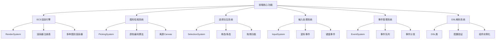
```mermaid
graph TB
    A[前端核心功能] --> B[ECS渲染引擎]
    A --> C[图形拾取系统]
    A --> D[选择交互系统]
    A --> E[输入处理系统]
    A --> F[事件管理系统]
    A --> G[DSL解析系统]
    
    B --> B1[RenderSystem]
    B --> B2[渲染器注册表]
    B --> B3[多种图形渲染器]
    
    C --> C1[PickingSystem]
    C --> C2[颜色编码算法]
    C --> C3[离屏Canvas]
    
    D --> D1[SelectionSystem]
    D --> D2[单选/多选]
    D --> D3[拖拽功能]
    
    E --> E1[InputSystem]
    E --> E2[鼠标事件]
    E --> E3[键盘事件]
    
    F --> F1[EventSystem]
    F --> F2[事件队列]
    F --> F3[事件分发]
    
    G --> G1[DSL类]
    G --> G2[配置验证]
    G --> G3[组件实例化]
```

## ECS 渲染引擎

### 渲染流程架构

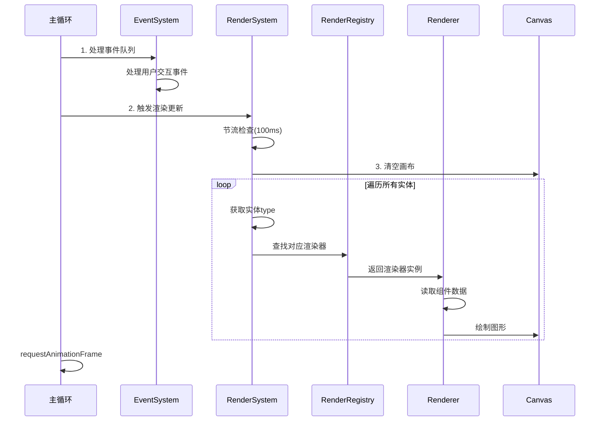
```mermaid
sequenceDiagram
    participant M as 主循环
    participant E as EventSystem
    participant R as RenderSystem
    participant RR as RenderRegistry
    participant RE as Renderer
    participant C as Canvas
    
    M->>E: 1. 处理事件队列
    E->>E: 处理用户交互事件
    M->>R: 2. 触发渲染更新
    R->>R: 节流检查(100ms)
    R->>C: 3. 清空画布
    
    loop 遍历所有实体
        R->>R: 获取实体type
        R->>RR: 查找对应渲染器
        RR->>RE: 返回渲染器实例
        RE->>RE: 读取组件数据
        RE->>C: 绘制图形
    end
    
    M->>M: requestAnimationFrame
```

### 渲染系统实现

#### RenderSystem 架构

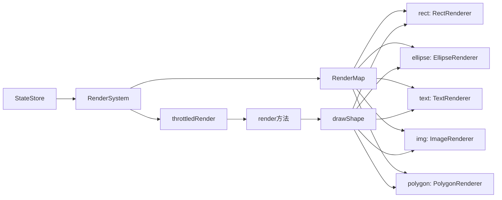
```mermaid
graph LR
    A[RenderSystem] --> B[RenderMap]
    B --> C[rect: RectRenderer]
    B --> D[ellipse: EllipseRenderer]
    B --> E[text: TextRenderer]
    B --> F[img: ImageRenderer]
    B --> G[polygon: PolygonRenderer]
    
    H[StateStore] --> A
    A --> I[throttledRender]
    I --> J[render方法]
    J --> K[drawShape]
    K --> C
    K --> D
    K --> E
    K --> F
    K --> G
```

#### RenderSystem 核心逻辑

```typescript
export class RenderSystem extends System {
  core: Core;
  ctx: CanvasRenderingContext2D;
  renderMap = new Map<string, System>();

  constructor(ctx: CanvasRenderingContext2D, core: Core) {
    super();
    this.core = core;
    this.ctx = ctx;
    this.initRenderMap();
  }

  // 初始化渲染器映射表
  initRenderMap() {
    Object.entries(renderRegistry).forEach(([key, SystemClass]) => {
      this.renderMap.set(key, new SystemClass(this.ctx, this.core));
    });
  }

  // 节流渲染（100ms）
  throttledRender = throttle((stateStore: StateStore) => {
    this.render(stateStore, this.ctx);
  }, 100);

  // 绘制单个图形
  drawShape(stateStore: StateStore, entityId: string) {
    const type = stateStore.type.get(entityId);
    if (!type) return;
    
    const renderer = this.renderMap.get(type);
    renderer?.draw(entityId);
  }

  // 主渲染方法
  render(stateStore: StateStore, ctx: CanvasRenderingContext2D) {
    // 清空画布
    ctx.clearRect(0, 0, ctx.canvas.width, ctx.canvas.height);

    // 遍历所有实体并渲染
    stateStore.position.forEach((pos, entityId) => {
      ctx.save();
      this.drawShape(stateStore, entityId);
      ctx.restore();
    });
  }

  // 每帧更新
  update(stateStore: StateStore) {
    this.throttledRender(stateStore);
  }
}
```

### 渲染器实现

#### 渲染器架构设计

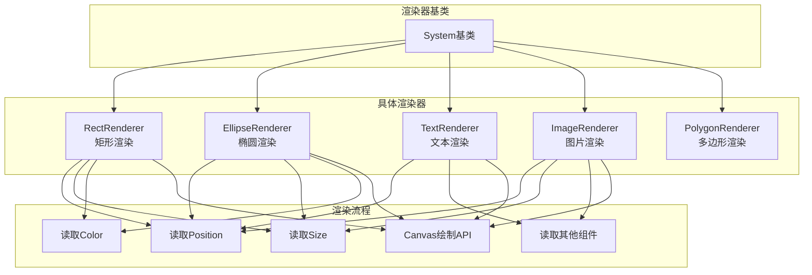
```mermaid
graph TB
    subgraph "渲染器基类"
        A[System基类]
    end
    
    subgraph "具体渲染器"
        B[RectRenderer<br/>矩形渲染]
        C[EllipseRenderer<br/>椭圆渲染]
        D[TextRenderer<br/>文本渲染]
        E[ImageRenderer<br/>图片渲染]
        F[PolygonRenderer<br/>多边形渲染]
    end
    
    subgraph "渲染流程"
        G[读取Position]
        H[读取Size]
        I[读取Color]
        J[读取其他组件]
        K[Canvas绘制API]
    end
    
    A --> B
    A --> C
    A --> D
    A --> E
    A --> F
    
    B --> G
    B --> H
    B --> I
    B --> K
    
    C --> G
    C --> H
    C --> I
    C --> K
    
    D --> G
    D --> J
    D --> K
    
    E --> G
    E --> H
    E --> J
    E --> K
```

#### 矩形渲染器

```typescript
export class RectRenderer extends System {
  ctx: CanvasRenderingContext2D;
  core: Core;

  constructor(ctx: CanvasRenderingContext2D, core: Core) {
    super();
    this.ctx = ctx;
    this.core = core;
  }

  draw(entityId: string) {
    const position = this.core.stateStore.position.get(entityId);
    const size = this.core.stateStore.size.get(entityId);
    const color = this.core.stateStore.color.get(entityId);
    const rotation = this.core.stateStore.rotation.get(entityId);

    if (!position || !size || !color) return;

    this.ctx.save();

    // 应用旋转
    if (rotation) {
      const centerX = position.x + size.width / 2;
      const centerY = position.y + size.height / 2;
      this.ctx.translate(centerX, centerY);
      this.ctx.rotate((rotation.value * Math.PI) / 180);
      this.ctx.translate(-centerX, -centerY);
    }

    // 填充
    if (color.fillColor) {
      this.ctx.fillStyle = color.fillColor;
      this.ctx.fillRect(position.x, position.y, size.width, size.height);
    }

    // 描边
    if (color.strokeColor) {
      const lineWidth = this.core.stateStore.lineWidth.get(entityId);
      this.ctx.strokeStyle = color.strokeColor;
      this.ctx.lineWidth = lineWidth?.value || 1;
      this.ctx.strokeRect(position.x, position.y, size.width, size.height);
    }

    this.ctx.restore();
  }
}
```

#### 椭圆渲染器

```typescript
export class EllipseRenderer extends System {
  draw(entityId: string) {
    const position = this.core.stateStore.position.get(entityId);
    const size = this.core.stateStore.size.get(entityId);
    const color = this.core.stateStore.color.get(entityId);

    if (!position || !size || !color) return;

    const centerX = position.x + size.width / 2;
    const centerY = position.y + size.height / 2;
    const radiusX = size.width / 2;
    const radiusY = size.height / 2;

    this.ctx.beginPath();
    this.ctx.ellipse(centerX, centerY, radiusX, radiusY, 0, 0, 2 * Math.PI);

    if (color.fillColor) {
      this.ctx.fillStyle = color.fillColor;
      this.ctx.fill();
    }

    if (color.strokeColor) {
      this.ctx.strokeStyle = color.strokeColor;
      this.ctx.stroke();
    }
  }
}
```

#### 文本渲染器

```typescript
export class TextRenderer extends System {
  draw(entityId: string) {
    const position = this.core.stateStore.position.get(entityId);
    const font = this.core.stateStore.font.get(entityId);

    if (!position || !font) return;

    this.ctx.save();

    // 设置字体样式
    this.ctx.font = `${font.weight} ${font.size}px ${font.family}`;
    this.ctx.fillStyle = font.fillColor;
    this.ctx.textBaseline = 'top';

    // 绘制文本
    this.ctx.fillText(font.text, position.x, position.y);

    this.ctx.restore();
  }
}
```

#### 图片渲染器

```typescript
export class ImageRenderer extends System {
  private imageCache = new Map<string, HTMLImageElement>();

  draw(entityId: string) {
    const position = this.core.stateStore.position.get(entityId);
    const size = this.core.stateStore.size.get(entityId);
    const img = this.core.stateStore.img.get(entityId);

    if (!position || !size || !img) return;

    let image = this.imageCache.get(img.src);

    if (!image) {
      image = new Image();
      image.src = img.src;
      this.imageCache.set(img.src, image);

      image.onload = () => {
        this.ctx.drawImage(image!, position.x, position.y, size.width, size.height);
      };
    } else if (image.complete) {
      this.ctx.drawImage(image, position.x, position.y, size.width, size.height);
    }
  }
}
```

## 图形拾取系统

### 拾取系统架构

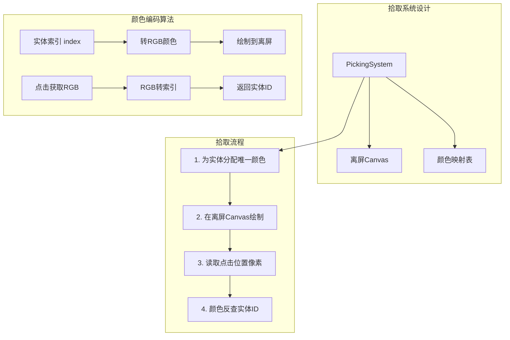
```mermaid
graph TB
    subgraph "拾取系统设计"
        A[PickingSystem]
        B[离屏Canvas]
        C[颜色映射表]
    end
    
    subgraph "拾取流程"
        D[1. 为实体分配唯一颜色]
        E[2. 在离屏Canvas绘制]
        F[3. 读取点击位置像素]
        G[4. 颜色反查实体ID]
    end
    
    subgraph "颜色编码算法"
        H[实体索引 index]
        I[转RGB颜色]
        J[绘制到离屏]
        K[点击获取RGB]
        L[RGB转索引]
        M[返回实体ID]
    end
    
    A --> B
    A --> C
    A --> D
    D --> E
    E --> F
    F --> G
    
    H --> I
    I --> J
    K --> L
    L --> M
```

### 拾取原理图

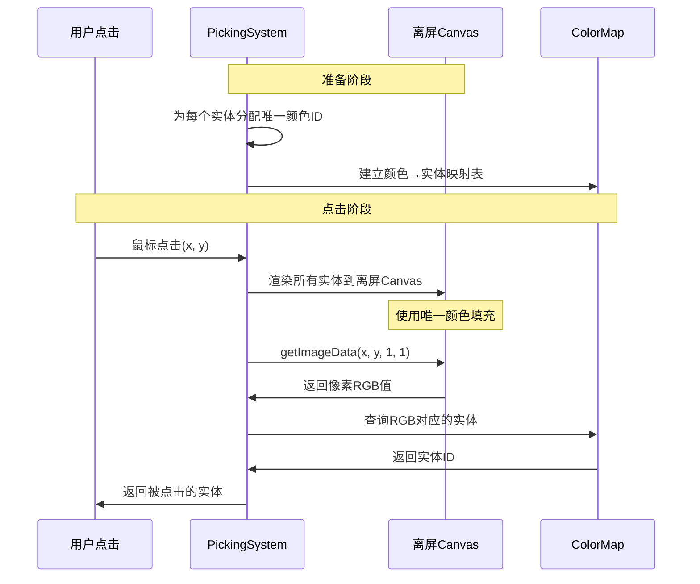
```mermaid
sequenceDiagram
    participant U as 用户点击
    participant P as PickingSystem
    participant O as 离屏Canvas
    participant M as ColorMap
    
    Note over P,O: 准备阶段
    P->>P: 为每个实体分配唯一颜色ID
    P->>M: 建立颜色→实体映射表
    
    Note over U,M: 点击阶段
    U->>P: 鼠标点击(x, y)
    P->>O: 渲染所有实体到离屏Canvas
    Note over O: 使用唯一颜色填充
    P->>O: getImageData(x, y, 1, 1)
    O->>P: 返回像素RGB值
    P->>M: 查询RGB对应的实体
    M->>P: 返回实体ID
    P->>U: 返回被点击的实体
```

### PickingSystem 实现

```typescript
export class PickingSystem extends System {
  core: Core;
  ctx: CanvasRenderingContext2D;
  offscreenCanvas: HTMLCanvasElement;
  offscreenCtx: CanvasRenderingContext2D;
  colorToEntityMap = new Map<string, string>();

  constructor(ctx: CanvasRenderingContext2D, core: Core) {
    super();
    this.core = core;
    this.ctx = ctx;

    // 创建离屏 Canvas
    this.offscreenCanvas = document.createElement('canvas');
    this.offscreenCanvas.width = ctx.canvas.width;
    this.offscreenCanvas.height = ctx.canvas.height;
    this.offscreenCtx = this.offscreenCanvas.getContext('2d')!;

    this.generateColorMap();
  }

  // 为每个实体生成唯一颜色
  generateColorMap() {
    let colorIndex = 1;
    this.core.stateStore.position.forEach((_, entityId) => {
      const color = this.indexToColor(colorIndex);
      this.colorToEntityMap.set(color, entityId);
      colorIndex++;
    });
  }

  // 索引转颜色
  indexToColor(index: number): string {
    const r = (index & 0xFF0000) >> 16;
    const g = (index & 0x00FF00) >> 8;
    const b = (index & 0x0000FF);
    return `rgb(${r},${g},${b})`;
  }

  // 颜色转索引
  colorToIndex(r: number, g: number, b: number): number {
    return (r << 16) | (g << 8) | b;
  }

  // 渲染到离屏 Canvas
  renderOffscreen() {
    this.offscreenCtx.clearRect(0, 0, this.offscreenCanvas.width, this.offscreenCanvas.height);

    let colorIndex = 1;
    this.core.stateStore.position.forEach((position, entityId) => {
      const size = this.core.stateStore.size.get(entityId);
      if (!size) return;

      const color = this.indexToColor(colorIndex);
      this.offscreenCtx.fillStyle = color;
      this.offscreenCtx.fillRect(position.x, position.y, size.width, size.height);

      colorIndex++;
    });
  }

  // 拾取实体
  pick(x: number, y: number): string | null {
    this.renderOffscreen();

    const pixel = this.offscreenCtx.getImageData(x, y, 1, 1).data;
    const color = `rgb(${pixel[0]},${pixel[1]},${pixel[2]})`;

    return this.colorToEntityMap.get(color) || null;
  }
}
```

## 选择系统

### 选择系统架构

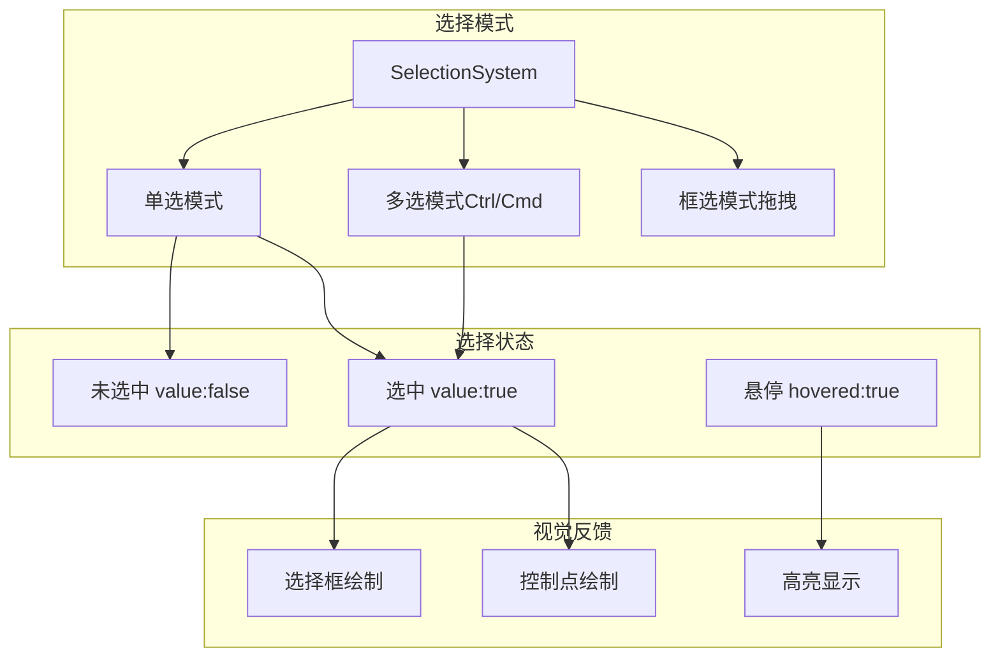
```mermaid
graph TB
    subgraph "选择模式"
        A[SelectionSystem]
        B[单选模式]
        C[多选模式Ctrl/Cmd]
        D[框选模式拖拽]
    end
    
    subgraph "选择状态"
        E[未选中 value:false]
        F[选中 value:true]
        G[悬停 hovered:true]
    end
    
    subgraph "视觉反馈"
        H[选择框绘制]
        I[控制点绘制]
        J[高亮显示]
    end
    
    A --> B
    A --> C
    A --> D
    
    B --> E
    B --> F
    C --> F
    
    F --> H
    F --> I
    G --> J
```

### 选择状态流转

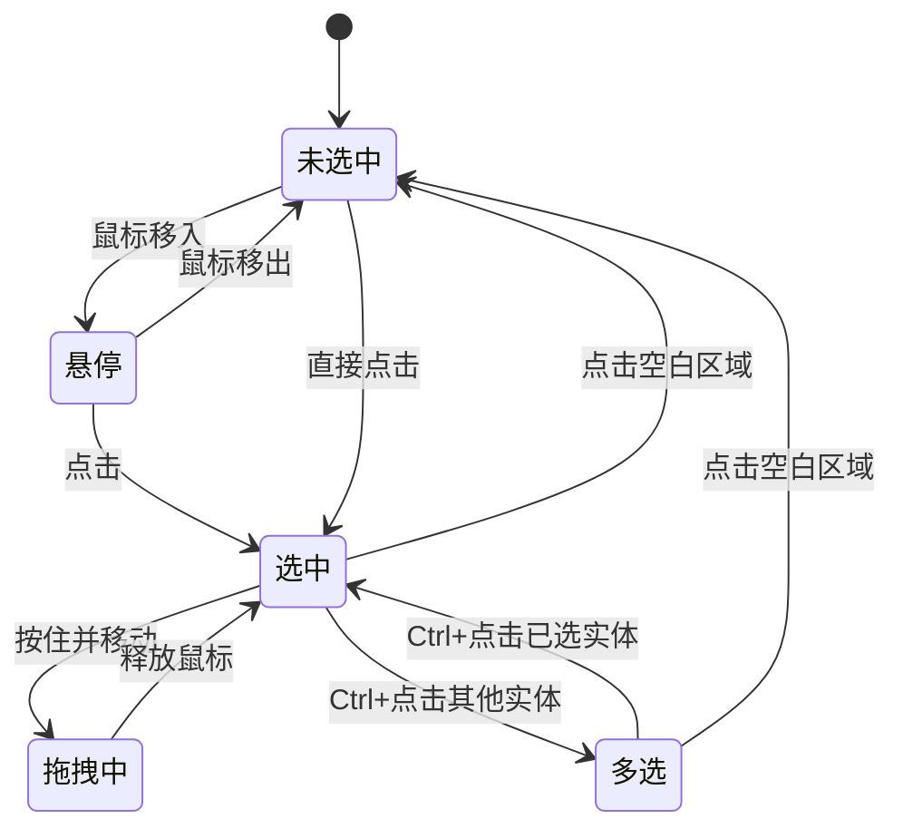
```mermaid
stateDiagram-v2
    [*] --> 未选中
    
    未选中 --> 悬停: 鼠标移入
    悬停 --> 未选中: 鼠标移出
    
    悬停 --> 选中: 点击
    未选中 --> 选中: 直接点击
    
    选中 --> 拖拽中: 按住并移动
    拖拽中 --> 选中: 释放鼠标
    
    选中 --> 未选中: 点击空白区域
    选中 --> 多选: Ctrl+点击其他实体
    多选 --> 选中: Ctrl+点击已选实体
    
    多选 --> 未选中: 点击空白区域
```

### SelectionSystem 实现

```typescript
export class SelectionSystem extends System {
  core: Core;
  ctx: CanvasRenderingContext2D;

  constructor(ctx: CanvasRenderingContext2D, core: Core) {
    super();
    this.core = core;
    this.ctx = ctx;
  }

  // 选中实体
  selectEntity(entityId: string) {
    const selected = this.core.stateStore.selected.get(entityId);
    if (selected) {
      selected.value = true;
    }
  }

  // 取消选中
  deselectEntity(entityId: string) {
    const selected = this.core.stateStore.selected.get(entityId);
    if (selected) {
      selected.value = false;
    }
  }

  // 取消所有选中
  deselectAll() {
    this.core.stateStore.selected.forEach((selected) => {
      selected.value = false;
    });
  }

  // 绘制选择框
  drawSelectionBox(entityId: string) {
    const position = this.core.stateStore.position.get(entityId);
    const size = this.core.stateStore.size.get(entityId);
    const selected = this.core.stateStore.selected.get(entityId);

    if (!position || !size || !selected?.value) return;

    this.ctx.save();

    // 绘制选择框
    this.ctx.strokeStyle = '#0078D4';
    this.ctx.lineWidth = 2;
    this.ctx.setLineDash([5, 5]);
    this.ctx.strokeRect(
      position.x - 2,
      position.y - 2,
      size.width + 4,
      size.height + 4
    );

    // 绘制控制点
    this.drawHandles(position, size);

    this.ctx.restore();
  }

  // 绘制控制点
  drawHandles(position: Position, size: Size) {
    const handleSize = 8;
    const handles = [
      { x: position.x, y: position.y }, // 左上
      { x: position.x + size.width, y: position.y }, // 右上
      { x: position.x, y: position.y + size.height }, // 左下
      { x: position.x + size.width, y: position.y + size.height }, // 右下
    ];

    handles.forEach(handle => {
      this.ctx.fillStyle = '#FFFFFF';
      this.ctx.strokeStyle = '#0078D4';
      this.ctx.lineWidth = 2;
      this.ctx.fillRect(
        handle.x - handleSize / 2,
        handle.y - handleSize / 2,
        handleSize,
        handleSize
      );
      this.ctx.strokeRect(
        handle.x - handleSize / 2,
        handle.y - handleSize / 2,
        handleSize,
        handleSize
      );
    });
  }

  update(stateStore: StateStore) {
    stateStore.selected.forEach((selected, entityId) => {
      if (selected.value) {
        this.drawSelectionBox(entityId);
      }
    });
  }
}
```

## 输入系统

### 输入系统架构

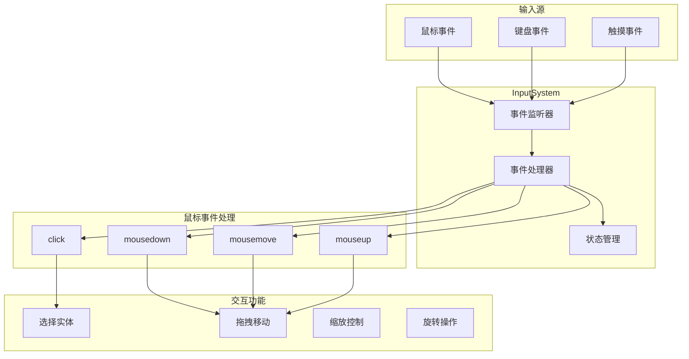
```mermaid
graph TB
    subgraph "输入源"
        A[鼠标事件]
        B[键盘事件]
        C[触摸事件]
    end
    
    subgraph "InputSystem"
        D[事件监听器]
        E[事件处理器]
        F[状态管理]
    end
    
    subgraph "鼠标事件处理"
        G[mousedown]
        H[mousemove]
        I[mouseup]
        J[click]
    end
    
    subgraph "交互功能"
        K[选择实体]
        L[拖拽移动]
        M[缩放控制]
        N[旋转操作]
    end
    
    A --> D
    B --> D
    C --> D
    
    D --> E
    E --> F
    
    E --> G
    E --> H
    E --> I
    E --> J
    
    G --> L
    H --> L
    I --> L
    J --> K
```

### 拖拽交互流程

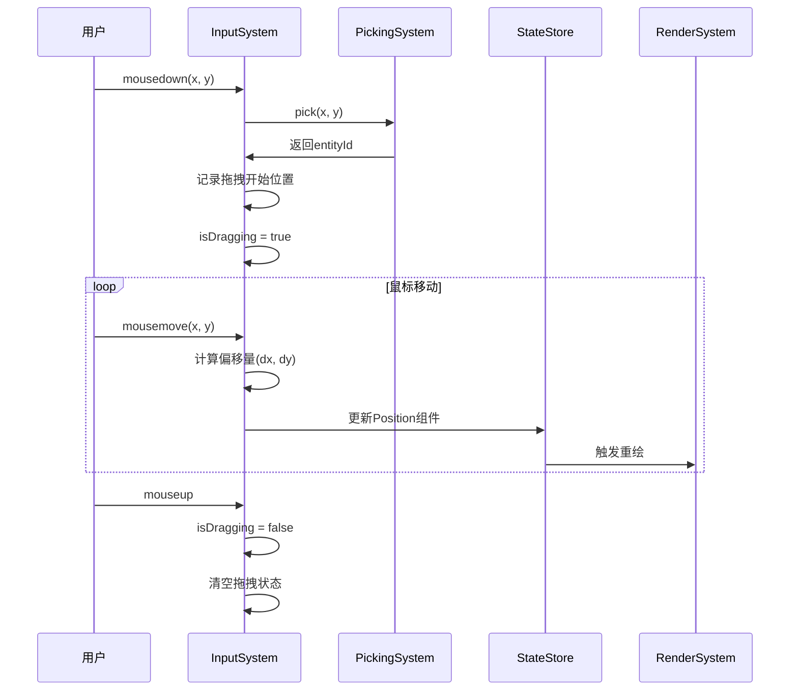
```mermaid
sequenceDiagram
    participant U as 用户
    participant I as InputSystem
    participant P as PickingSystem
    participant S as StateStore
    participant R as RenderSystem
    
    U->>I: mousedown(x, y)
    I->>P: pick(x, y)
    P->>I: 返回entityId
    I->>I: 记录拖拽开始位置
    I->>I: isDragging = true
    
    loop 鼠标移动
        U->>I: mousemove(x, y)
        I->>I: 计算偏移量(dx, dy)
        I->>S: 更新Position组件
        S->>R: 触发重绘
    end
    
    U->>I: mouseup
    I->>I: isDragging = false
    I->>I: 清空拖拽状态
```

### InputSystem 实现

```typescript
export class InputSystem extends System {
  canvas: HTMLCanvasElement;
  core: Core;
  pickingSystem: PickingSystem;
  isDragging = false;
  dragStartPos: { x: number; y: number } | null = null;
  selectedEntity: string | null = null;

  constructor(canvas: HTMLCanvasElement, core: Core, pickingSystem: PickingSystem) {
    super();
    this.canvas = canvas;
    this.core = core;
    this.pickingSystem = pickingSystem;
    this.bindEvents();
  }

  bindEvents() {
    this.canvas.addEventListener('mousedown', this.handleMouseDown);
    this.canvas.addEventListener('mousemove', this.handleMouseMove);
    this.canvas.addEventListener('mouseup', this.handleMouseUp);
    this.canvas.addEventListener('click', this.handleClick);
  }

  handleClick = (e: MouseEvent) => {
    const rect = this.canvas.getBoundingClientRect();
    const x = e.clientX - rect.left;
    const y = e.clientY - rect.top;

    // 拾取实体
    const entityId = this.pickingSystem.pick(x, y);

    if (entityId) {
      // 如果按下 Ctrl/Cmd，则多选
      if (e.ctrlKey || e.metaKey) {
        const selected = this.core.stateStore.selected.get(entityId);
        if (selected) {
          selected.value = !selected.value;
        }
      } else {
        // 单选
        this.core.stateStore.selected.forEach((s) => (s.value = false));
        const selected = this.core.stateStore.selected.get(entityId);
        if (selected) {
          selected.value = true;
        }
      }
    } else {
      // 点击空白，取消所有选中
      this.core.stateStore.selected.forEach((s) => (s.value = false));
    }
  };

  handleMouseDown = (e: MouseEvent) => {
    const rect = this.canvas.getBoundingClientRect();
    const x = e.clientX - rect.left;
    const y = e.clientY - rect.top;

    const entityId = this.pickingSystem.pick(x, y);

    if (entityId) {
      this.isDragging = true;
      this.selectedEntity = entityId;
      this.dragStartPos = { x, y };
    }
  };

  handleMouseMove = (e: MouseEvent) => {
    if (!this.isDragging || !this.selectedEntity || !this.dragStartPos) return;

    const rect = this.canvas.getBoundingClientRect();
    const x = e.clientX - rect.left;
    const y = e.clientY - rect.top;

    const dx = x - this.dragStartPos.x;
    const dy = y - this.dragStartPos.y;

    // 更新位置
    const position = this.core.stateStore.position.get(this.selectedEntity);
    if (position) {
      position.x += dx;
      position.y += dy;
    }

    this.dragStartPos = { x, y };
  };

  handleMouseUp = () => {
    this.isDragging = false;
    this.selectedEntity = null;
    this.dragStartPos = null;
  };

  update(stateStore: StateStore) {
    // 输入系统主要是事件驱动，不需要每帧更新
  }
}
```

## 事件系统

### 事件系统架构

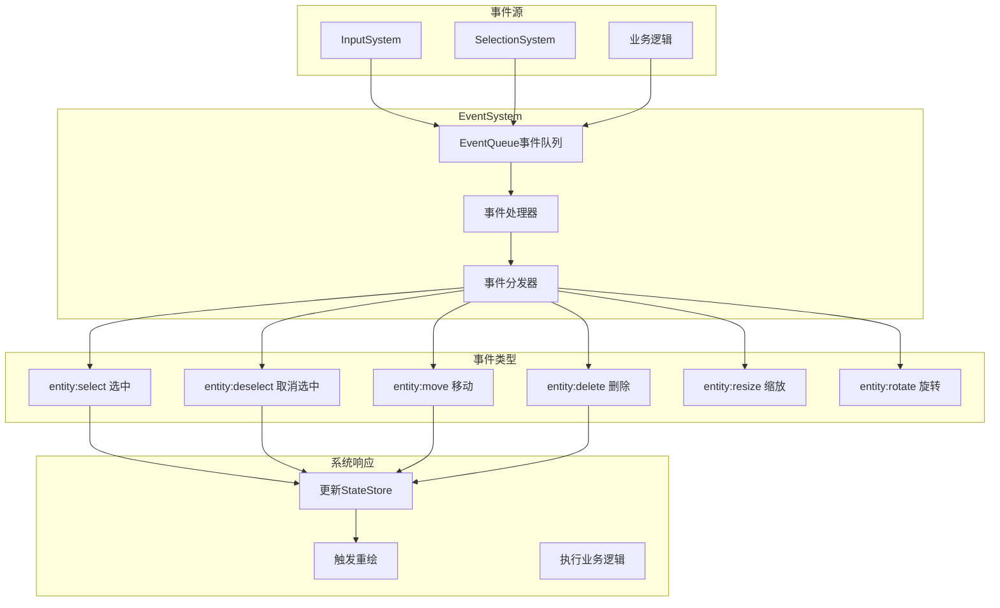
```mermaid
graph TB
    subgraph "事件源"
        A[InputSystem]
        B[SelectionSystem]
        C[业务逻辑]
    end
    
    subgraph "EventSystem"
        D[EventQueue事件队列]
        E[事件处理器]
        F[事件分发器]
    end
    
    subgraph "事件类型"
        G[entity:select 选中]
        H[entity:deselect 取消选中]
        I[entity:move 移动]
        J[entity:delete 删除]
        K[entity:resize 缩放]
        L[entity:rotate 旋转]
    end
    
    subgraph "系统响应"
        M[更新StateStore]
        N[触发重绘]
        O[执行业务逻辑]
    end
    
    A --> D
    B --> D
    C --> D
    
    D --> E
    E --> F
    
    F --> G
    F --> H
    F --> I
    F --> J
    F --> K
    F --> L
    
    G --> M
    H --> M
    I --> M
    J --> M
    
    M --> N
```

### 事件处理流程

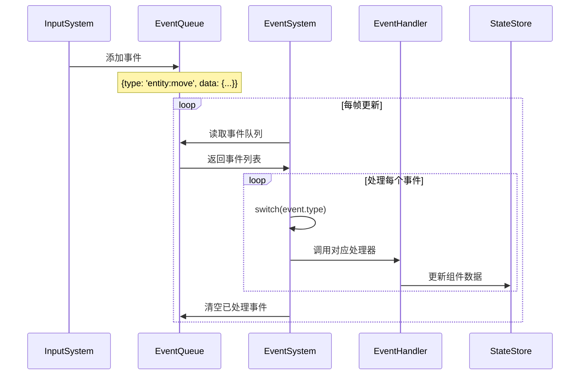
```mermaid
sequenceDiagram
    participant I as InputSystem
    participant Q as EventQueue
    participant E as EventSystem
    participant H as EventHandler
    participant S as StateStore
    
    I->>Q: 添加事件
    Note over Q: {type: 'entity:move', data: {...}}
    
    loop 每帧更新
        E->>Q: 读取事件队列
        Q->>E: 返回事件列表
        
        loop 处理每个事件
            E->>E: switch(event.type)
            E->>H: 调用对应处理器
            H->>S: 更新组件数据
        end
        
        E->>Q: 清空已处理事件
    end
```

### EventSystem 实现

```typescript
interface Event {
  type: string;
  data?: any;
  timestamp: number;
}

export class EventSystem extends System {
  core: Core;

  constructor(core: Core) {
    super();
    this.core = core;
  }

  // 添加事件到队列
  addEvent(type: string, data?: any) {
    this.core.stateStore.eventQueue.push({
      type,
      data,
      timestamp: Date.now(),
    });
  }

  // 处理事件
  processEvents() {
    const events = this.core.stateStore.eventQueue;

    events.forEach(event => {
      switch (event.type) {
        case 'entity:select':
          this.handleEntitySelect(event.data);
          break;
        case 'entity:deselect':
          this.handleEntityDeselect(event.data);
          break;
        case 'entity:move':
          this.handleEntityMove(event.data);
          break;
        case 'entity:delete':
          this.handleEntityDelete(event.data);
          break;
      }
    });

    // 清空已处理事件
    this.core.stateStore.eventQueue = [];
  }

  handleEntitySelect(entityId: string) {
    const selected = this.core.stateStore.selected.get(entityId);
    if (selected) {
      selected.value = true;
    }
  }

  handleEntityDeselect(entityId: string) {
    const selected = this.core.stateStore.selected.get(entityId);
    if (selected) {
      selected.value = false;
    }
  }

  handleEntityMove(data: { entityId: string; dx: number; dy: number }) {
    const position = this.core.stateStore.position.get(data.entityId);
    if (position) {
      position.x += data.dx;
      position.y += data.dy;
    }
  }

  handleEntityDelete(entityId: string) {
    // 从所有组件中删除实体数据
    this.core.stateStore.position.delete(entityId);
    this.core.stateStore.size.delete(entityId);
    this.core.stateStore.color.delete(entityId);
    this.core.stateStore.selected.delete(entityId);
    this.core.stateStore.rotation.delete(entityId);
    this.core.stateStore.type.delete(entityId);
  }

  update(stateStore: StateStore) {
    this.processEvents();
  }
}
```

## DSL 解析器

### DSL 解析架构

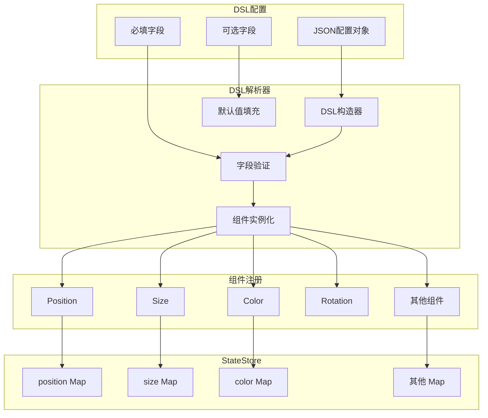
```mermaid
graph TB
    subgraph DSL配置
        A[JSON配置对象]
        B[必填字段]
        C[可选字段]
    end
    
    subgraph DSL解析器
        D[DSL构造器]
        E[字段验证]
        F[默认值填充]
        G[组件实例化]
    end
    
    subgraph 组件注册
        H[Position]
        I[Size]
        J[Color]
        K[Rotation]
        L[其他组件]
    end
    
    subgraph StateStore
        M[position Map]
        N[size Map]
        O[color Map]
        P[其他 Map]
    end
    
    A --> D
    B --> E
    C --> F
    D --> E
    E --> G
    
    G --> H
    G --> I
    G --> J
    G --> K
    G --> L
    
    H --> M
    I --> N
    J --> O
    L --> P
```

### DSL 解析流程

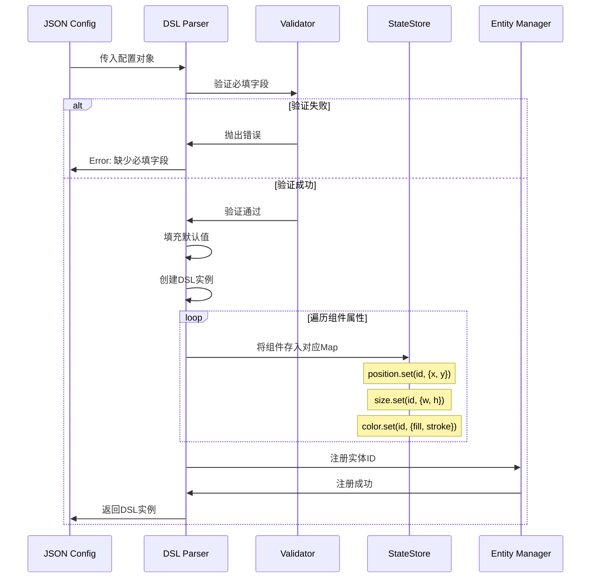
```mermaid
sequenceDiagram
    participant C as JSON Config
    participant D as DSL Parser
    participant V as Validator
    participant S as StateStore
    participant E as Entity Manager
    
    C->>D: 传入配置对象
    D->>V: 验证必填字段
    
    alt 验证失败
        V->>D: 抛出错误
        D->>C: Error: 缺少必填字段
    else 验证成功
        V->>D: 验证通过
        D->>D: 填充默认值
        D->>D: 创建DSL实例
        
        loop 遍历组件属性
            D->>S: 将组件存入对应Map
            Note over S: position.set(id, {x, y})
            Note over S: size.set(id, {w, h})
            Note over S: color.set(id, {fill, stroke})
        end
        
        D->>E: 注册实体ID
        E->>D: 注册成功
        D->>C: 返回DSL实例
    end
```

### DSL 类实现

```typescript
export class DSL {
  id: string;
  type: string;
  position: Position;
  size: Size;
  color: Color;
  selected?: { value: boolean; hovered: boolean };
  rotation?: { value: number };
  font?: Font;
  lineWidth?: { value: number };
  img?: Img;
  scale?: Scale;
  polygon?: Polygon;
  ellipseRadius?: EllipseRadius;

  constructor(config: any) {
    this.id = config.id;
    this.type = config.type;
    this.position = config.position;
    this.size = config.size;
    this.color = config.color;
    this.selected = config.selected || { value: false, hovered: false };
    this.rotation = config.rotation || { value: 0 };
    this.font = config.font;
    this.lineWidth = config.lineWidth || { value: 1 };
    this.img = config.img;
    this.scale = config.scale;
    this.polygon = config.polygon;
    this.ellipseRadius = config.ellipseRadius;

    this.validate();
  }

  validate() {
    if (!this.id) throw new Error('DSL 缺少 id 字段');
    if (!this.type) throw new Error('DSL 缺少 type 字段');
    if (!this.position) throw new Error('DSL 缺少 position 字段');
    if (!this.size) throw new Error('DSL 缺少 size 字段');
    if (!this.color) throw new Error('DSL 缺少 color 字段');
  }
}
```

### DSL 使用示例

```typescript
const dsls = [
  {
    id: "rect-1",
    type: "rect",
    position: { x: 100, y: 100 },
    size: { width: 200, height: 100 },
    color: { 
      fillColor: "#FF5000", 
      strokeColor: "#000000" 
    },
    rotation: { value: 0 },
    selected: { value: false },
  },
  {
    id: "text-1",
    type: "text",
    position: { x: 120, y: 130 },
    size: { width: 160, height: 40 },
    color: { fillColor: "", strokeColor: "" },
    font: {
      family: "Arial",
      size: 24,
      weight: "bold",
      text: "Hello World",
      fillColor: "#FFFFFF",
    },
  },
  {
    id: "ellipse-1",
    type: "ellipse",
    position: { x: 350, y: 100 },
    size: { width: 120, height: 80 },
    color: { 
      fillColor: "#00BFFF", 
      strokeColor: "#000000" 
    },
  },
];

// 初始化 Core
const core = new Core(dsls);
```

## Canvas 组件集成

### Canvas 组件架构

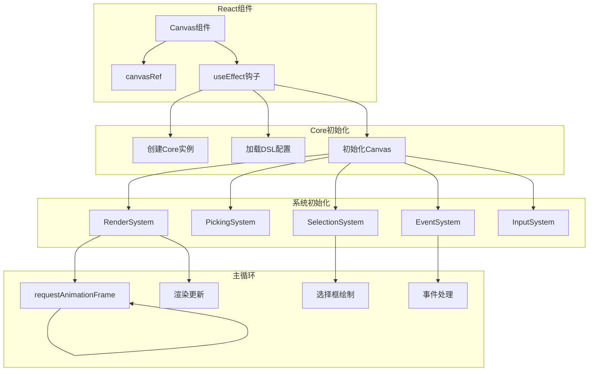
```mermaid
graph TB
    subgraph "React组件"
        A[Canvas组件]
        B[canvasRef]
        C[useEffect钩子]
    end
    
    subgraph "Core初始化"
        D[创建Core实例]
        E[加载DSL配置]
        F[初始化Canvas]
    end
    
    subgraph "系统初始化"
        G[RenderSystem]
        H[PickingSystem]
        I[SelectionSystem]
        J[EventSystem]
        K[InputSystem]
    end
    
    subgraph "主循环"
        L[requestAnimationFrame]
        M[事件处理]
        N[渲染更新]
        O[选择框绘制]
    end
    
    A --> B
    A --> C
    C --> D
    C --> E
    C --> F
    
    F --> G
    F --> H
    F --> I
    F --> J
    F --> K
    
    G --> L
    J --> M
    G --> N
    I --> O
    
    L --> L
```

### 系统初始化流程

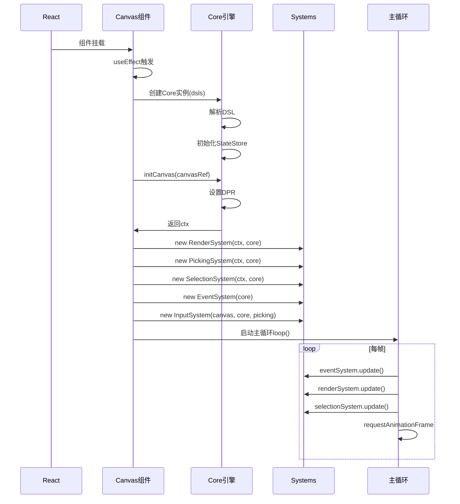
```mermaid
sequenceDiagram
    participant R as React
    participant C as Canvas组件
    participant Core as Core引擎
    participant S as Systems
    participant L as 主循环
    
    R->>C: 组件挂载
    C->>C: useEffect触发
    C->>Core: 创建Core实例(dsls)
    Core->>Core: 解析DSL
    Core->>Core: 初始化StateStore
    
    C->>Core: initCanvas(canvasRef)
    Core->>Core: 设置DPR
    Core->>C: 返回ctx
    
    C->>S: new RenderSystem(ctx, core)
    C->>S: new PickingSystem(ctx, core)
    C->>S: new SelectionSystem(ctx, core)
    C->>S: new EventSystem(core)
    C->>S: new InputSystem(canvas, core, picking)
    
    C->>L: 启动主循环loop()
    
    loop 每帧
        L->>S: eventSystem.update()
        L->>S: renderSystem.update()
        L->>S: selectionSystem.update()
        L->>L: requestAnimationFrame
    end
```

### Canvas.tsx 实现

```typescript
import { useEffect, useRef, useState } from "react";
import { Core } from "../Core/Core";
import { RenderSystem } from "../Core/System/RenderSystem/RenderSystem";
import { SelectionSystem } from "../Core/System/SelectionSystem";
import { PickingSystem } from "../Core/System/PickingSystem";
import { EventSystem } from "../Core/System/EventSystem";
import { InputSystem } from "../Core/System/InputSystem";

function Canvas() {
  const canvasRef = useRef<HTMLCanvasElement>(null);
  const [core, setCore] = useState<Core | null>(null);

  useEffect(() => {
    if (!canvasRef.current) return;

    // 初始化 Core
    const dsls = []; // 从服务器或状态加载 DSL
    const coreInstance = new Core(dsls);
    const ctx = coreInstance.initCanvas(canvasRef.current);

    // 初始化系统
    const renderSystem = new RenderSystem(ctx, coreInstance);
    const pickingSystem = new PickingSystem(ctx, coreInstance);
    const selectionSystem = new SelectionSystem(ctx, coreInstance);
    const eventSystem = new EventSystem(coreInstance);
    const inputSystem = new InputSystem(
      canvasRef.current,
      coreInstance,
      pickingSystem
    );

    // 主循环
    function loop() {
      eventSystem.update(coreInstance.stateStore);
      renderSystem.update(coreInstance.stateStore);
      selectionSystem.update(coreInstance.stateStore);
      requestAnimationFrame(loop);
    }

    loop();
    setCore(coreInstance);

    return () => {
      // 清理事件监听
    };
  }, []);

  return (
    <div className="canvas-container">
      <canvas 
        ref={canvasRef} 
        width={800} 
        height={600}
        style={{ border: '1px solid #ccc' }}
      />
    </div>
  );
}

export default Canvas;
```

## 性能优化技巧

### 性能优化架构

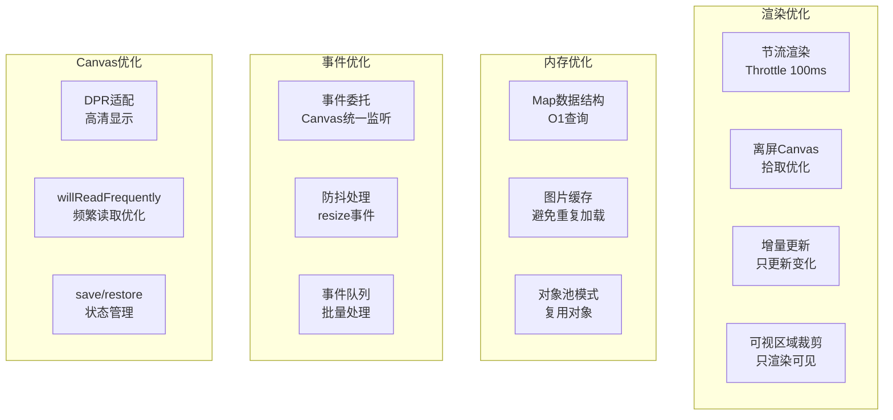
```mermaid
graph TB
    subgraph "渲染优化"
        A[节流渲染<br/>Throttle 100ms]
        B[离屏Canvas<br/>拾取优化]
        C[增量更新<br/>只更新变化]
        D[可视区域裁剪<br/>只渲染可见]
    end
    
    subgraph "内存优化"
        E[Map数据结构<br/>O1查询]
        F[图片缓存<br/>避免重复加载]
        G[对象池模式<br/>复用对象]
    end
    
    subgraph "事件优化"
        H[事件委托<br/>Canvas统一监听]
        I[防抖处理<br/>resize事件]
        J[事件队列<br/>批量处理]
    end
    
    subgraph "Canvas优化"
        K[DPR适配<br/>高清显示]
        L[willReadFrequently<br/>频繁读取优化]
        M[save/restore<br/>状态管理]
    end
```

### 性能优化对比

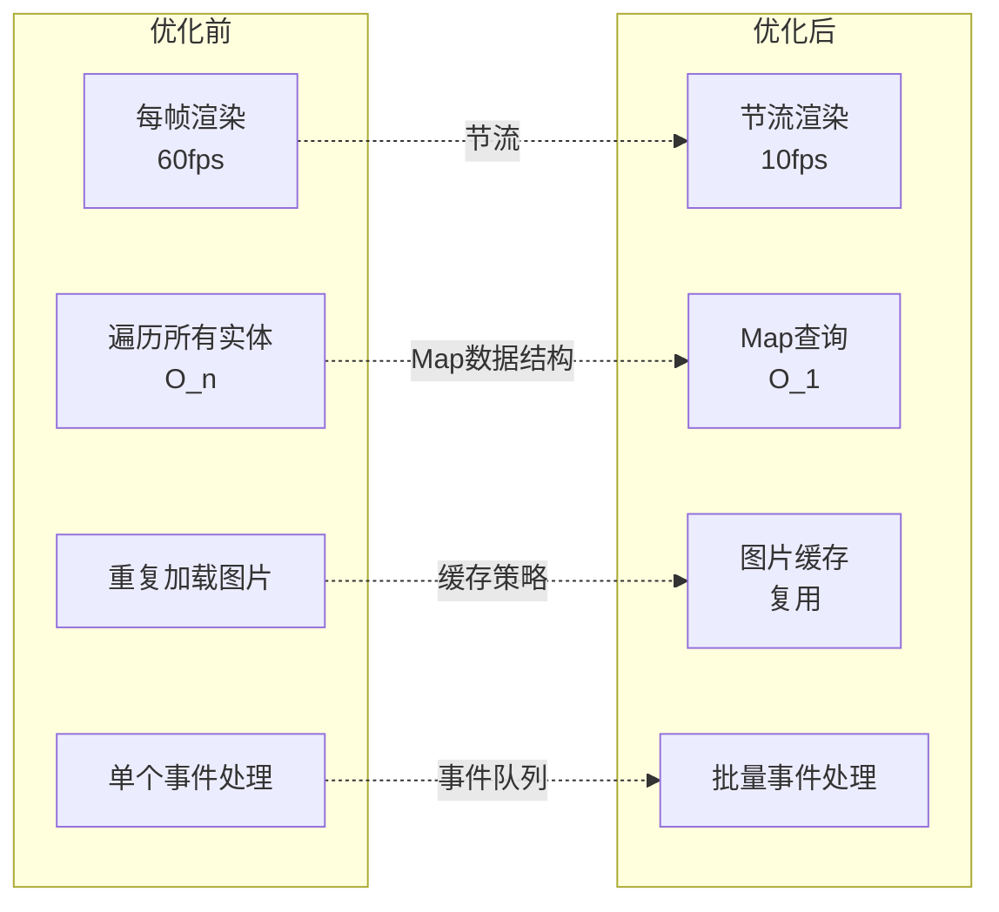
```mermaid
graph LR
    subgraph "优化前"
        A1[每帧渲染<br/>60fps]
        A2[遍历所有实体<br/>O_n]
        A3[重复加载图片]
        A4[单个事件处理]
    end
    
    subgraph "优化后"
        B1[节流渲染<br/>10fps]
        B2[Map查询<br/>O_1]
        B3[图片缓存<br/>复用]
        B4[批量事件处理]
    end
    
    A1 -.节流.-> B1
    A2 -.Map数据结构.-> B2
    A3 -.缓存策略.-> B3
    A4 -.事件队列.-> B4
```

### 节流渲染

```typescript
import { throttle } from 'lodash';

throttledRender = throttle((stateStore: StateStore) => {
  this.render(stateStore, this.ctx);
}, 100); // 限制为 100ms 一次
```

### 离屏 Canvas

```typescript
// 用于图形拾取，不显示
const offscreenCanvas = document.createElement('canvas');
const offscreenCtx = offscreenCanvas.getContext('2d');
```

### 图片缓存

```typescript
private imageCache = new Map<string, HTMLImageElement>();

loadImage(src: string): HTMLImageElement {
  if (this.imageCache.has(src)) {
    return this.imageCache.get(src)!;
  }
  
  const img = new Image();
  img.src = src;
  this.imageCache.set(src, img);
  return img;
}
```

### 可视区域裁剪

```typescript
render(stateStore: StateStore) {
  const viewport = this.getViewport();
  
  stateStore.position.forEach((position, entityId) => {
    const size = stateStore.size.get(entityId);
    if (!size) return;
    
    // 只渲染可视区域内的实体
    if (this.isInViewport(position, size, viewport)) {
      this.drawShape(stateStore, entityId);
    }
  });
}
```

## 完整数据流架构

### 端到端数据流

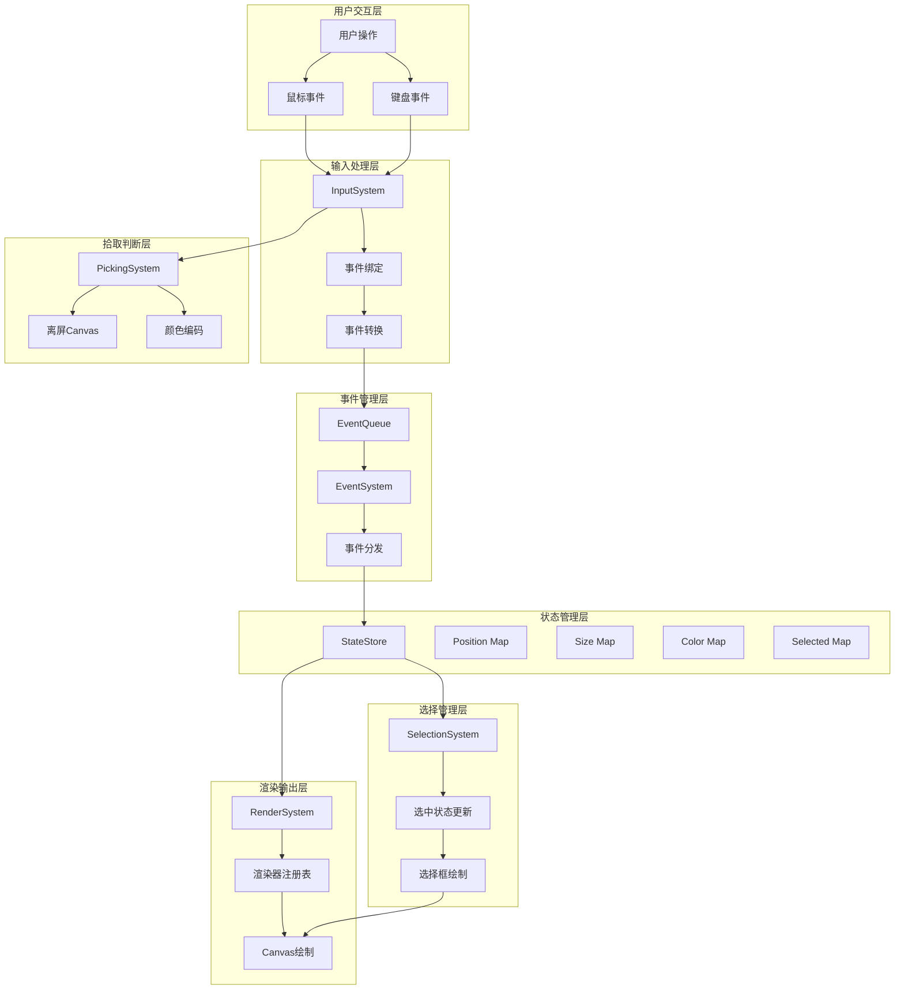
```mermaid
graph TB
    subgraph "用户交互层"
        A[用户操作]
        B[鼠标事件]
        C[键盘事件]
    end
    
    subgraph "输入处理层"
        D[InputSystem]
        E[事件绑定]
        F[事件转换]
    end
    
    subgraph "事件管理层"
        G[EventQueue]
        H[EventSystem]
        I[事件分发]
    end
    
    subgraph "状态管理层"
        J[StateStore]
        K[Position Map]
        L[Size Map]
        M[Color Map]
        N[Selected Map]
    end
    
    subgraph "拾取判断层"
        O[PickingSystem]
        P[离屏Canvas]
        Q[颜色编码]
    end
    
    subgraph "选择管理层"
        R[SelectionSystem]
        S[选中状态更新]
        T[选择框绘制]
    end
    
    subgraph "渲染输出层"
        U[RenderSystem]
        V[渲染器注册表]
        W[Canvas绘制]
    end
    
    A --> B
    A --> C
    B --> D
    C --> D
    
    D --> E
    E --> F
    F --> G
    
    G --> H
    H --> I
    I --> J
    
    D --> O
    O --> P
    O --> Q
    
    J --> R
    R --> S
    S --> T
    
    J --> U
    U --> V
    V --> W
    
    T --> W
```

### 完整交互流程

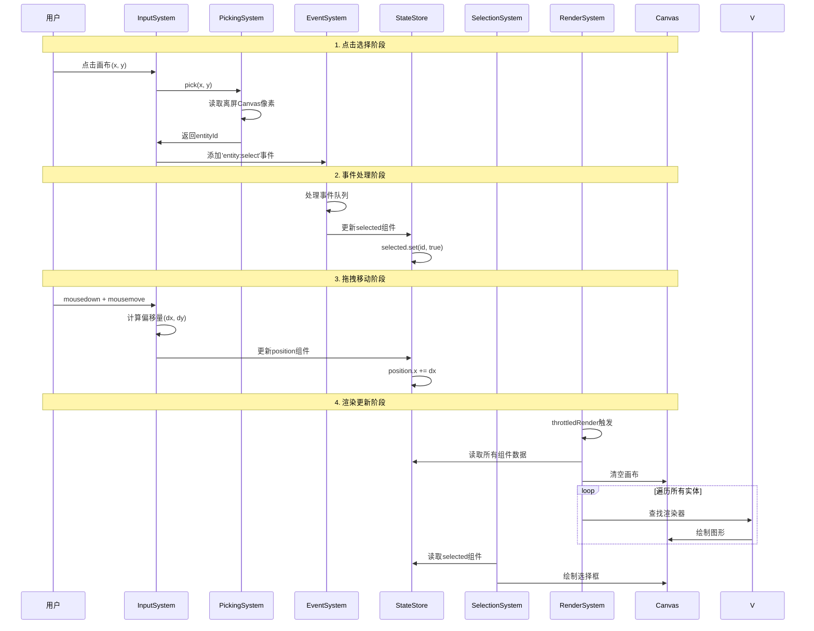
```mermaid
sequenceDiagram
    participant U as 用户
    participant I as InputSystem
    participant P as PickingSystem
    participant E as EventSystem
    participant S as StateStore
    participant Sel as SelectionSystem
    participant R as RenderSystem
    participant C as Canvas
    
    Note over U,C: 1. 点击选择阶段
    U->>I: 点击画布(x, y)
    I->>P: pick(x, y)
    P->>P: 读取离屏Canvas像素
    P->>I: 返回entityId
    I->>E: 添加'entity:select'事件
    
    Note over U,C: 2. 事件处理阶段
    E->>E: 处理事件队列
    E->>S: 更新selected组件
    S->>S: selected.set(id, true)
    
    Note over U,C: 3. 拖拽移动阶段
    U->>I: mousedown + mousemove
    I->>I: 计算偏移量(dx, dy)
    I->>S: 更新position组件
    S->>S: position.x += dx
    
    Note over U,C: 4. 渲染更新阶段
    R->>R: throttledRender触发
    R->>S: 读取所有组件数据
    R->>C: 清空画布
    
    loop 遍历所有实体
        R->>V: 查找渲染器
        V->>C: 绘制图形
    end
    
    Sel->>S: 读取selected组件
    Sel->>C: 绘制选择框
```

## 架构优势总结

### 设计优势

```mermaid
mindmap
  root((ECS架构优势))
    高性能
      数据局部性
      缓存友好
      Map O1查询
      节流渲染
    可扩展性
      添加新组件
      添加新系统
      添加新渲染器
      插件化设计
    可维护性
      数据逻辑分离
      单一职责
      模块化设计
      清晰的依赖关系
    灵活性
      组合优于继承
      动态添加删除组件
      运行时修改
      DSL配置驱动
```

### 技术亮点

| 特性 | 实现方式 | 优势 |
|------|----------|------|
| **ECS 架构** | Entity-Component-System 模式 | 数据与逻辑分离，高性能 |
| **颜色编码拾取** | 离屏 Canvas + RGB 映射 | 精确快速，支持复杂图形 |
| **节流渲染** | Lodash throttle 100ms | 降低 CPU 使用，提升性能 |
| **Map 数据结构** | StateStore 使用 Map | O(1) 查询，内存高效 |
| **图片缓存** | ImageCache Map | 避免重复加载，提升速度 |
| **事件队列** | EventQueue 批量处理 | 解耦系统，灵活扩展 |
| **DSL 配置** | JSON 声明式配置 | 易于序列化，可视化编辑 |
| **DPR 适配** | Canvas 高清适配 | 支持 Retina 屏幕 |

## 总结

本文档详细介绍了 Duck-Core 前端画布系统的核心功能实现，涵盖：

1. ✅ **ECS 渲染引擎**：高性能的图形渲染系统
2. ✅ **图形拾取系统**：基于颜色编码的精确拾取算法
3. ✅ **选择交互系统**：单选、多选、拖拽完整实现
4. ✅ **输入处理系统**：鼠标、键盘事件统一管理
5. ✅ **事件管理系统**：事件队列和分发机制
6. ✅ **DSL 解析系统**：声明式配置解析和验证
7. ✅ **性能优化**：节流、缓存、可视区域裁剪等优化技术

所有实现都基于 TypeScript 类型安全，遵循 SOLID 原则，确保代码的可维护性和可扩展性。


---

# 后端架构设计

## 概述

Duck-Core 后端基于 Go 语言的 Gin 框架构建，采用经典的分层架构设计，提供 RESTful API 和 gRPC 服务，支持用户认证、权限管理、部门管理等核心业务功能。

## 整体架构

```mermaid
graph TB
    subgraph "客户端层"
        A[Web前端]
        B[移动端]
        C[其他服务]
    end
    
    subgraph "接口层"
        D[HTTP API<br/>Gin Router]
        E[gRPC Server]
    end
    
    subgraph "中间件层"
        F[Recovery]
        G[Trace ID]
        H[Logger]
        I[JWT Auth]
        J[白名单]
    end
    
    subgraph "业务层"
        K[Handler层]
        L[Service层]
    end
    
    subgraph "数据层"
        M[Repository层]
        N[(MySQL数据库)]
    end
    
    A --> D
    B --> D
    C --> E
    D --> F
    F --> G
    G --> H
    H --> I
    I --> J
    J --> K
    E --> K
    K --> L
    L --> M
    M --> N
```

## 分层架构设计

### 1. 路由层（Router）

**职责**：
- 定义 API 端点路径
- HTTP 方法映射
- 请求分发到对应的 Handler
- 路由分组管理

**目录结构**：
```
internal/router/
├── router.go              # 路由注册中心
├── user_router.go         # 用户路由
├── roles_router.go        # 角色路由
├── permissions_router.go  # 权限路由
├── department_router.go   # 部门路由
├── dict_router.go         # 字典路由
└── rpc_router.go          # RPC 路由
```

**路由注册流程**：
```mermaid
graph LR
    A[main.go] --> B[RegisterRoutes]
    B --> C[创建路由组 /api]
    C --> D[注册用户路由]
    C --> E[注册角色路由]
    C --> F[注册权限路由]
    C --> G[注册部门路由]
    C --> H[注册字典路由]
```

**示例代码**：
```go
func RegisterRoutes(r *gin.Engine, container *dig.Container) {
    route := r.Group("api")
    
    // Swagger 文档
    r.GET("/swagger/*any", ginSwagger.WrapHandler(swaggerFiles.Handler))
    
    // 404 处理
    r.NoRoute(func(c *gin.Context) {
        c.JSON(http.StatusNotFound, dto.Fail(404, "接口不存在"))
    })
    
    // 注册各模块路由
    RegisterUserRoutes(route, container)
    RegisterRolesRoutes(route, container)
    RegisterPermissionsRoutes(route, container)
    RegisterDepartmentRoutes(route, container)
    RegisterDictRoutes(route, container)
    RegisterRpcRoutes(route, container)
}
```

### 2. 处理层（Handler）

**职责**：
- 接收并验证请求参数
- 调用业务服务层
- 处理响应格式
- 错误处理和状态码返回

**设计原则**：
- 薄处理层，不包含业务逻辑
- 统一的响应格式
- 完整的参数校验
- Swagger 文档注释

**Handler 结构**：
```go
type UserHandler struct {
    service service.UserService
}

func NewUserHandler(service service.UserService) *UserHandler {
    return &UserHandler{service: service}
}
```

**标准处理流程**：
```mermaid
sequenceDiagram
    participant C as Client
    participant H as Handler
    participant S as Service
    
    C->>H: HTTP Request
    H->>H: 参数绑定
    H->>H: 参数验证
    H->>S: 调用业务方法
    S->>H: 返回结果
    H->>H: 格式化响应
    H->>C: JSON Response
```

### 3. 服务层（Service）

**职责**：
- 实现核心业务逻辑
- 事务管理
- 数据验证和转换
- 调用数据访问层

**服务接口设计**：
```go
type UserService interface {
    Login(c *gin.Context, body dto.LoginBody) dto.Result[dto.LoginResult]
    Register(c *gin.Context, body dto.RegBody) error
    List(ctx *gin.Context, query dto.ListQuery) (dto.Result[dto.List[dto.UserWithRole]], error)
    Update(c *gin.Context, body dto.UserRoleRequest) error
    UpdateRoles(c *gin.Context, id int, body *dto.User) error
    Delete(c *gin.Context, body dto.DeleteIds) error
}
```

**服务实现模式**：
```go
type userService struct {
    db  *gorm.DB
    log *log.LoggerWithContext
}

func NewUserService(db *gorm.DB, log *log.LoggerWithContext) UserService {
    return &userService{db: db, log: log}
}
```

**核心服务模块**：

| 服务 | 文件 | 功能 |
|------|------|------|
| UserService | users_service.go | 用户管理、登录认证 |
| RoleService | roles_service.go | 角色管理、权限分配 |
| PermissionService | permissions_service.go | 权限管理 |
| DepartmentService | department_service.go | 部门树形管理 |
| DictService | dict_service.go | 字典数据管理 |

### 4. 数据访问层（Repository）

**职责**：
- 数据库 CRUD 操作
- 数据库连接管理
- 表结构迁移

**GORM 配置**：
```go
func NewDB(config *config.Config) (*gorm.DB, error) {
    dsn := fmt.Sprintf("%s:%s@tcp(%s:%s)/%s?charset=utf8mb4&parseTime=True&loc=Local",
        config.Database.Username,
        config.Database.Password,
        config.Database.Host,
        config.Database.Port,
        config.Database.DBName,
    )
    
    db, err := gorm.Open(mysql.Open(dsn), &gorm.Config{
        Logger: logger.Default.LogMode(logger.Info),
    })
    
    return db, err
}
```

## 依赖注入架构（DI）

### DI 容器设计

使用 `uber-go/dig` 实现依赖注入，解耦各层之间的依赖关系。

```mermaid
graph TD
    A[DI Container] --> B[Config 配置]
    A --> C[Logger 日志]
    A --> D[DB 数据库]
    A --> E[gRPC Clients]
    A --> F[Services 服务层]
    A --> G[Handlers 处理层]
    
    B -.-> D
    C -.-> F
    D -.-> F
    E -.-> F
    F -.-> G
```

### 初始化流程

```go
func NewContainer() *dig.Container {
    container := dig.New()
    
    // 1. 公共日志管理器
    log.NewProvideLogger(container)
    
    // 2. gRPC 客户端
    grpcContainer.NewProvideClients(container)
    
    // 3. 配置
    config.ProvideConfig(container)
    
    // 4. 数据库
    repo.ProvideDB(container)
    
    // 5. 服务层
    service.Provide(container)
    
    // 6. 处理层
    handler.Provide(container)
    
    return container
}
```

### 依赖注册

**服务层注册**：
```go
func Provide(container *dig.Container) {
    ProvideUserService(container)
    ProvideRoleService(container)
    ProvidePermissionService(container)
    ProvideDepartmentService(container)
    ProvideDictService(container)
}

func ProvideUserService(container *dig.Container) {
    if err := container.Provide(NewUserService); err != nil {
        panic(err)
    }
}
```

**处理层注册**：
```go
func Provide(container *dig.Container) {
    container.Provide(handler.NewUserHandler)
    container.Provide(handler.NewRoleHandler)
    container.Provide(handler.NewPermissionHandler)
    container.Provide(handler.NewDepartmentHandler)
    container.Provide(handler.NewDictHandler)
}
```

## 中间件架构

### 中间件执行链

```mermaid
graph LR
    A[请求] --> B[Recovery<br/>恢复]
    B --> C[Trace<br/>追踪ID]
    C --> D[Logger<br/>日志]
    D --> E[AuthWhiteList<br/>白名单]
    E --> F[JWT<br/>认证]
    F --> G[Handler<br/>业务处理]
```

### 中间件详解

#### 1. Recovery 中间件

**功能**：捕获 panic，防止服务崩溃

```go
func RecoveryWithZap(logger *zap.Logger) gin.HandlerFunc {
    return func(c *gin.Context) {
        defer func() {
            if err := recover(); err != nil {
                // 记录错误堆栈
                logger.Error("panic recovered",
                    zap.Any("error", err),
                    zap.String("stack", string(debug.Stack())),
                )
                
                // 返回 500 错误
                c.JSON(500, gin.H{"error": "Internal Server Error"})
                c.Abort()
            }
        }()
        c.Next()
    }
}
```

#### 2. Trace 中间件

**功能**：为每个请求生成唯一追踪 ID

```go
func Trace(c *gin.Context) {
    traceId := uuid.New().String()
    c.Set("traceId", traceId)
    c.Header("X-Trace-ID", traceId)
    c.Next()
}
```

#### 3. Logger 中间件

**功能**：记录请求和响应日志

```go
func (l *LoggerMiddleware) Logger(c *gin.Context) {
    start := time.Now()
    path := c.Request.URL.Path
    
    c.Next()
    
    latency := time.Since(start)
    
    l.logger.Info("request",
        zap.String("method", c.Request.Method),
        zap.String("path", path),
        zap.Int("status", c.Writer.Status()),
        zap.Duration("latency", latency),
        zap.String("ip", c.ClientIP()),
        zap.String("traceId", c.GetString("traceId")),
    )
}
```

#### 4. JWT 中间件

**功能**：验证访问令牌

```go
func JWTAuth() gin.HandlerFunc {
    return func(c *gin.Context) {
        token := c.GetHeader("Authorization")
        
        if token == "" {
            c.JSON(401, dto.Fail(401, "未授权"))
            c.Abort()
            return
        }
        
        // 验证 Token
        claims, err := jwt.ParseToken(token)
        if err != nil {
            c.JSON(401, dto.Fail(401, "Token 无效"))
            c.Abort()
            return
        }
        
        c.Set("userId", claims.UserId)
        c.Next()
    }
}
```

## gRPC 服务架构

### gRPC 组件结构

```
internal/grpc/
├── server.go           # gRPC 服务器
├── register.go         # 服务注册
├── handler/            # gRPC 处理器
│   └── hello_handler.go
├── client/             # gRPC 客户端
│   └── user_client.go
├── container/          # 客户端容器
│   ├── clients.go
│   └── container.go
└── proto/              # Protocol Buffers
    ├── hello.proto
    ├── hello.pb.go
    └── hello_grpc.pb.go
```

### gRPC 服务器启动

```go
func IntServer(container *dig.Container) {
    lis, err := net.Listen("tcp", ":50051")
    if err != nil {
        log.Fatalf("failed to listen: %v", err)
    }
    
    s := grpc.NewServer()
    
    // 注册服务
    RegisterServices(s, container)
    
    // 启动服务器
    if err := s.Serve(lis); err != nil {
        log.Fatalf("failed to serve: %v", err)
    }
}
```

### gRPC 客户端管理

```go
type Clients struct {
    UserClient user.UserServiceClient
}

func NewClients() *Clients {
    conn, err := grpc.Dial("localhost:50051", grpc.WithInsecure())
    if err != nil {
        log.Fatalf("did not connect: %v", err)
    }
    
    return &Clients{
        UserClient: user.NewUserServiceClient(conn),
    }
}
```

## 配置管理架构

### 配置文件结构

```
config/
├── config.go           # 配置加载
├── config.dev.yaml     # 开发环境
└── config.prod.yaml    # 生产环境
```

### 配置数据结构

```go
type Config struct {
    Database DatabaseConfig `yaml:"database"`
    Server   ServerConfig   `yaml:"server"`
    JWT      JWTConfig      `yaml:"jwt"`
    GRPC     GRPCConfig     `yaml:"grpc"`
}

type DatabaseConfig struct {
    Host     string `yaml:"host"`
    Port     string `yaml:"port"`
    Username string `yaml:"username"`
    Password string `yaml:"password"`
    DBName   string `yaml:"dbname"`
}
```

### 配置加载

```go
func LoadConfig() (*Config, error) {
    env := os.Getenv("ENV")
    if env == "" {
        env = "development"
    }
    
    configFile := fmt.Sprintf("config/config.%s.yaml", env)
    
    viper.SetConfigFile(configFile)
    if err := viper.ReadInConfig(); err != nil {
        return nil, err
    }
    
    var config Config
    if err := viper.Unmarshal(&config); err != nil {
        return nil, err
    }
    
    return &config, nil
}
```

## 日志架构

### 日志系统设计

```mermaid
graph TB
    A[请求] --> B[Trace中间件生成ID]
    B --> C[Logger中间件]
    C --> D[业务代码]
    D --> E[Zap Logger]
    E --> F[控制台输出]
    E --> G[文件输出]
    E --> H[日志聚合系统]
```

### Zap 日志配置

```go
func InitLogger() (*zap.Logger, error) {
    config := zap.Config{
        Level:            zap.NewAtomicLevelAt(zap.InfoLevel),
        Development:      false,
        Encoding:         "json",
        EncoderConfig:    zap.NewProductionEncoderConfig(),
        OutputPaths:      []string{"stdout", "logs/app.log"},
        ErrorOutputPaths: []string{"stderr"},
    }
    
    return config.Build()
}
```

### 日志上下文管理

```go
type LoggerWithContext struct {
    logger *zap.Logger
}

func (l *LoggerWithContext) WithContext(c *gin.Context) *zap.Logger {
    traceId := c.GetString("traceId")
    return l.logger.With(zap.String("traceId", traceId))
}
```

## 安全架构

### 认证流程

```mermaid
sequenceDiagram
    participant C as 客户端
    participant H as Handler
    participant S as Service
    participant J as JWT工具
    participant DB as 数据库
    
    C->>H: POST /login
    H->>S: Login(account, password)
    S->>DB: 查询用户
    DB->>S: 用户数据
    S->>S: SHA256验证密码
    S->>J: 生成Token
    J->>S: AccessToken + RefreshToken
    S->>H: 登录结果
    H->>C: 返回Token
```

### 授权流程

```mermaid
graph TB
    A[请求] --> B{携带Token?}
    B -->|否| C[返回401]
    B -->|是| D[JWT中间件验证]
    D --> E{Token有效?}
    E -->|否| C
    E -->|是| F[解析用户信息]
    F --> G{检查权限}
    G -->|无权限| H[返回403]
    G -->|有权限| I[执行业务逻辑]
```

### RBAC 权限模型

```mermaid
graph LR
    A[用户] -->|拥有| B[角色]
    B -->|拥有| C[权限]
    C -->|控制| D[资源访问]
```

## 数据库架构

### 连接池配置

```go
sqlDB, _ := db.DB()

// 设置连接池
sqlDB.SetMaxIdleConns(10)           // 最大空闲连接数
sqlDB.SetMaxOpenConns(100)          // 最大打开连接数
sqlDB.SetConnMaxLifetime(time.Hour) // 连接最大生命周期
```

### 事务管理

```go
func (s *userService) CreateWithRoles(user *model.User, roleIds []int) error {
    return s.db.Transaction(func(tx *gorm.DB) error {
        // 创建用户
        if err := tx.Create(user).Error; err != nil {
            return err
        }
        
        // 分配角色
        var roles []*model.Role
        if err := tx.Find(&roles, roleIds).Error; err != nil {
            return err
        }
        
        return tx.Model(user).Association("Roles").Append(roles)
    })
}
```

## 错误处理架构

### 统一错误响应

```go
type Result[T any] struct {
    Success bool   `json:"success"`
    Code    int    `json:"code"`
    Message string `json:"message"`
    Data    T      `json:"data,omitempty"`
}

func Success[T any](data T) Result[T] {
    return Result[T]{
        Success: true,
        Code:    200,
        Data:    data,
    }
}

func Fail(code int, message string) Result[any] {
    return Result[any]{
        Success: false,
        Code:    code,
        Message: message,
    }
}
```

## 性能优化

### 数据库优化

1. **索引优化**：关键字段添加索引
2. **预加载**：减少 N+1 查询
3. **批量操作**：使用批量插入/更新
4. **连接池**：复用数据库连接

### API 性能优化

1. **分页查询**：限制单次返回数据量
2. **缓存策略**：使用 Redis 缓存热点数据
3. **异步处理**：耗时操作使用异步
4. **gRPC**：服务间通信使用 gRPC
