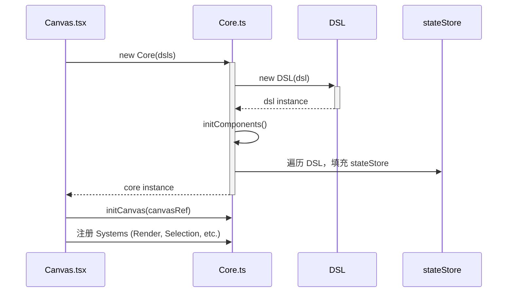
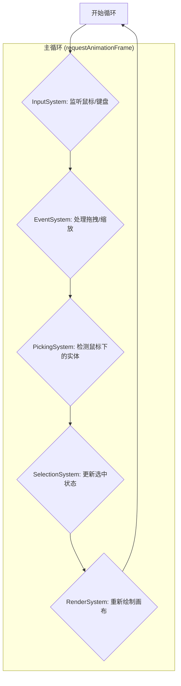

# 前端架构解析：实体-组件-系统 (ECS)

<cite>
  **本文档中引用的文件**
  * [src/Core/Core.ts](file:///home/guangguang/project/duck-core/frontend/src/Core/Core.ts)
  * [src/Core/Entity/Entity.ts](file:///home/guangguang/project/duck-core/frontend/src/Core/Entity/Entity.ts)
  * [src/Core/Components/index.ts](file:///home/guangguang/project/duck-core/frontend/src/Core/Components/index.ts)
  * [src/Core/System/RenderSystem/RenderSystem.ts](file:///home/guangguang/project/duck-core/frontend/src/Core/System/RenderSystem/RenderSystem.ts)
  * [src/Canvas/Canvas.tsx](file:///home/guangguang/project/duck-core/frontend/src/Canvas/Canvas.tsx)
</cite>

## 目录
1. [简介：ECS 架构模式](#简介-ecs-架构模式)
2. [核心概念详解](#核心概念详解)
    1. [Core: 引擎核心](#core-引擎核心)
    2. [Entity: 实体](#entity-实体)
    3. [Component: 组件](#component-组件)
    4. [System: 系统](#system-系统)
3. [工作流程](#工作流程)
    1. [初始化流程](#初始化流程)
    2. [渲染与交互循环](#渲染与交互循环)
4. [代码结构分析](#代码结构分析)
    1. [`Core`](#core)
    2. [`Components`](#components)
    3. [`Systems`](#systems)
    4. [`Entity`](#entity)
5. [总结](#总结)

## 简介：ECS 架构模式

前端 `duck-core` 的核心部分采用了一种在游戏开发中非常流行的架构模式——**实体-组件-系统 (Entity-Component-System, ECS)**。这种模式通过组合而非继承来构建对象，极大地提高了代码的灵活性、可重用性和可维护性。

*   **实体 (Entity)**: 仅仅是一个唯一的 ID，它本身不包含任何数据或逻辑。
*   **组件 (Component)**: 纯粹的数据容器，用于描述实体的某个方面（如位置、颜色、大小）。
*   **系统 (System)**: 负责处理具有特定组件组合的实体，实现具体的业务逻辑（如渲染、物理模拟、用户输入处理）。

```mermaid
graph TD
    subgraph "ECS 架构"
        E[Entity (ID)] -- "拥有" --> C1[Component A (数据)]
        E -- "拥有" --> C2[Component B (数据)]
        E -- "拥有" --> C3[Component C (数据)]

        S[System (逻辑)] -- "操作" --> E
    end

    style E fill:#dae8fc,stroke:#6c8ebf,stroke-width:2px
    style C1 fill:#d5e8d4,stroke:#82b366,stroke-width:1px
    style C2 fill:#d5e8d4,stroke:#82b366,stroke-width:1px
    style C3 fill:#d5e8d4,stroke:#82b366,stroke-width:1px
    style S fill:#f8cecc,stroke:#b85450,stroke-width:2px
```

## 核心概念详解

### Core: 引擎核心

`Core/Core.ts` 是整个 ECS 引擎的“大脑”。它负责：
*   **状态管理**: 维护一个 `stateStore` 对象，该对象中的每个键都对应一种组件类型，值为一个 `Map`，存储着 `entityId -> componentData` 的映射。
*   **系统管理**: 持有所有 `System` 的实例，并在主循环中调用它们的 `update` 方法。
*   **初始化**: 接收 DSL (Domain-Specific Language) 数据，并将其解析为实体和组件，完成引擎的初始化。

### Entity: 实体

`Core/Entity/Entity.ts` 中的 `Entity` 类是一个实体管理器。它的主要职责是：
*   **生成唯一 ID**: 通过 `generateId` 方法为新实体创建一个唯一的 ID。
*   **ID 与颜色转换**: 为了实现高效的“拾取”（Picking）操作（即通过点击画布坐标识别物体），它提供了 `idToRGBA` 和 `rgbaToId` 方法。实体 ID 被编码成一种唯一的颜色，渲染到一个离屏画布上。当用户点击时，通过读取该点击坐标的颜色，就能快速反解出实体 ID。

### Component: 组件

`Core/Components/` 目录下的文件定义了各种组件。这些组件都是简单的数据结构（通常是 `class` 或 `type`），例如：
*   `Position.ts`: `{ x: number; y: number }`
*   `Size.ts`: `{ width: number; height: number }`
*   `Color.ts`: `{ fillColor: string; strokeColor: string }`
*   `Rotation.ts`: `{ value: number }`

这种设计使得为一个实体添加或移除某种特性变得非常简单，只需在 `stateStore` 中增删相应的组件数据即可。

### System: 系统

`Core/System/` 目录下的文件定义了各种系统，它们是行为和逻辑的载体。
*   **`RenderSystem`**: 遍历所有拥有 `Position`, `Size`, `Color` 等渲染相关组件的实体，并将它们绘制到 Canvas 上。它内部维护一个 `renderMap`，根据实体的 `type` 组件来调用不同的绘制函数（如绘制矩形、圆形、文本等）。
*   **`SelectionSystem`**: 处理实体的选中和取消选中逻辑。
*   **`PickingSystem`**: 利用 `Entity` 类的颜色编码能力，实现高效的鼠标拾取。
*   **`EventSystem`**: 处理高层级的事件，如拖拽、缩放。
*   **`InputSystem`**: 处理底层的鼠标和键盘输入。

## 工作流程

### 初始化流程


1.  React 组件 `Canvas.tsx` 在 `useEffect` 中被初始化。
2.  它创建了一个 `Core` 实例，并将预定义的 `dsls` (画布元素的描述) 传入。
3.  `Core` 的构造函数遍历 `dsls`，调用 `initComponents` 方法。
4.  `initComponents` 将每个 `dsl` 对象中的属性，按照组件类型分别存入 `stateStore` 的各个 `Map` 中。例如，`dsl.position` 存入 `stateStore.position`。
5.  `Canvas.tsx` 获取到 `canvas` 元素的引用后，调用 `core.initCanvas` 初始化上下文，并创建和注册所有需要的 `System`。

### 渲染与交互循环


1.  一个主循环（通常由 `requestAnimationFrame` 驱动）不断执行。
2.  在每一帧，`Core` 会依次调用所有已注册 `System` 的 `update` 方法。
3.  `InputSystem` 首先检查原始输入事件。
4.  `EventSystem` 根据输入状态，更新实体组件（例如，修改被拖拽物体的 `Position` 组件）。
5.  `RenderSystem` 最后执行，它会读取 `stateStore` 中最新的组件数据，清空画布，然后将所有实体重新绘制出来。

## 代码结构分析

*   **`Core`**: 位于 `src/Core/Core.ts`，是整个引擎的中心协调器。
*   **`Components`**: 位于 `src/Core/Components/`，定义了所有原子数据结构。
*   **`Systems`**: 位于 `src/Core/System/`，实现了所有业务逻辑。
*   **`Entity`**: 位于 `src/Core/Entity/Entity.ts`，提供了实体 ID 管理和拾取支持。

## 总结

`duck-core` 前端通过 ECS 架构，成功地将数据和逻辑分离，构建了一个高度模块化、可扩展的 Canvas 渲染引擎。

*   **优点**:
    *   **灵活性**: 可以通过任意组合组件来创建复杂的实体，而无需创建庞大而复杂的类继承体系。
    *   **性能**: 将相同类型的数据连续存储在 `Map` 中，有利于缓存优化。系统可以高效地迭代它们所关心的实体。
    *   **解耦**: 系统之间、系统与组件之间都是解耦的，修改或增加一个系统不会影响到其他部分。
*   **应用场景**: 这种架构特别适合需要处理大量动态对象的场景，如图形编辑器、游戏引擎、数据可视化工具等。

理解了 ECS 模式，就掌握了 `duck-core` 前端的核心设计思想。
