# 前端架构设计

## 概述

Duck-Core 前端采用 React + TypeScript 构建，核心是一个基于 ECS（Entity-Component-System）架构的画布渲染引擎，实现了高性能的图形绘制和交互系统。

## 整体架构

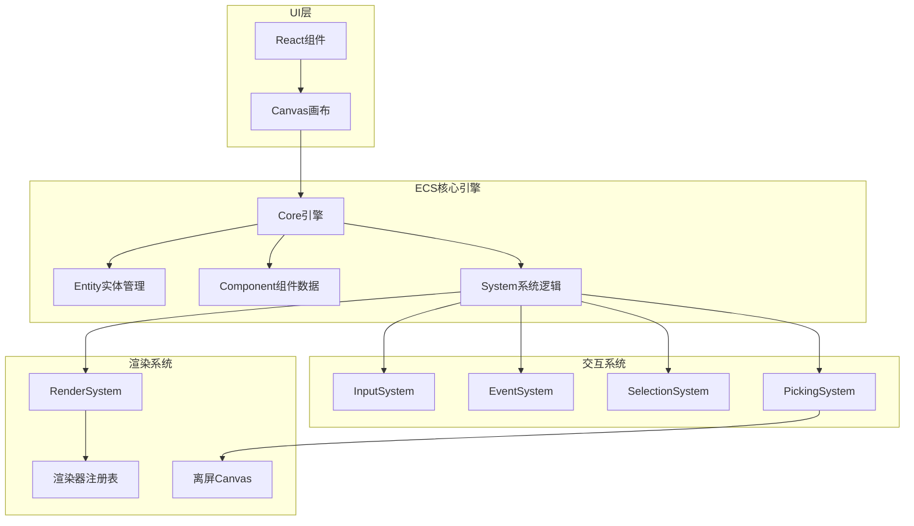

## ECS 架构设计

### ECS 核心概念

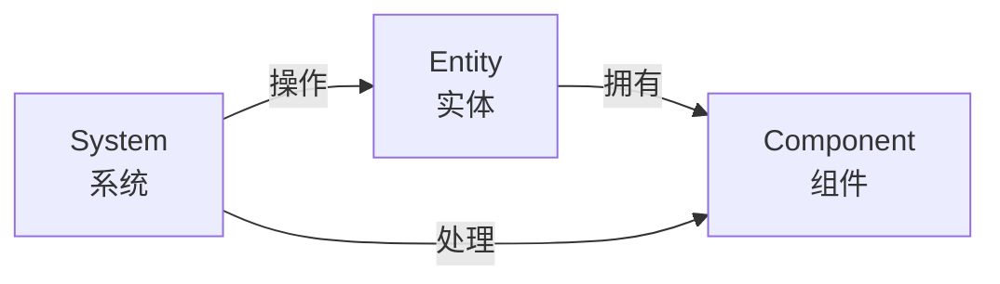

**Entity（实体）**：
- 唯一标识符（ID）
- 代表画布上的一个对象
- 不包含数据和逻辑

**Component（组件）**：
- 纯数据结构
- 描述实体的属性
- 可组合和复用

**System（系统）**：
- 包含逻辑的处理器
- 操作特定组件的数据
- 实现渲染、交互等功能

### 架构优势

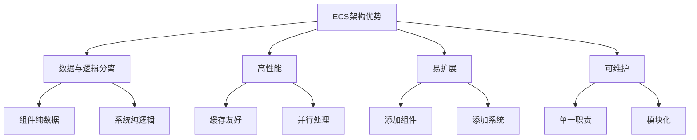

## 核心模块架构

### 1. Core 引擎

**职责**：
- 管理所有实体和组件
- 注册和调度系统
- 维护全局状态

**目录结构**：
```
Core/
├── Core.ts              # 核心引擎
├── enum.ts              # 枚举定义
├── index.ts             # 导出文件
├── types/               # 类型定义
│   └── index.ts
├── Components/          # 组件定义
│   ├── index.ts
│   ├── Position.ts
│   ├── Size.ts
│   ├── Color.ts
│   ├── Rotation.ts
│   ├── Font.ts
│   ├── Scale.ts
│   └── ...
├── System/              # 系统逻辑
│   ├── System.ts
│   ├── RenderSystem/
│   ├── SelectionSystem.ts
│   ├── PickingSystem.ts
│   ├── EventSystem.ts
│   └── InputSystem.ts
├── Entity/              # 实体管理
│   └── Entity.ts
└── DSL/                 # DSL 解析
    └── DSL.ts
```

**Core 类设计**：
```typescript
export class Core {
  // 是否多选模式
  multiple: boolean = false;
  
  // DSL 配置数组
  dsls: DSL[] = [];
  
  // 系统映射表
  SystemMap: Map<string, System> = new Map();
  
  // 状态仓库（所有组件数据）
  stateStore: StateStore = {
    position: new Map<string, Position>(),
    size: new Map<string, Size>(),
    color: new Map<string, Color>(),
    selected: new Map<string, { value: boolean; hovered: boolean }>(),
    rotation: new Map<string, { value: number }>(),
    type: new Map<string, string>(),
    font: new Map<string, Font>(),
    lineWidth: new Map<string, { value: number }>(),
    img: new Map<string, Img>(),
    scale: new Map<string, Scale>(),
    polygon: new Map<string, Polygon>(),
    ellipseRadius: new Map<string, EllipseRadius>(),
    eventQueue: [],
  };
  
  // 系统数组
  system: System[] = [];
  
  // 实体管理器
  entityManager = new Entity();
}
```

### 2. Component 组件系统

**组件数据结构**：

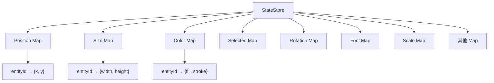

**核心组件定义**：

| 组件 | 数据结构 | 说明 |
|------|----------|------|
| Position | `{ x: number, y: number }` | 位置坐标 |
| Size | `{ width: number, height: number }` | 尺寸大小 |
| Color | `{ fillColor: string, strokeColor: string }` | 颜色 |
| Rotation | `{ value: number }` | 旋转角度 |
| Font | `{ family, size, weight, text, fillColor }` | 字体样式 |
| Scale | `{ x: number, y: number }` | 缩放比例 |
| Selected | `{ value: boolean, hovered: boolean }` | 选中状态 |

**组件初始化流程**：
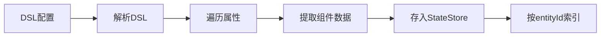

### 3. System 系统架构

**系统基类**：
```typescript
export class System {
  update?(stateStore: StateStore): void;
  draw?(entityId: string): void;
}
```

**系统执行流程**：
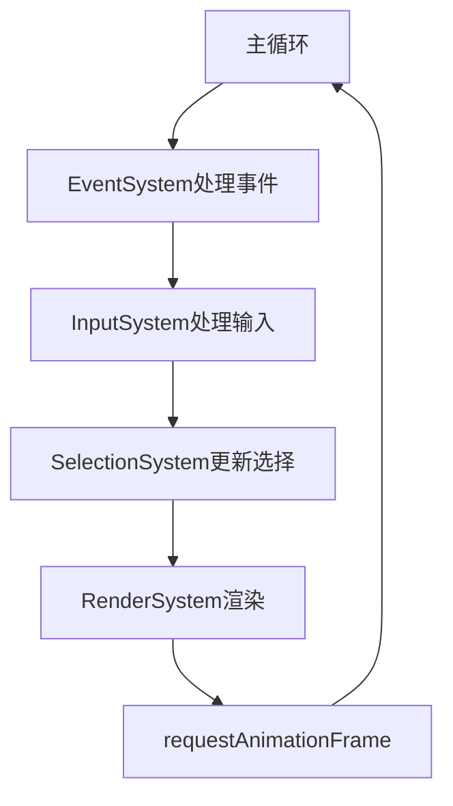

**核心系统列表**：

| 系统 | 职责 | 更新频率 |
|------|------|----------|
| RenderSystem | 渲染所有图形 | 每帧（节流100ms） |
| InputSystem | 处理鼠标键盘输入 | 事件驱动 |
| EventSystem | 事件队列管理 | 每帧 |
| SelectionSystem | 选择框绘制 | 每帧 |
| PickingSystem | 图形拾取检测 | 事件驱动 |

## 渲染系统架构

### RenderSystem 设计

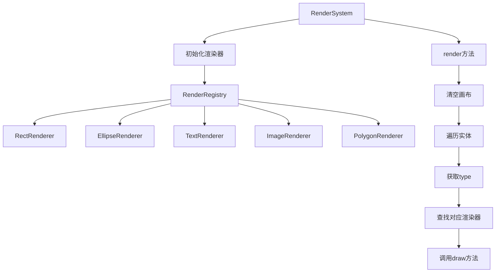

**渲染循环**：
```typescript
render(stateStore: StateStore, ctx: CanvasRenderingContext2D) {
  // 清空画布
  ctx.clearRect(0, 0, ctx.canvas.width, ctx.canvas.height);
  
  // 遍历所有实体
  stateStore.position.forEach((pos, entityId) => {
    ctx.save();
    // 绘制图形
    this.drawShape(stateStore, entityId);
    ctx.restore();
  });
}
```

**节流优化**：
```typescript
throttledRender = throttle((stateStore: StateStore) => {
  this.render(stateStore, this.ctx);
}, 100); // 限制渲染频率为 100ms
```

### 渲染器注册表

```typescript
const renderRegistry = {
  rect: RectRenderer,
  ellipse: EllipseRenderer,
  text: TextRenderer,
  img: ImageRenderer,
  polygon: PolygonRenderer,
  line: LineRenderer,
};

export default renderRegistry;
```

**渲染器接口**：
```typescript
class RectRenderer extends System {
  constructor(ctx: CanvasRenderingContext2D, core: Core) {
    super();
    this.ctx = ctx;
    this.core = core;
  }
  
  draw(entityId: string) {
    const position = this.core.stateStore.position.get(entityId);
    const size = this.core.stateStore.size.get(entityId);
    const color = this.core.stateStore.color.get(entityId);
    
    if (!position || !size || !color) return;
    
    this.ctx.fillStyle = color.fillColor;
    this.ctx.fillRect(position.x, position.y, size.width, size.height);
    
    this.ctx.strokeStyle = color.strokeColor;
    this.ctx.strokeRect(position.x, position.y, size.width, size.height);
  }
}
```

### DPR 适配

```typescript
initCanvas(canvas: HTMLCanvasElement) {
  const dpr = window.devicePixelRatio || 1;
  
  // 设置样式尺寸
  canvas.style.width = canvas.width + "px";
  canvas.style.height = canvas.height + "px";
  
  // 设置实际尺寸（考虑设备像素比）
  canvas.width = canvas.width * dpr;
  canvas.height = canvas.height * dpr;
  
  const ctx = canvas.getContext("2d", {
    willReadFrequently: true,
  }) as CanvasRenderingContext2D;
  
  // 缩放上下文
  ctx.scale(dpr, dpr);
  
  return ctx;
}
```

## 交互系统架构

### InputSystem 设计

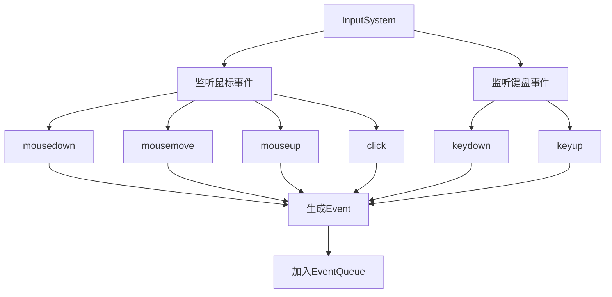

**事件绑定**：
```typescript
class InputSystem extends System {
  constructor(canvas: HTMLCanvasElement, core: Core) {
    super();
    this.canvas = canvas;
    this.core = core;
    this.bindEvents();
  }
  
  bindEvents() {
    this.canvas.addEventListener('mousedown', this.handleMouseDown);
    this.canvas.addEventListener('mousemove', this.handleMouseMove);
    this.canvas.addEventListener('mouseup', this.handleMouseUp);
    this.canvas.addEventListener('click', this.handleClick);
  }
  
  handleMouseDown = (e: MouseEvent) => {
    const event = {
      type: 'mousedown',
      x: e.clientX,
      y: e.clientY,
      timestamp: Date.now(),
    };
    this.core.stateStore.eventQueue.push(event);
  }
}
```

### EventSystem 设计

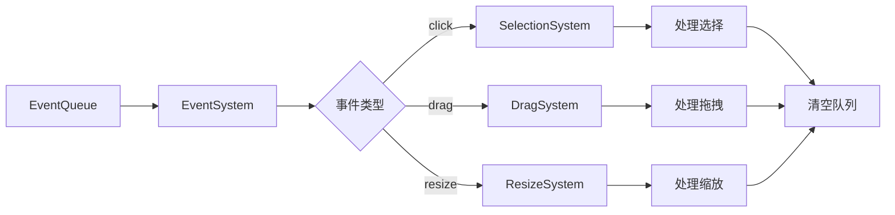

**事件处理**：
```typescript
class EventSystem extends System {
  update(stateStore: StateStore) {
    const events = stateStore.eventQueue;
    
    events.forEach(event => {
      switch (event.type) {
        case 'mousedown':
          this.handleMouseDown(event);
          break;
        case 'mousemove':
          this.handleMouseMove(event);
          break;
        case 'mouseup':
          this.handleMouseUp(event);
          break;
      }
    });
    
    // 清空已处理事件
    stateStore.eventQueue = [];
  }
}
```

### SelectionSystem 设计

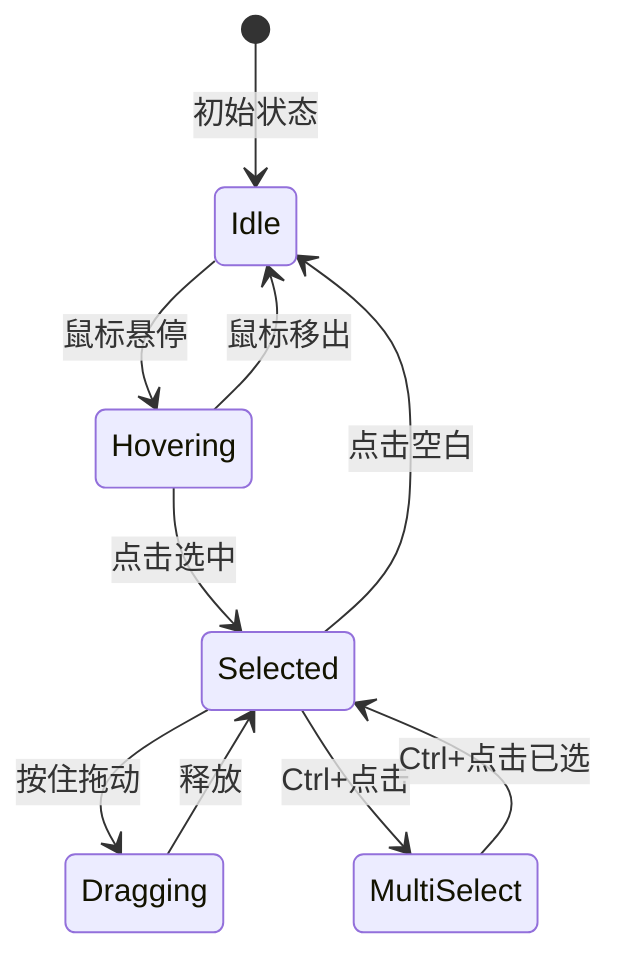

**选择框绘制**：
```typescript
class SelectionSystem extends System {
  draw(entityId: string) {
    const selected = this.core.stateStore.selected.get(entityId);
    const position = this.core.stateStore.position.get(entityId);
    const size = this.core.stateStore.size.get(entityId);
    
    if (!selected?.value || !position || !size) return;
    
    // 绘制选择框
    this.ctx.strokeStyle = '#0078D4';
    this.ctx.lineWidth = 2;
    this.ctx.setLineDash([5, 5]);
    this.ctx.strokeRect(
      position.x - 2,
      position.y - 2,
      size.width + 4,
      size.height + 4
    );
    this.ctx.setLineDash([]);
  }
}
```

### PickingSystem 设计

**颜色编码拾取法**：

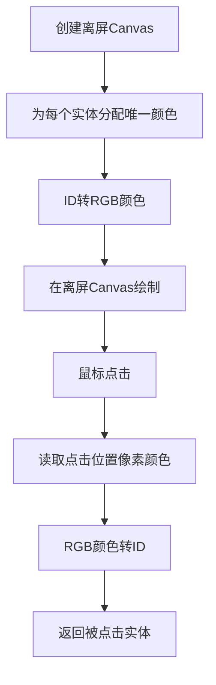

**实现原理**：
```typescript
class PickingSystem extends System {
  offscreenCanvas: HTMLCanvasElement;
  offscreenCtx: CanvasRenderingContext2D;
  
  // ID 转颜色
  idToColor(id: number): string {
    const r = (id & 0xFF0000) >> 16;
    const g = (id & 0x00FF00) >> 8;
    const b = (id & 0x0000FF);
    return `rgb(${r},${g},${b})`;
  }
  
  // 颜色转 ID
  colorToId(r: number, g: number, b: number): number {
    return (r << 16) | (g << 8) | b;
  }
  
  // 拾取实体
  pick(x: number, y: number): string | null {
    const pixel = this.offscreenCtx.getImageData(x, y, 1, 1).data;
    const id = this.colorToId(pixel[0], pixel[1], pixel[2]);
    return this.idMap.get(id) || null;
  }
}
```

## DSL 架构

### DSL 定义

```typescript
export class DSL {
  id: string;
  type: string;
  position: Position;
  size: Size;
  color: Color;
  selected?: { value: boolean };
  rotation?: { value: number };
  font?: Font;
  lineWidth?: { value: number };
  img?: Img;
  scale?: Scale;
  polygon?: Polygon;
  ellipseRadius?: EllipseRadius;
}
```

### DSL 解析流程

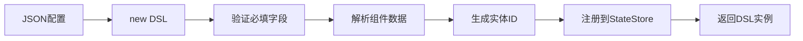

**DSL 示例**：
```typescript
const dsl = {
  id: "rect-1",
  type: "rect",
  position: { x: 100, y: 100 },
  size: { width: 200, height: 100 },
  color: { 
    fillColor: "#FF5000", 
    strokeColor: "#000000" 
  },
  rotation: { value: 0 },
  selected: { value: false },
};
```

## 状态管理架构

### StateStore 设计

```typescript
export interface StateStore {
  position: Map<string, Position>;
  size: Map<string, Size>;
  color: Map<string, Color>;
  selected: Map<string, { value: boolean; hovered: boolean }>;
  rotation: Map<string, { value: number }>;
  type: Map<string, string>;
  font: Map<string, Font>;
  lineWidth: Map<string, { value: number }>;
  img: Map<string, Img>;
  scale: Map<string, Scale>;
  polygon: Map<string, Polygon>;
  ellipseRadius: Map<string, EllipseRadius>;
  eventQueue: Event[];
}
```

**数据访问模式**：
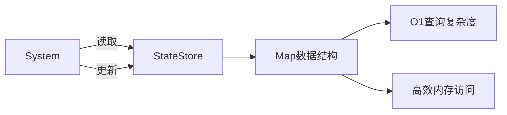

### 数据流

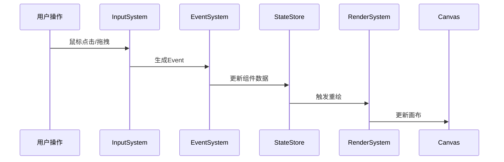

## 性能优化架构

### 1. 渲染优化

**节流渲染**：
```typescript
throttledRender = throttle((stateStore: StateStore) => {
  this.render(stateStore, this.ctx);
}, 100);
```

**离屏渲染**：
```typescript
// PickingSystem 使用离屏 Canvas
const offscreenCanvas = document.createElement('canvas');
const offscreenCtx = offscreenCanvas.getContext('2d');
```

**增量更新**：
```typescript
// 只更新变化的实体
const changedEntities = detectChanges(prevState, currentState);
changedEntities.forEach(entityId => {
  this.drawShape(stateStore, entityId);
});
```

### 2. 内存优化

**Map 数据结构**：
- O(1) 查询复杂度
- 内存占用少
- 支持快速迭代

**对象池模式**（可选）：
```typescript
class EntityPool {
  private pool: Entity[] = [];
  
  acquire(): Entity {
    return this.pool.pop() || new Entity();
  }
  
  release(entity: Entity) {
    entity.reset();
    this.pool.push(entity);
  }
}
```

### 3. 事件优化

**事件委托**：
```typescript
// 在 Canvas 上统一监听
canvas.addEventListener('click', (e) => {
  const entityId = this.pickingSystem.pick(e.x, e.y);
  if (entityId) {
    this.handleEntityClick(entityId);
  }
});
```

**防抖和节流**：
```typescript
// 节流鼠标移动
const throttledMouseMove = throttle(handleMouseMove, 16); // 60fps

// 防抖窗口调整
const debouncedResize = debounce(handleResize, 200);
```

## 可扩展性设计

### 添加新组件

```typescript
// 1. 定义组件类型
export interface Shadow {
  offsetX: number;
  offsetY: number;
  blur: number;
  color: string;
}

// 2. 更新 StateStore
export interface StateStore {
  // ... 现有组件
  shadow: Map<string, Shadow>;
}

// 3. 在 DSL 中使用
class DSL {
  // ... 现有属性
  shadow?: Shadow;
}
```

### 添加新系统

```typescript
// 1. 创建系统类
class AnimationSystem extends System {
  update(stateStore: StateStore) {
    // 动画逻辑
  }
}

// 2. 在 Core 中注册
this.SystemMap.set('animation', new AnimationSystem(this));

// 3. 在主循环中调用
this.SystemMap.get('animation')?.update(this.stateStore);
```

### 添加新渲染器

```typescript
// 1. 创建渲染器类
class StarRenderer extends System {
  draw(entityId: string) {
    // 绘制星形
  }
}

// 2. 注册到 RenderRegistry
const renderRegistry = {
  // ... 现有渲染器
  star: StarRenderer,
};
```

## Canvas 组件架构

```typescript
function Canvas(props: CanvasProps) {
  const canvasRef = useRef<HTMLCanvasElement>(null);
  const [core, setCore] = useState<Core | null>(null);
  
  useEffect(() => {
    if (!canvasRef.current) return;
    
    // 初始化核心引擎
    const coreInstance = new Core(dsls);
    const ctx = coreInstance.initCanvas(canvasRef.current);
    
    // 初始化系统
    const renderSystem = new RenderSystem(ctx, coreInstance);
    const inputSystem = new InputSystem(canvasRef.current, coreInstance);
    const selectionSystem = new SelectionSystem(ctx, coreInstance);
    const pickingSystem = new PickingSystem(ctx, coreInstance);
    const eventSystem = new EventSystem(coreInstance);
    
    // 启动渲染循环
    function loop() {
      eventSystem.update(coreInstance.stateStore);
      renderSystem.update(coreInstance.stateStore);
      selectionSystem.update(coreInstance.stateStore);
      requestAnimationFrame(loop);
    }
    
    loop();
    setCore(coreInstance);
  }, []);
  
  return <canvas ref={canvasRef} width={800} height={600} />;
}
```
