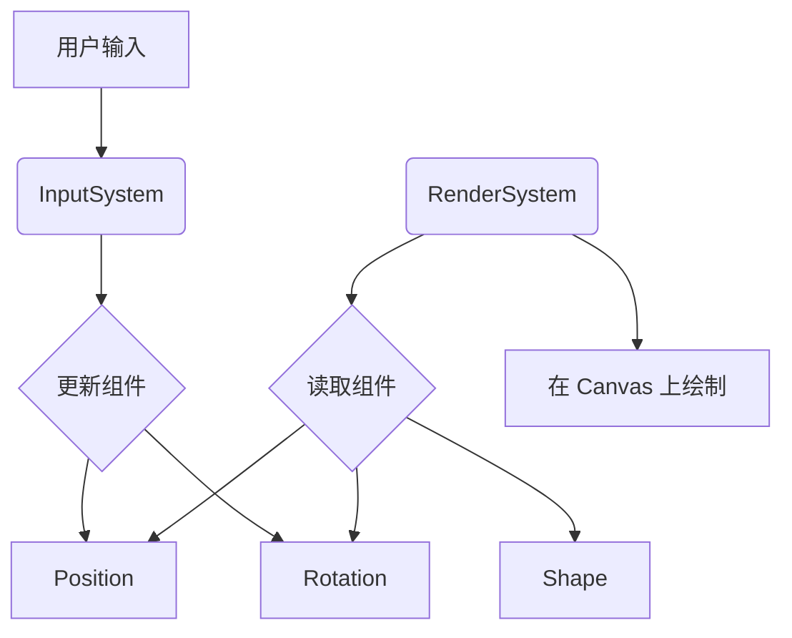

# 核心架构：ECS

前端的核心部分采用了 **ECS (Entity Component System)** 架构模式。这种模式广泛应用于游戏开发，能够提供极高的灵活性和可扩展性。

## ECS 的三个核心概念

1.  **Entity (实体)**:
    - 一个实体就是一个唯一的 ID，它本身不包含任何数据或逻辑。
    - 在本项目中，一个实体可以代表画布上的任何一个对象，如一个矩形、一张图片或一段文字。

2.  **Component (组件)**:
    - 组件是纯粹的数据容器，用于描述实体的属性。
    - 例如，`Position` 组件存储了实体的位置信息（x, y 坐标），`Size` 组件存储了实体的尺寸（宽度和高度）。
    - 一个实体可以拥有多个组件。

3.  **System (系统)**:
    - 系统是处理逻辑的地方，它会遍历所有拥有特定组件组合的实体，并对它们进行操作。
    - 例如，`RenderSystem` 会遍历所有拥有 `Position` 和 `Shape` 组件的实体，并将它们绘制到画布上。`InputSystem` 会处理用户的输入事件，并更新相应实体的组件数据。

## ECS 在项目中的应用

- **`Core/Entity/`**: 定义了 `Entity` 类。
- **`Core/Components/`**: 存放了所有可用的组件，如 `Position`、`Scale`、`Color` 等。
- **`Core/System/`**: 包含了所有的系统，如 `EventSystem`、`InputSystem` 等。

通过这种方式，我们可以轻松地通过添加新的组件和系统来扩展功能，而无需修改现有的代码，这大大提高了代码的可维护性和复用性。
