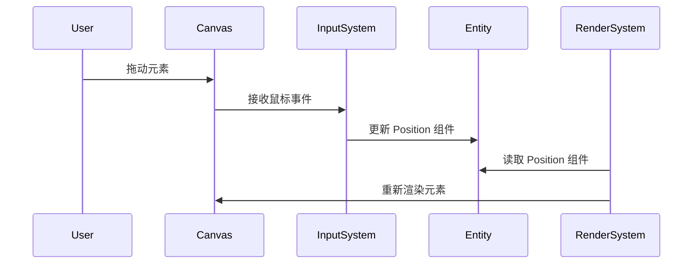

# 画布功能

`Canvas` 组件是前端应用的核心，它负责渲染所有的画布元素，并处理用户的交互。

## 主要功能

- **元素渲染**:
  - 支持渲染多种类型的元素，如矩形、圆形、图片、文字等。
  - 渲染过程由 `RenderSystem` 驱动，它会根据实体所拥有的组件来决定如何绘制。

- **用户交互**:
  - **拖拽**: 用户可以拖动画布上的任意元素。
  - **缩放**: 支持通过鼠标滚轮或手势对画布进行缩放。
  - **旋转**: 用户可以旋转选中的元素。
  - **选择**: 支持单击和框选来选择一个或多个元素。

- **插件系统**:
  - 画布的功能可以通过插件进行扩展。
  - 每个插件可以包含自己的组件和系统，用于实现特定的功能，如对齐线、网格背景等。

## 组件交互流程

