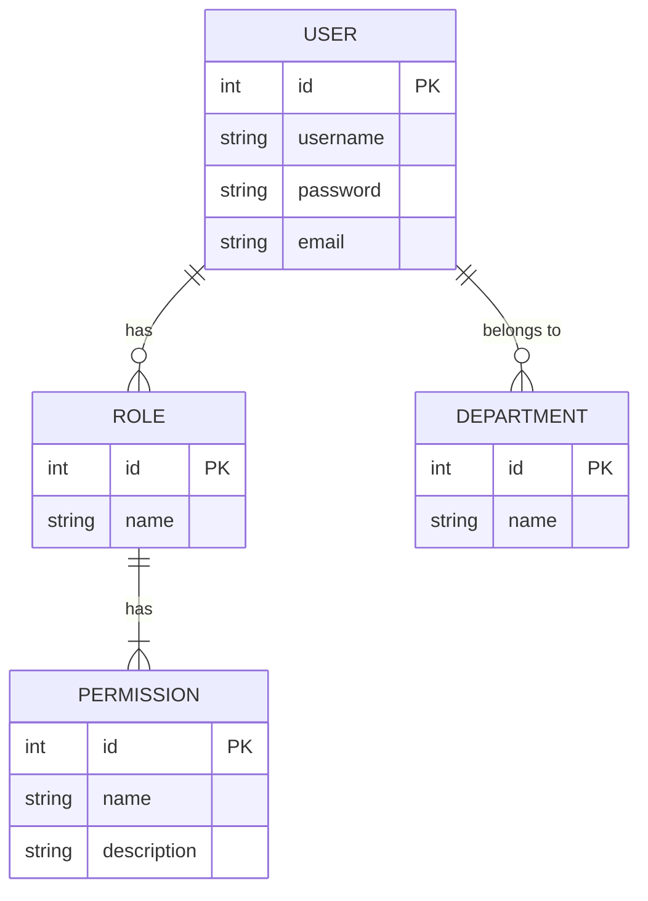

# 数据库设计

本项目使用 GORM 作为 ORM 框架，数据库模型定义在 `internal/model/` 目录下。

## 数据表关系 (ERD)

## 主要数据表

- **`users`**: 存储用户信息，包括用户名、密码（加密后）、邮箱等。
- **`roles`**: 定义了用户角色，如管理员、普通用户等。
- **`permissions`**: 存储了系统中的所有权限点。
- **`role_permissions`**: 角色与权限的关联表。
- **`user_roles`**: 用户与角色的关联表。
- **`departments`**: 部门信息表。
- **`dicts`**: 字典主表。
- **`dict_items`**: 字典项表。

## 数据迁移

项目使用 GORM 的 `AutoMigrate` 功能在应用启动时自动同步数据库结构。迁移逻辑位于 `internal/repo/migrate.go` 文件中。
