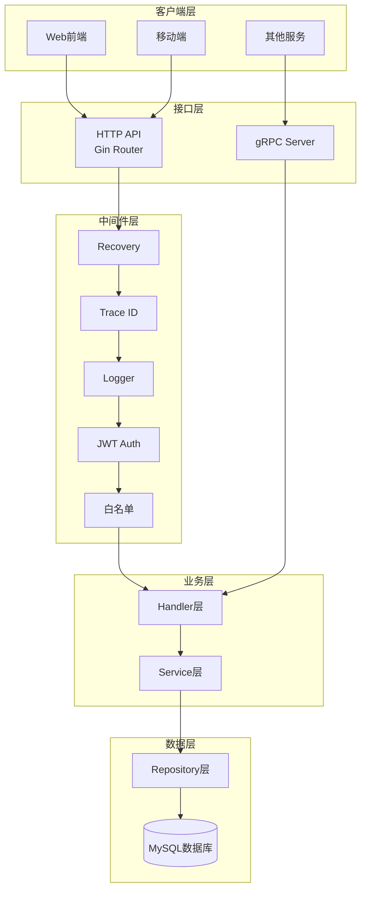
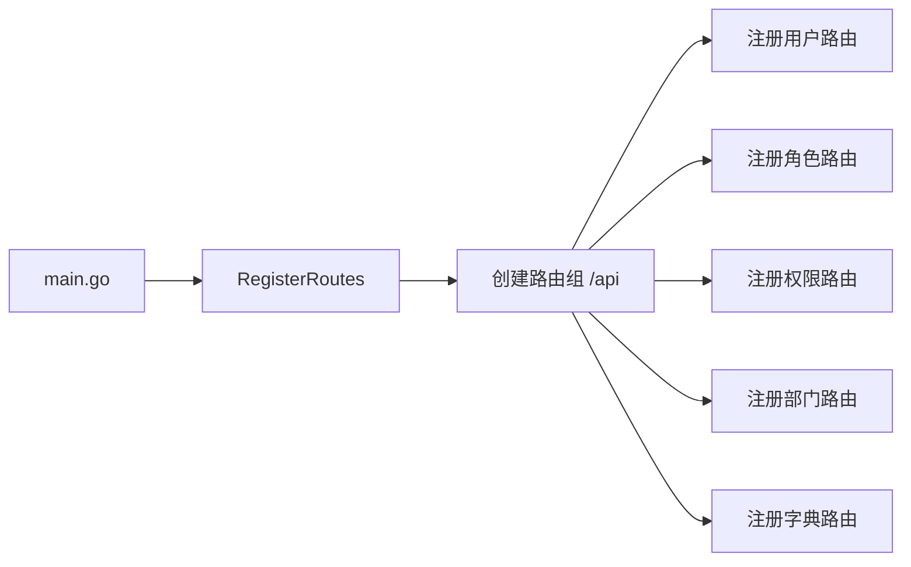
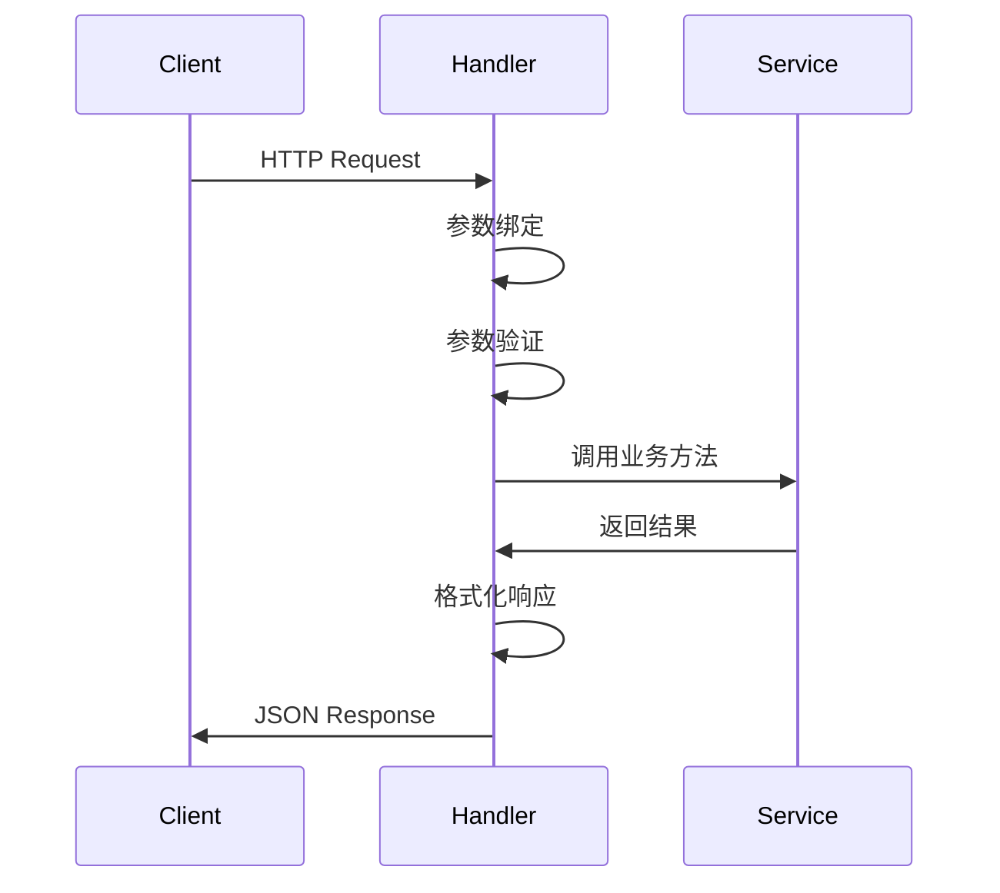
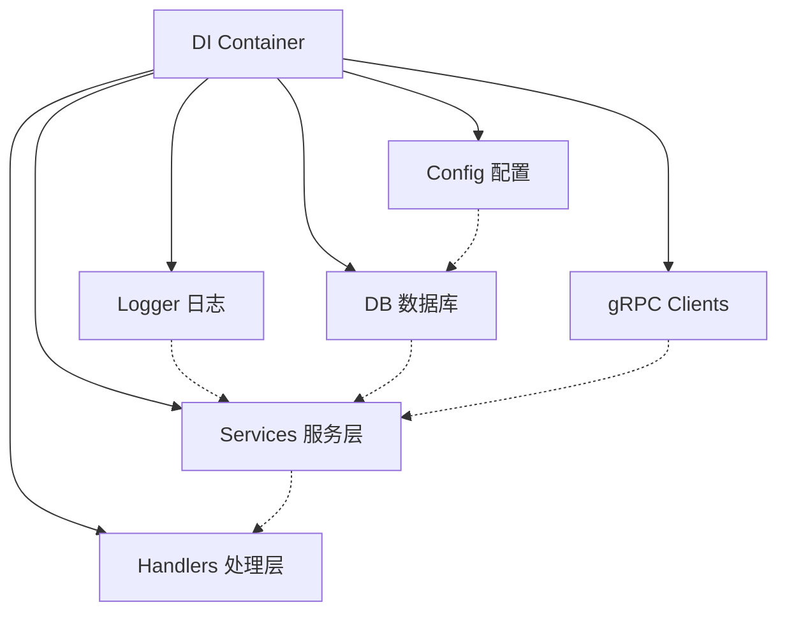
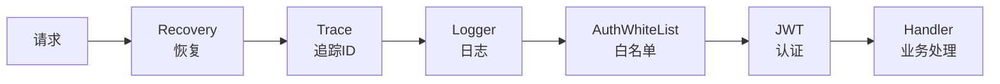
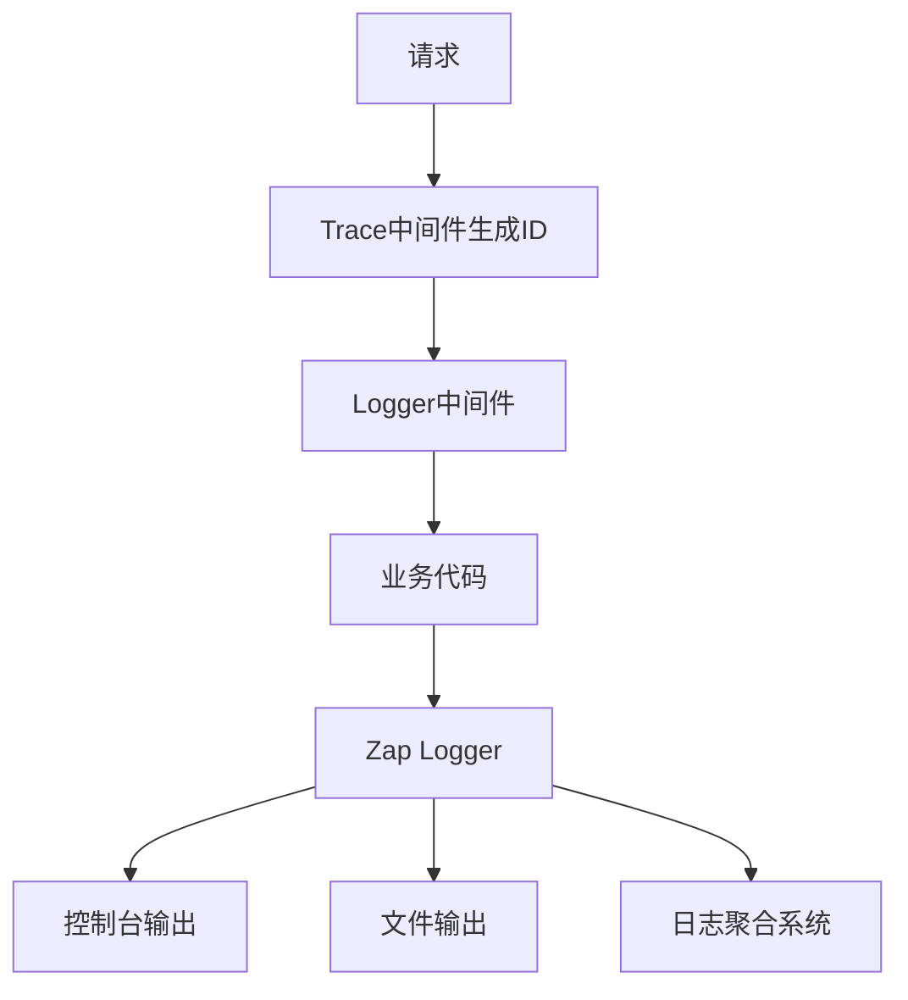
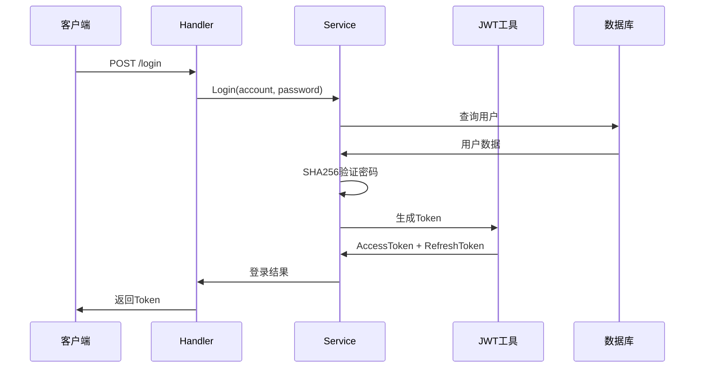
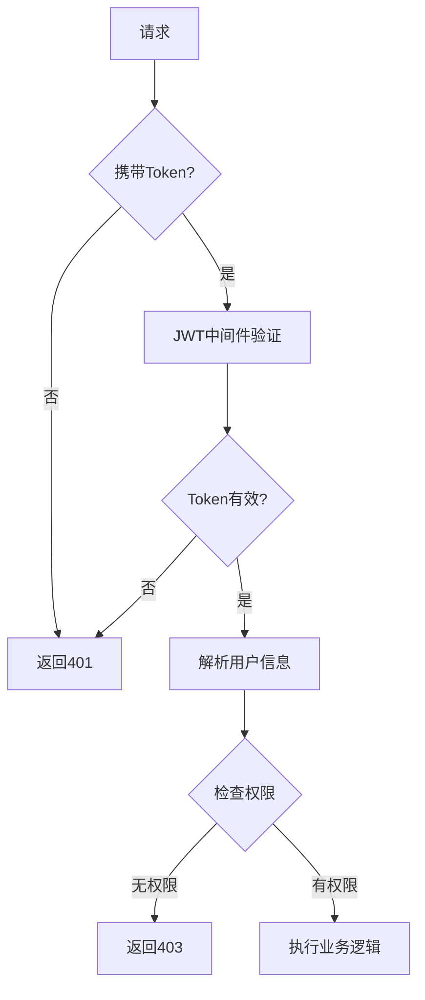
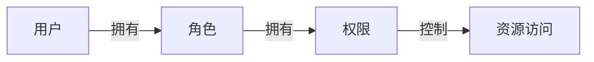

# 后端架构设计

## 概述

Duck-Core 后端基于 Go 语言的 Gin 框架构建，采用经典的分层架构设计，提供 RESTful API 和 gRPC 服务，支持用户认证、权限管理、部门管理等核心业务功能。

## 整体架构



## 分层架构设计

### 1. 路由层（Router）

**职责**：
- 定义 API 端点路径
- HTTP 方法映射
- 请求分发到对应的 Handler
- 路由分组管理

**目录结构**：
```
internal/router/
├── router.go              # 路由注册中心
├── user_router.go         # 用户路由
├── roles_router.go        # 角色路由
├── permissions_router.go  # 权限路由
├── department_router.go   # 部门路由
├── dict_router.go         # 字典路由
└── rpc_router.go          # RPC 路由
```

**路由注册流程**：


**示例代码**：
```go
func RegisterRoutes(r *gin.Engine, container *dig.Container) {
    route := r.Group("api")
    
    // Swagger 文档
    r.GET("/swagger/*any", ginSwagger.WrapHandler(swaggerFiles.Handler))
    
    // 404 处理
    r.NoRoute(func(c *gin.Context) {
        c.JSON(http.StatusNotFound, dto.Fail(404, "接口不存在"))
    })
    
    // 注册各模块路由
    RegisterUserRoutes(route, container)
    RegisterRolesRoutes(route, container)
    RegisterPermissionsRoutes(route, container)
    RegisterDepartmentRoutes(route, container)
    RegisterDictRoutes(route, container)
    RegisterRpcRoutes(route, container)
}
```

### 2. 处理层（Handler）

**职责**：
- 接收并验证请求参数
- 调用业务服务层
- 处理响应格式
- 错误处理和状态码返回

**设计原则**：
- 薄处理层，不包含业务逻辑
- 统一的响应格式
- 完整的参数校验
- Swagger 文档注释

**Handler 结构**：
```go
type UserHandler struct {
    service service.UserService
}

func NewUserHandler(service service.UserService) *UserHandler {
    return &UserHandler{service: service}
}
```

**标准处理流程**：


### 3. 服务层（Service）

**职责**：
- 实现核心业务逻辑
- 事务管理
- 数据验证和转换
- 调用数据访问层

**服务接口设计**：
```go
type UserService interface {
    Login(c *gin.Context, body dto.LoginBody) dto.Result[dto.LoginResult]
    Register(c *gin.Context, body dto.RegBody) error
    List(ctx *gin.Context, query dto.ListQuery) (dto.Result[dto.List[dto.UserWithRole]], error)
    Update(c *gin.Context, body dto.UserRoleRequest) error
    UpdateRoles(c *gin.Context, id int, body *dto.User) error
    Delete(c *gin.Context, body dto.DeleteIds) error
}
```

**服务实现模式**：
```go
type userService struct {
    db  *gorm.DB
    log *log.LoggerWithContext
}

func NewUserService(db *gorm.DB, log *log.LoggerWithContext) UserService {
    return &userService{db: db, log: log}
}
```

**核心服务模块**：

| 服务 | 文件 | 功能 |
|------|------|------|
| UserService | users_service.go | 用户管理、登录认证 |
| RoleService | roles_service.go | 角色管理、权限分配 |
| PermissionService | permissions_service.go | 权限管理 |
| DepartmentService | department_service.go | 部门树形管理 |
| DictService | dict_service.go | 字典数据管理 |

### 4. 数据访问层（Repository）

**职责**：
- 数据库 CRUD 操作
- 数据库连接管理
- 表结构迁移

**GORM 配置**：
```go
func NewDB(config *config.Config) (*gorm.DB, error) {
    dsn := fmt.Sprintf("%s:%s@tcp(%s:%s)/%s?charset=utf8mb4&parseTime=True&loc=Local",
        config.Database.Username,
        config.Database.Password,
        config.Database.Host,
        config.Database.Port,
        config.Database.DBName,
    )
    
    db, err := gorm.Open(mysql.Open(dsn), &gorm.Config{
        Logger: logger.Default.LogMode(logger.Info),
    })
    
    return db, err
}
```

## 依赖注入架构（DI）

### DI 容器设计

使用 `uber-go/dig` 实现依赖注入，解耦各层之间的依赖关系。



### 初始化流程

```go
func NewContainer() *dig.Container {
    container := dig.New()
    
    // 1. 公共日志管理器
    log.NewProvideLogger(container)
    
    // 2. gRPC 客户端
    grpcContainer.NewProvideClients(container)
    
    // 3. 配置
    config.ProvideConfig(container)
    
    // 4. 数据库
    repo.ProvideDB(container)
    
    // 5. 服务层
    service.Provide(container)
    
    // 6. 处理层
    handler.Provide(container)
    
    return container
}
```

### 依赖注册

**服务层注册**：
```go
func Provide(container *dig.Container) {
    ProvideUserService(container)
    ProvideRoleService(container)
    ProvidePermissionService(container)
    ProvideDepartmentService(container)
    ProvideDictService(container)
}

func ProvideUserService(container *dig.Container) {
    if err := container.Provide(NewUserService); err != nil {
        panic(err)
    }
}
```

**处理层注册**：
```go
func Provide(container *dig.Container) {
    container.Provide(handler.NewUserHandler)
    container.Provide(handler.NewRoleHandler)
    container.Provide(handler.NewPermissionHandler)
    container.Provide(handler.NewDepartmentHandler)
    container.Provide(handler.NewDictHandler)
}
```

## 中间件架构

### 中间件执行链



### 中间件详解

#### 1. Recovery 中间件

**功能**：捕获 panic，防止服务崩溃

```go
func RecoveryWithZap(logger *zap.Logger) gin.HandlerFunc {
    return func(c *gin.Context) {
        defer func() {
            if err := recover(); err != nil {
                // 记录错误堆栈
                logger.Error("panic recovered",
                    zap.Any("error", err),
                    zap.String("stack", string(debug.Stack())),
                )
                
                // 返回 500 错误
                c.JSON(500, gin.H{"error": "Internal Server Error"})
                c.Abort()
            }
        }()
        c.Next()
    }
}
```

#### 2. Trace 中间件

**功能**：为每个请求生成唯一追踪 ID

```go
func Trace(c *gin.Context) {
    traceId := uuid.New().String()
    c.Set("traceId", traceId)
    c.Header("X-Trace-ID", traceId)
    c.Next()
}
```

#### 3. Logger 中间件

**功能**：记录请求和响应日志

```go
func (l *LoggerMiddleware) Logger(c *gin.Context) {
    start := time.Now()
    path := c.Request.URL.Path
    
    c.Next()
    
    latency := time.Since(start)
    
    l.logger.Info("request",
        zap.String("method", c.Request.Method),
        zap.String("path", path),
        zap.Int("status", c.Writer.Status()),
        zap.Duration("latency", latency),
        zap.String("ip", c.ClientIP()),
        zap.String("traceId", c.GetString("traceId")),
    )
}
```

#### 4. JWT 中间件

**功能**：验证访问令牌

```go
func JWTAuth() gin.HandlerFunc {
    return func(c *gin.Context) {
        token := c.GetHeader("Authorization")
        
        if token == "" {
            c.JSON(401, dto.Fail(401, "未授权"))
            c.Abort()
            return
        }
        
        // 验证 Token
        claims, err := jwt.ParseToken(token)
        if err != nil {
            c.JSON(401, dto.Fail(401, "Token 无效"))
            c.Abort()
            return
        }
        
        c.Set("userId", claims.UserId)
        c.Next()
    }
}
```

## gRPC 服务架构

### gRPC 组件结构

```
internal/grpc/
├── server.go           # gRPC 服务器
├── register.go         # 服务注册
├── handler/            # gRPC 处理器
│   └── hello_handler.go
├── client/             # gRPC 客户端
│   └── user_client.go
├── container/          # 客户端容器
│   ├── clients.go
│   └── container.go
└── proto/              # Protocol Buffers
    ├── hello.proto
    ├── hello.pb.go
    └── hello_grpc.pb.go
```

### gRPC 服务器启动

```go
func IntServer(container *dig.Container) {
    lis, err := net.Listen("tcp", ":50051")
    if err != nil {
        log.Fatalf("failed to listen: %v", err)
    }
    
    s := grpc.NewServer()
    
    // 注册服务
    RegisterServices(s, container)
    
    // 启动服务器
    if err := s.Serve(lis); err != nil {
        log.Fatalf("failed to serve: %v", err)
    }
}
```

### gRPC 客户端管理

```go
type Clients struct {
    UserClient user.UserServiceClient
}

func NewClients() *Clients {
    conn, err := grpc.Dial("localhost:50051", grpc.WithInsecure())
    if err != nil {
        log.Fatalf("did not connect: %v", err)
    }
    
    return &Clients{
        UserClient: user.NewUserServiceClient(conn),
    }
}
```

## 配置管理架构

### 配置文件结构

```
config/
├── config.go           # 配置加载
├── config.dev.yaml     # 开发环境
└── config.prod.yaml    # 生产环境
```

### 配置数据结构

```go
type Config struct {
    Database DatabaseConfig `yaml:"database"`
    Server   ServerConfig   `yaml:"server"`
    JWT      JWTConfig      `yaml:"jwt"`
    GRPC     GRPCConfig     `yaml:"grpc"`
}

type DatabaseConfig struct {
    Host     string `yaml:"host"`
    Port     string `yaml:"port"`
    Username string `yaml:"username"`
    Password string `yaml:"password"`
    DBName   string `yaml:"dbname"`
}
```

### 配置加载

```go
func LoadConfig() (*Config, error) {
    env := os.Getenv("ENV")
    if env == "" {
        env = "development"
    }
    
    configFile := fmt.Sprintf("config/config.%s.yaml", env)
    
    viper.SetConfigFile(configFile)
    if err := viper.ReadInConfig(); err != nil {
        return nil, err
    }
    
    var config Config
    if err := viper.Unmarshal(&config); err != nil {
        return nil, err
    }
    
    return &config, nil
}
```

## 日志架构

### 日志系统设计



### Zap 日志配置

```go
func InitLogger() (*zap.Logger, error) {
    config := zap.Config{
        Level:            zap.NewAtomicLevelAt(zap.InfoLevel),
        Development:      false,
        Encoding:         "json",
        EncoderConfig:    zap.NewProductionEncoderConfig(),
        OutputPaths:      []string{"stdout", "logs/app.log"},
        ErrorOutputPaths: []string{"stderr"},
    }
    
    return config.Build()
}
```

### 日志上下文管理

```go
type LoggerWithContext struct {
    logger *zap.Logger
}

func (l *LoggerWithContext) WithContext(c *gin.Context) *zap.Logger {
    traceId := c.GetString("traceId")
    return l.logger.With(zap.String("traceId", traceId))
}
```

## 安全架构

### 认证流程



### 授权流程



### RBAC 权限模型



## 数据库架构

### 连接池配置

```go
sqlDB, _ := db.DB()

// 设置连接池
sqlDB.SetMaxIdleConns(10)           // 最大空闲连接数
sqlDB.SetMaxOpenConns(100)          // 最大打开连接数
sqlDB.SetConnMaxLifetime(time.Hour) // 连接最大生命周期
```

### 事务管理

```go
func (s *userService) CreateWithRoles(user *model.User, roleIds []int) error {
    return s.db.Transaction(func(tx *gorm.DB) error {
        // 创建用户
        if err := tx.Create(user).Error; err != nil {
            return err
        }
        
        // 分配角色
        var roles []*model.Role
        if err := tx.Find(&roles, roleIds).Error; err != nil {
            return err
        }
        
        return tx.Model(user).Association("Roles").Append(roles)
    })
}
```

## 错误处理架构

### 统一错误响应

```go
type Result[T any] struct {
    Success bool   `json:"success"`
    Code    int    `json:"code"`
    Message string `json:"message"`
    Data    T      `json:"data,omitempty"`
}

func Success[T any](data T) Result[T] {
    return Result[T]{
        Success: true,
        Code:    200,
        Data:    data,
    }
}

func Fail(code int, message string) Result[any] {
    return Result[any]{
        Success: false,
        Code:    code,
        Message: message,
    }
}
```

## 性能优化

### 数据库优化

1. **索引优化**：关键字段添加索引
2. **预加载**：减少 N+1 查询
3. **批量操作**：使用批量插入/更新
4. **连接池**：复用数据库连接

### API 性能优化

1. **分页查询**：限制单次返回数据量
2. **缓存策略**：使用 Redis 缓存热点数据
3. **异步处理**：耗时操作使用异步
4. **gRPC**：服务间通信使用 gRPC
