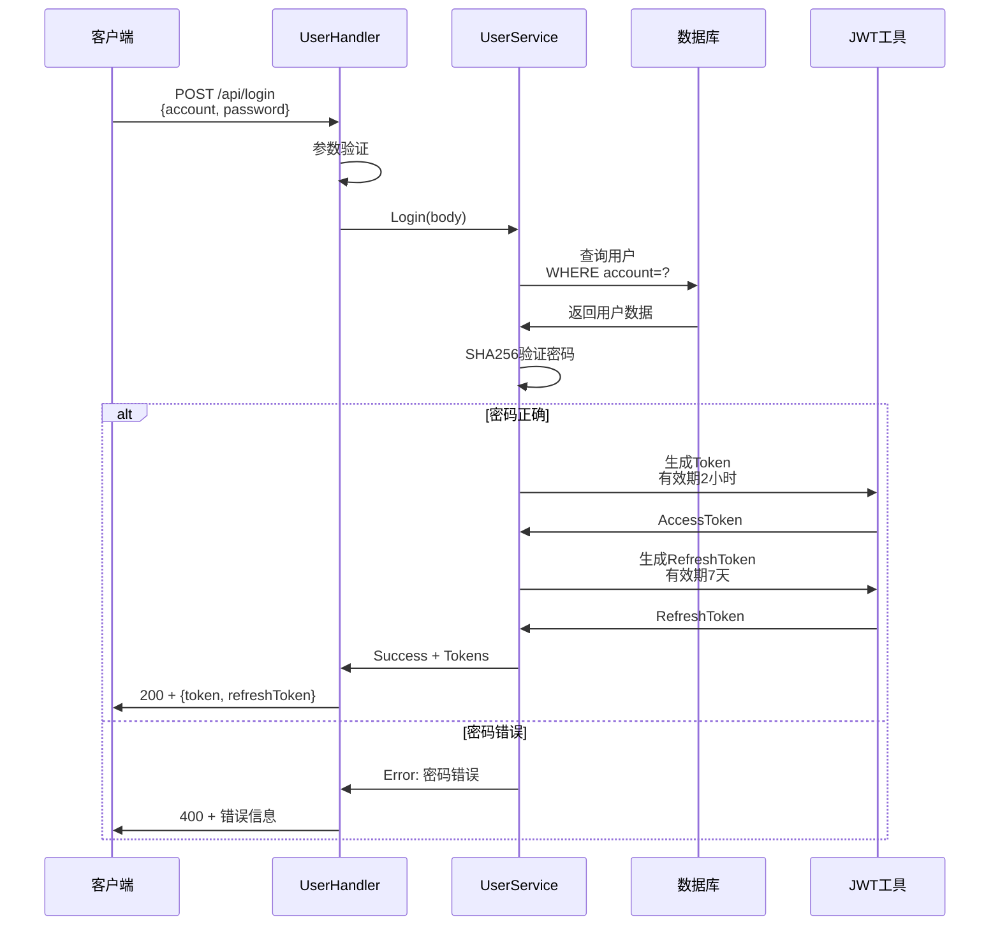
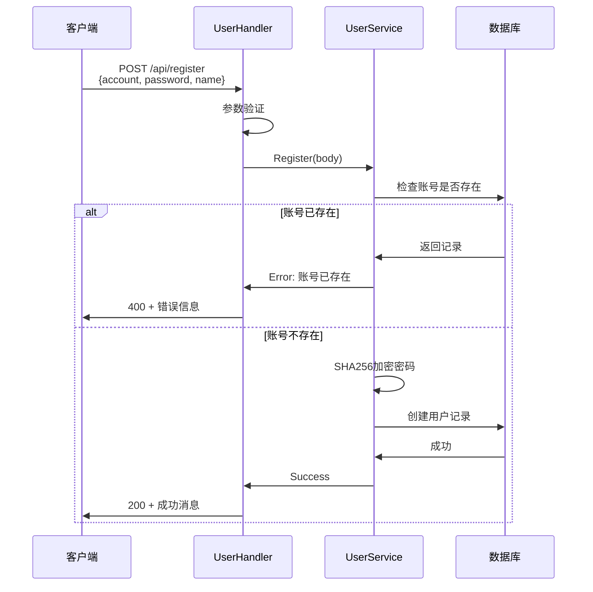
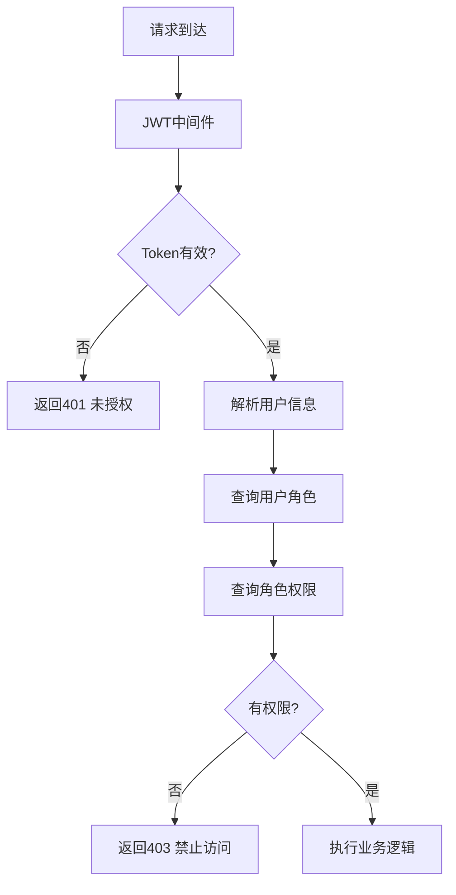

# 后端核心功能实现

## 用户认证系统

### 登录功能

#### 登录流程



#### 实现代码

```go
func (s *userService) Login(c *gin.Context, body dto.LoginBody) dto.Result[dto.LoginResult] {
    var user model.User
    
    // 查询用户
    result := s.db.Where("account = ?", body.Account).First(&user)
    if result.Error != nil {
        return dto.ServiceFail[dto.LoginResult](errors.New("密码错误,请检查账号密码"))
    }
    
    // SHA256 验证密码
    psd := sha256.Sum256([]byte(body.Password))
    hashPsd := hex.EncodeToString(psd[:])
    
    if user.Account == body.Account && hashPsd == *user.Password {
        // 生成访问令牌（2小时过期）
        sign, err := jwt.Auth(user, time.Now().Add(2*time.Hour).Unix())
        if err != nil {
            return dto.ServiceFail[dto.LoginResult](err)
        }
        
        // 生成刷新令牌（7天过期）
        refreshToken, err := jwt.Auth(user, time.Now().Add(24*7*time.Hour).Unix())
        if err != nil {
            return dto.ServiceFail[dto.LoginResult](err)
        }
        
        return dto.ServiceSuccess(dto.LoginResult{
            Token:        sign,
            RefreshToken: refreshToken,
        })
    }
    
    return dto.ServiceFail[dto.LoginResult](errors.New("账号或密码错误"))
}
```

### 注册功能

#### 注册流程



#### 密码加密

```go
func hashPassword(password string) string {
    psd := sha256.Sum256([]byte(password))
    return hex.EncodeToString(psd[:])
}

func (s *userService) Register(c *gin.Context, body dto.RegBody) error {
    // 检查账号是否已存在
    var existingUser model.User
    if err := s.db.Where("account = ?", body.Account).First(&existingUser).Error; err == nil {
        return errors.New("账号已存在")
    }
    
    // 加密密码
    hashedPassword := hashPassword(body.Password)
    
    // 创建用户
    user := model.User{
        Name:       body.Name,
        Account:    body.Account,
        Password:   &hashedPassword,
        Phone:      body.Phone,
        Email:      body.Email,
        CreateTime: time.Now(),
        UpdateTime: time.Now(),
    }
    
    return s.db.Create(&user).Error
}
```

### JWT Token 实现

#### Token 生成

```go
func Auth(user model.User, exp int64) (string, error) {
    claims := jwt.MapClaims{
        "userId":  user.ID,
        "account": user.Account,
        "name":    user.Name,
        "exp":     exp,
    }
    
    token := jwt.NewWithClaims(jwt.SigningMethodHS256, claims)
    
    // 使用密钥签名
    secretKey := []byte("your-secret-key")
    return token.SignedString(secretKey)
}
```

#### Token 验证

```go
func ParseToken(tokenString string) (*Claims, error) {
    token, err := jwt.ParseWithClaims(tokenString, &Claims{}, func(token *jwt.Token) (interface{}, error) {
        return []byte("your-secret-key"), nil
    })
    
    if err != nil {
        return nil, err
    }
    
    if claims, ok := token.Claims.(*Claims); ok && token.Valid {
        return claims, nil
    }
    
    return nil, errors.New("invalid token")
}
```

## RBAC 权限控制系统

### 权限验证流程



### 角色管理

#### 创建角色

```go
func (s *roleService) Create(c *gin.Context, body dto.RoleRequest) error {
    role := model.Role{
        Name:        body.Name,
        Description: body.Description,
        CreateTime:  time.Now(),
        UpdateTime:  time.Now(),
    }
    
    return s.db.Create(&role).Error
}
```

#### 分配权限给角色

```go
func (s *roleService) AssignPermissions(roleId int, permissionIds []int) error {
    return s.db.Transaction(func(tx *gorm.DB) error {
        var role model.Role
        if err := tx.First(&role, roleId).Error; err != nil {
            return err
        }
        
        var permissions []*model.Permission
        if err := tx.Find(&permissions, permissionIds).Error; err != nil {
            return err
        }
        
        // 替换角色的权限
        return tx.Model(&role).Association("Permissions").Replace(permissions)
    })
}
```

### 用户角色管理

#### 分配角色给用户

```go
func (s *userService) UpdateRoles(c *gin.Context, userId int, body *dto.User) error {
    return s.db.Transaction(func(tx *gorm.DB) error {
        var user model.User
        if err := tx.First(&user, userId).Error; err != nil {
            return err
        }
        
        var roles []*model.Role
        if err := tx.Find(&roles, body.RoleIds).Error; err != nil {
            return err
        }
        
        return tx.Model(&user).Association("Roles").Replace(roles)
    })
}
```

#### 检查用户权限

```go
func (s *userService) HasPermission(userId int, permissionCode string) (bool, error) {
    var count int64
    
    err := s.db.Table("users").
        Select("COUNT(*)").
        Joins("JOIN user_roles ON users.id = user_roles.user_id").
        Joins("JOIN role_permissions ON user_roles.role_id = role_permissions.role_id").
        Joins("JOIN permissions ON role_permissions.permission_id = permissions.id").
        Where("users.id = ? AND permissions.code = ?", userId, permissionCode).
        Count(&count).Error
    
    return count > 0, err
}
```

## 分页查询系统

### 分页参数

```go
type ListQuery struct {
    PageNum  int    `form:"pageNum" binding:"required,min=1"`
    PageSize int    `form:"pageSize" binding:"required,min=1,max=100"`
    Search   string `form:"search"`
}
```

### 分页实现

```go
func (s *userService) List(ctx *gin.Context, query dto.ListQuery) (dto.Result[dto.List[dto.UserWithRole]], error) {
    var users []model.User
    var total int64
    
    // 构建查询
    db := s.db.Model(&model.User{})
    
    // 搜索条件
    if query.Search != "" {
        db = db.Where("name LIKE ? OR account LIKE ?", 
            "%"+query.Search+"%", 
            "%"+query.Search+"%")
    }
    
    // 查询总数
    if err := db.Count(&total).Error; err != nil {
        return dto.ServiceFail[dto.List[dto.UserWithRole]](err), err
    }
    
    // 分页查询
    offset := (query.PageNum - 1) * query.PageSize
    if err := db.Offset(offset).
        Limit(query.PageSize).
        Preload("Roles").
        Preload("Departments").
        Find(&users).Error; err != nil {
        return dto.ServiceFail[dto.List[dto.UserWithRole]](err), err
    }
    
    // 构建响应
    list := dto.List[dto.UserWithRole]{
        List:     convertToUserWithRole(users),
        Total:    total,
        PageNum:  query.PageNum,
        PageSize: query.PageSize,
        Pages:    int(math.Ceil(float64(total) / float64(query.PageSize))),
    }
    
    return dto.ServiceSuccess(list), nil
}
```

### 查询优化

```go
// 预加载关联数据，避免 N+1 查询
db.Preload("Roles").
   Preload("Departments").
   Preload("Roles.Permissions").
   Find(&users)

// 选择特定字段
db.Select("id", "name", "account", "email").Find(&users)

// 使用索引
db.Where("account = ?", account).First(&user) // account 字段有索引
```

## 部门管理系统

### 树形结构查询

```go
func (s *departmentService) GetTree() ([]*model.Department, error) {
    var departments []*model.Department
    
    // 查询所有部门
    if err := s.db.Find(&departments).Error; err != nil {
        return nil, err
    }
    
    // 构建树形结构
    return buildTree(departments, nil), nil
}

func buildTree(departments []*model.Department, parentId *int) []*model.Department {
    var tree []*model.Department
    
    for _, dept := range departments {
        if (parentId == nil && dept.ParentID == nil) || 
           (parentId != nil && dept.ParentID != nil && *dept.ParentID == *parentId) {
            dept.Children = buildTree(departments, &dept.ID)
            tree = append(tree, dept)
        }
    }
    
    return tree
}
```

### 创建部门

```go
func (s *departmentService) Create(body dto.DepartmentRequest) error {
    dept := model.Department{
        Name:       body.Name,
        ParentID:   body.ParentID,
        CreateTime: time.Now(),
    }
    
    // 计算层级和路径
    if dept.ParentID != nil {
        var parent model.Department
        if err := s.db.First(&parent, *dept.ParentID).Error; err != nil {
            return err
        }
        dept.Level = parent.Level + 1
        dept.Path = parent.Path + fmt.Sprintf("%d/", parent.ID)
    } else {
        dept.Level = 1
        dept.Path = "/"
    }
    
    return s.db.Create(&dept).Error
}
```

## 字典管理系统

### 字典数据查询

```go
func (s *dictService) GetItems(dictCode string) ([]model.DictItem, error) {
    var items []model.DictItem
    
    err := s.db.Where("dict_code = ?", dictCode).
        Order("sort ASC").
        Find(&items).Error
    
    return items, err
}
```

### 创建字典项

```go
func (s *dictService) CreateItem(body dto.DictItemRequest) error {
    item := model.DictItem{
        DictCode:   body.DictCode,
        Label:      body.Label,
        Value:      body.Value,
        Sort:       body.Sort,
        CreateTime: time.Now(),
    }
    
    return s.db.Create(&item).Error
}
```

## gRPC 服务实现

### gRPC 服务定义

```protobuf
syntax = "proto3";

package hello;

service HelloService {
  rpc SayHello (HelloRequest) returns (HelloResponse) {}
}

message HelloRequest {
  string name = 1;
}

message HelloResponse {
  string message = 1;
}
```

### gRPC 服务器实现

```go
type HelloHandler struct {
    pb.UnimplementedHelloServiceServer
}

func (h *HelloHandler) SayHello(ctx context.Context, req *pb.HelloRequest) (*pb.HelloResponse, error) {
    message := fmt.Sprintf("Hello, %s!", req.Name)
    return &pb.HelloResponse{Message: message}, nil
}

// 启动 gRPC 服务器
func IntServer(container *dig.Container) {
    lis, err := net.Listen("tcp", ":50051")
    if err != nil {
        log.Fatalf("failed to listen: %v", err)
    }
    
    s := grpc.NewServer()
    
    // 注册服务
    pb.RegisterHelloServiceServer(s, &HelloHandler{})
    
    if err := s.Serve(lis); err != nil {
        log.Fatalf("failed to serve: %v", err)
    }
}
```

### gRPC 客户端实现

```go
type UserClient struct {
    conn   *grpc.ClientConn
    client pb.UserServiceClient
}

func NewUserClient(address string) (*UserClient, error) {
    conn, err := grpc.Dial(address, grpc.WithInsecure())
    if err != nil {
        return nil, err
    }
    
    return &UserClient{
        conn:   conn,
        client: pb.NewUserServiceClient(conn),
    }, nil
}

func (c *UserClient) GetUser(ctx context.Context, userId int) (*pb.User, error) {
    req := &pb.GetUserRequest{UserId: int32(userId)}
    return c.client.GetUser(ctx, req)
}
```

## 日志系统

### 日志初始化

```go
func InitLogger() (*zap.Logger, error) {
    config := zap.Config{
        Level:       zap.NewAtomicLevelAt(zap.InfoLevel),
        Development: false,
        Encoding:    "json",
        EncoderConfig: zapcore.EncoderConfig{
            TimeKey:        "timestamp",
            LevelKey:       "level",
            NameKey:        "logger",
            CallerKey:      "caller",
            MessageKey:     "msg",
            StacktraceKey:  "stacktrace",
            LineEnding:     zapcore.DefaultLineEnding,
            EncodeLevel:    zapcore.LowercaseLevelEncoder,
            EncodeTime:     zapcore.ISO8601TimeEncoder,
            EncodeDuration: zapcore.SecondsDurationEncoder,
            EncodeCaller:   zapcore.ShortCallerEncoder,
        },
        OutputPaths:      []string{"stdout", "logs/app.log"},
        ErrorOutputPaths: []string{"stderr"},
    }
    
    return config.Build()
}
```

### 日志上下文

```go
type LoggerWithContext struct {
    logger *zap.Logger
}

func (l *LoggerWithContext) WithContext(c *gin.Context) *zap.Logger {
    traceId := c.GetString("traceId")
    userId := c.GetInt("userId")
    
    return l.logger.With(
        zap.String("traceId", traceId),
        zap.Int("userId", userId),
    )
}

// 使用示例
func (h *UserHandler) GetUser(c *gin.Context) {
    log := h.log.WithContext(c)
    
    log.Info("获取用户信息",
        zap.Int("userId", userId),
    )
}
```

## 错误处理

### 统一错误响应

```go
type Result[T any] struct {
    Success bool   `json:"success"`
    Code    int    `json:"code"`
    Message string `json:"message"`
    Data    T      `json:"data,omitempty"`
}

func Success[T any](data T) Result[T] {
    return Result[T]{
        Success: true,
        Code:    200,
        Data:    data,
    }
}

func Fail(code int, message string) Result[any] {
    return Result[any]{
        Success: false,
        Code:    code,
        Message: message,
    }
}

func ServiceSuccess[T any](data T) Result[T] {
    return Success(data)
}

func ServiceFail[T any](err error) Result[T] {
    return Result[T]{
        Success: false,
        Code:    500,
        Message: err.Error(),
    }
}
```

### 错误恢复

```go
func RecoveryWithZap(logger *zap.Logger) gin.HandlerFunc {
    return func(c *gin.Context) {
        defer func() {
            if err := recover(); err != nil {
                logger.Error("panic recovered",
                    zap.Any("error", err),
                    zap.String("stack", string(debug.Stack())),
                    zap.String("path", c.Request.URL.Path),
                    zap.String("method", c.Request.Method),
                )
                
                c.JSON(500, dto.Fail(500, "Internal Server Error"))
                c.Abort()
            }
        }()
        c.Next()
    }
}
```

## 数据库事务

### 事务示例

```go
func (s *userService) CreateWithRoles(user *model.User, roleIds []int) error {
    return s.db.Transaction(func(tx *gorm.DB) error {
        // 1. 创建用户
        if err := tx.Create(user).Error; err != nil {
            return err
        }
        
        // 2. 查询角色
        var roles []*model.Role
        if err := tx.Find(&roles, roleIds).Error; err != nil {
            return err
        }
        
        // 3. 分配角色
        if err := tx.Model(user).Association("Roles").Append(roles); err != nil {
            return err
        }
        
        return nil
    })
}
```

### 事务回滚

```go
// 自动回滚
func (s *service) DoSomething() error {
    return s.db.Transaction(func(tx *gorm.DB) error {
        if err := tx.Create(&obj1).Error; err != nil {
            return err // 自动回滚
        }
        
        if err := tx.Create(&obj2).Error; err != nil {
            return err // 自动回滚
        }
        
        return nil // 提交事务
    })
}
```
