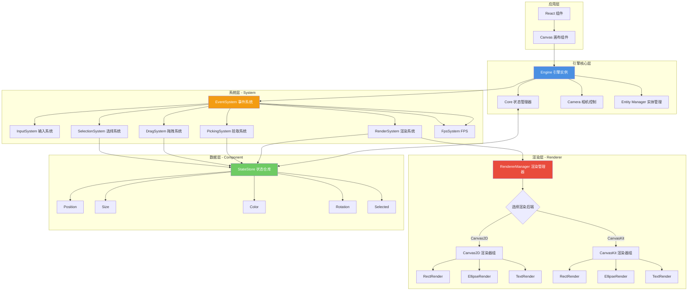
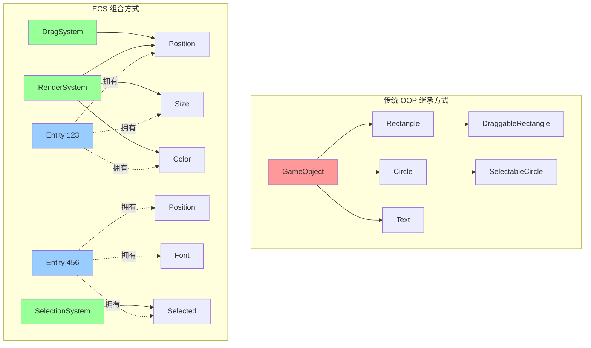
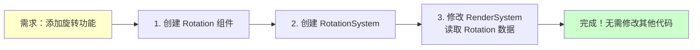
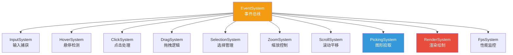
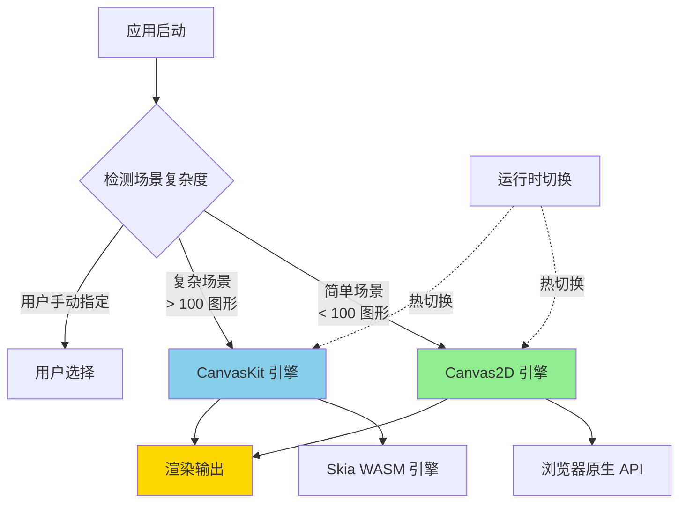
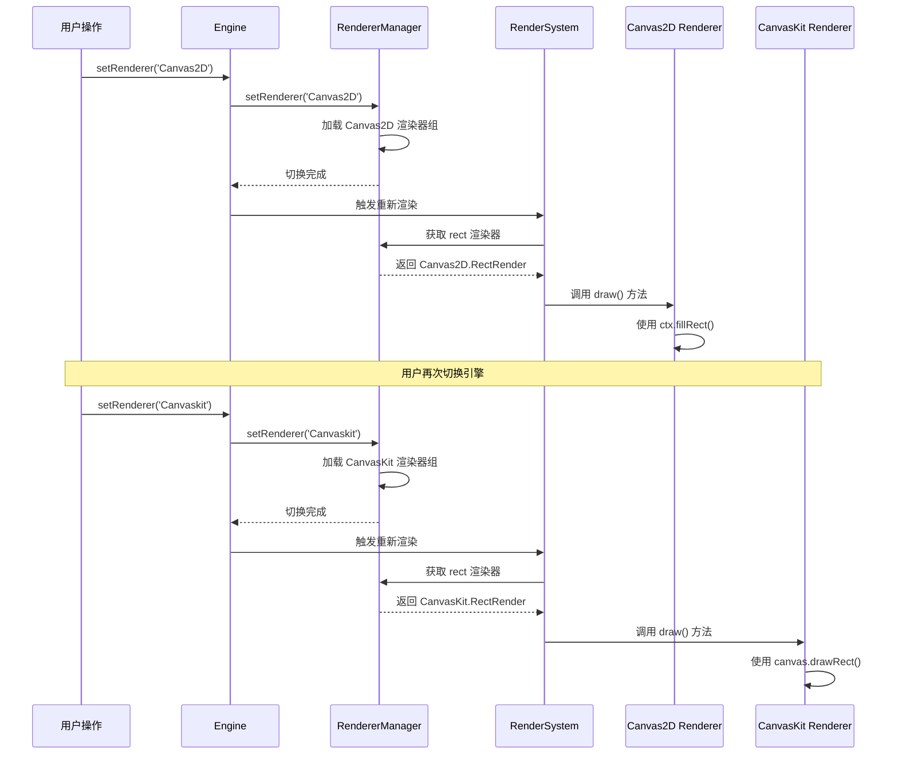
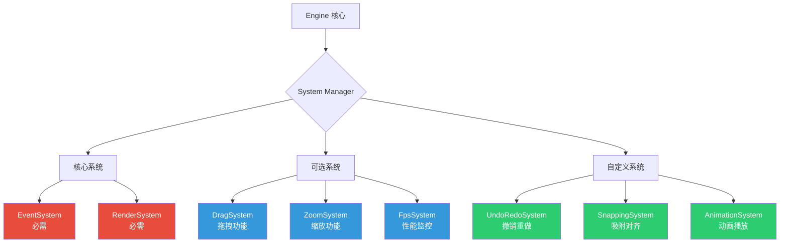
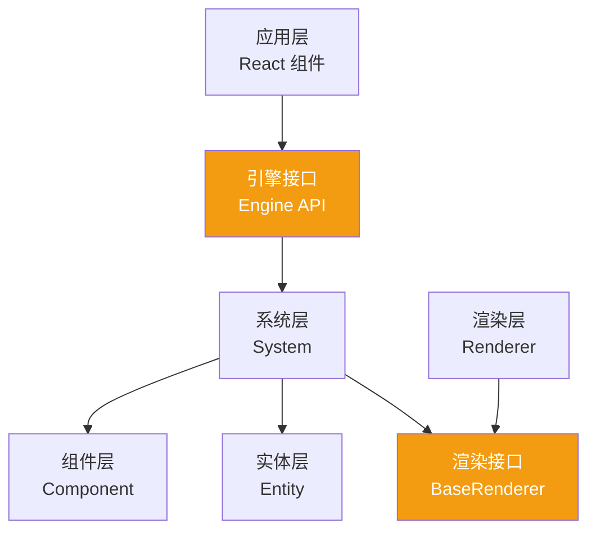

# ECS渲染引擎架构文档

## 写在前面
之前写过一篇ECS文章，为什么还要再写一个，本质上因为之前的文档，截止到目前来说，变化巨大，底层已经改了很多很多，所以有必要把一些内容拎出来单独去说。

## 项目概览

Duck-Core 是一个基于 **ECS（Entity-Component-System）架构**构建的高性能 Canvas 渲染引擎，专为复杂图形编辑场景设计。引擎的核心特色在于**双渲染后端架构**、**插件化系统设计**和**极致的渲染性能优化**。

### 核心技术栈
- **CanvasKit-WASM** - Google Skia 图形库的 WebAssembly 移植版
- **Canvas2D API** - 浏览器原生渲染接口

### 架构核心亮点

**ECS 架构模式** - 数据驱动的实体组件系统，实现逻辑与数据完全解耦

**双引擎架构** - Canvas2D 与 CanvasKit 双渲染后端，运行时无缝切换

🔌 **插件化设计** - 开放式扩展点，支持自定义渲染器、系统和组件

⚡ **极致性能** - 颜色编码拾取、离屏渲染、渲染节流等多重优化

---

## 整体架构设计

整个引擎采用分层架构，从底层的渲染抽象到顶层的用户交互，每一层职责清晰且可独立替换。



---

## ECS 架构深度解析

### 什么是 ECS 架构？

ECS（Entity-Component-System）是一种源自游戏引擎的设计模式，它彻底改变了传统面向对象的继承体系，转而采用**组合优于继承**的理念。

**三大核心概念：**

1. **Entity（实体）** - 仅是一个唯一 ID，不包含任何数据和逻辑
2. **Component（组件）** - 纯数据结构，描述实体的属性（如位置、颜色、大小）
3. **System（系统）** - 纯逻辑处理单元，操作特定组件组合的实体



### ECS 架构的核心优势

#### 1. 极致的解耦性

传统 OOP 中，功能通过继承链紧密耦合。而 ECS 中，系统只依赖组件接口，实体的行为完全由组件组合决定。

```typescript
// ❌ 传统方式：紧耦合的继承链
class Shape {
  render() { /* ... */ }
}
class DraggableShape extends Shape {
  drag() { /* ... */ }
}
class SelectableDraggableShape extends DraggableShape {
  select() { /* ... */ }
}

// ✅ ECS 方式：组件自由组合
const rect = createEntity()
addComponent(rect, Position, { x: 100, y: 100 })
addComponent(rect, Size, { width: 200, height: 150 })
addComponent(rect, Draggable, {})  // 可拖拽
addComponent(rect, Selected, {})   // 可选中
```

#### 2. 强大的可扩展性

新增功能无需修改现有代码，只需添加新的组件和系统：



#### 3. 天然的并行处理能力

系统之间无共享状态，可以安全地并行执行：

```typescript
// 多个系统可以同时读取同一个组件
async function updateFrame() {
  await Promise.all([
    physicsSystem.update(),   // 读取 Position
    renderSystem.update(),    // 读取 Position
    collisionSystem.update(), // 读取 Position
  ])
}
```

#### System 系统架构

系统负责处理逻辑，通过查询 StateStore 获取需要的组件数据：

```typescript
abstract class System {
  abstract update(stateStore: StateStore): void
}

class RenderSystem extends System {
  update(stateStore: StateStore) {
    // 查询所有拥有 Position 组件的实体
    for (const [entityId, position] of stateStore.position) {
      const size = stateStore.size.get(entityId)
      const color = stateStore.color.get(entityId)
      const type = stateStore.type.get(entityId)
      
      // 根据类型调用对应的渲染器
      this.renderMap.get(type)?.draw(entityId)
    }
  }
}
```

**系统完整列表：**



## 双引擎架构设计

### 架构设计理念

不同的应用场景对渲染引擎有不同的需求：

- **简单场景**：需要快速启动、体积小、兼容性好
- **复杂场景**：需要高性能、丰富特效、大量图形

传统方案通常只支持单一渲染后端，难以兼顾两者。本引擎采用**双引擎可切换架构**，在运行时动态选择最优渲染后端。



### 渲染后端对比

| 特性 | Canvas2D | CanvasKit (Skia) |
|-----|----------|------------------|
| **启动速度** | ⚡️ 即时（0ms） | 🐢 需加载 WASM（~2s） |
| **包体积** | ✅ 0 KB | ⚠️ ~1.5 MB |
| **浏览器兼容性** | ✅ 100% | ⚠️ 需支持 WASM |
| **渲染性能** | 🟡 中等 | 🟢 优秀 |
| **复杂路径渲染** | 🟡 一般 | 🟢 优秀 |
| **文字渲染** | 🟡 质量一般 | 🟢 亚像素级 |
| **滤镜特效** | ❌ 有限 | ✅ 丰富 |
| **离屏渲染** | ✅ 支持 | ✅ 支持 |
| **最佳场景** | 简单图形、快速原型 | 复杂设计、高性能需求 |

### RendererManager 渲染管理器

`RendererManager` 是双引擎架构的核心枢纽，负责渲染器的注册、切换和调度：

```typescript
class RendererManager {
  rendererName: 'Canvas2D' | 'Canvaskit' = 'Canvaskit'
  
  // 渲染器映射表
  renderer: {
    rect: typeof RectRender
    ellipse: typeof EllipseRender
    text: typeof TextRender
    img: typeof ImgRender
    polygon: typeof PolygonRender
  }
  
  // 切换渲染后端
  setRenderer(name: 'Canvas2D' | 'Canvaskit') {
    this.rendererName = name
    
    if (name === 'Canvas2D') {
      this.renderer = Canvas2DRenderers
    } else {
      this.renderer = CanvaskitRenderers
    }
  }
}
```

**渲染器切换流程：**



### 渲染器统一接口

所有渲染器实现相同的接口，保证可替换性：

```typescript
abstract class BaseRenderer extends System {
  constructor(protected engine: Engine) {
    super()
  }
  
  // 统一的渲染接口
  abstract draw(entityId: string): void
  
}
```

### 自定义渲染器扩展

引擎支持用户自定义渲染器，只需实现 `System` 接口：

```typescript
// 1. 创建自定义渲染器
class CustomStarRender extends System {
  draw(entityId: string) {
    const points = this.getComponent<Polygon>(entityId, 'polygon')
    const color = this.getComponent<Color>(entityId, 'color')
    
    // 自定义绘制逻辑
    const ctx = this.engine.ctx
    ctx.beginPath()
    points.points.forEach((p, i) => {
      i === 0 ? ctx.moveTo(p.x, p.y) : ctx.lineTo(p.x, p.y)
    })
    ctx.closePath()
    ctx.fillStyle = color.fill
    ctx.fill()
  }
}
const customRenderMap = {
  star: CustomStarRender
}
// 2. 注册到引擎
new RendererRegistry().register({
  "custom": customRenderMap
})


```

### 字体渲染优化

CanvasKit 需要预加载字体文件，引擎实现了字体管理器：

```typescript
async function loadFonts(CanvasKit: any) {
  const fontsBase = import.meta.env?.MODE === 'production' 
    ? '/design/fonts/' 
    : '/fonts/'

  const [robotoFont, notoSansFont] = await Promise.all([
    fetch(`${fontsBase}Roboto-Regular.ttf`).then(r => r.arrayBuffer()),
    fetch(`${fontsBase}NotoSansSC-VariableFont_wght_2.ttf`).then(r => r.arrayBuffer()),
  ])

  const fontMgr = CanvasKit.FontMgr.FromData(robotoFont, notoSansFont)
  return fontMgr
}

// 在 CanvasKit 初始化时调用
export async function createCanvasKit() {
  const CanvasKit = await initCanvasKit()
  const FontMgr = await loadFonts(CanvasKit)
  return { CanvasKit, FontMgr }
}
```

### 引擎工厂模式

使用工厂函数创建不同配置的引擎实例：

```typescript
export function createCanvasRenderer(engine: Engine) {
  // Canvas2D 引擎创建器
  const createCanvas2D = (config: DefaultConfig) => {
    const canvas = document.createElement('canvas')
    const dpr = window.devicePixelRatio || 1
    canvas.style.width = config.width + 'px'
    canvas.style.height = config.height + 'px'
    canvas.width = config.width * dpr
    canvas.height = config.height * dpr
    
    const ctx = canvas.getContext('2d', {
      willReadFrequently: true,
    }) as CanvasRenderingContext2D
    ctx.scale(dpr, dpr)
    
    config.container.appendChild(canvas)
    
    return { canvasDom: canvas, canvas: ctx, ctx }
  }

  // CanvasKit 引擎创建器
  const createCanvasKitSkia = async (config: DefaultConfig) => {
    const { CanvasKit, FontMgr } = await createCanvasKit()
    const canvasDom = document.createElement('canvas')
    const dpr = window.devicePixelRatio || 1
    
    canvasDom.style.width = config.width + 'px'
    canvasDom.style.height = config.height + 'px'
    canvasDom.width = config.width * dpr
    canvasDom.height = config.height * dpr
    canvasDom.id = 'canvasKitCanvas'
    
    config.container.appendChild(canvasDom)
    
    const surface = CanvasKit.MakeWebGLCanvasSurface('canvasKitCanvas')
    const canvas = surface!.getCanvas()
    
    return {
      canvasDom,
      surface,
      canvas: canvas,
      FontMgr: FontMgr,
      ck: CanvasKit,
    }
  }

  return {
    createCanvas2D,
    createCanvasKitSkia,
  }
}
```

### Engine 引擎核心

`Engine` 类是整个渲染系统的中枢，协调所有子系统的运行：

```typescript
class Engine implements EngineContext {
  camera: Camera = new Camera()
  entityManager: Entity = new Entity()
  SystemMap: Map<string, System> = new Map()
  rendererManager: RendererManager = new RendererManager()
  
  canvas!: Canvas  // 渲染画布（类型取决于渲染后端）
  ctx!: CanvasRenderingContext2D
  ck!: CanvasKit
  
  constructor(public core: Core, rendererName?: string) {
    // 初始化渲染器
    this.rendererManager.rendererName = rendererName || 'Canvaskit'
    this.rendererManager.setRenderer(this.rendererManager.rendererName)
  }
  
  // 添加系统
  addSystem(system: System) {
    this.system.push(system)
    this.SystemMap.set(system.constructor.name, system)
  }
  
  // 获取系统
  getSystemByName<T extends System>(name: string): T | undefined {
    return this.SystemMap.get(name) as T
  }
  
  // 清空画布（适配双引擎）
  clear() {
    const canvas = this.canvas as any
    if (canvas?.clearRect) {
      // Canvas2D 清空方式
      canvas.clearRect(0, 0, this.defaultSize.width, this.defaultSize.height)
    } else {
      // CanvasKit 清空方式
      this.canvas.clear(this.ck.WHITE)
    }
  }
}
```

---

## 插件化系统设计

### 系统即插件

引擎的所有功能都以 System 形式实现，每个 System 都是独立的插件。这种设计带来极高的灵活性：



### 核心系统详解

#### 1. EventSystem - 事件总线

EventSystem 是整个引擎的调度中枢，协调所有其他系统的执行：

```typescript
class EventSystem extends System {
  private eventQueue: Event[] = []
  
  update(stateStore: StateStore) {
    // 执行系统更新顺序
    this.executeSystem('InputSystem')      // 1. 捕获输入
    this.executeSystem('HoverSystem')      // 2. 检测悬停
    this.executeSystem('ClickSystem')      // 3. 处理点击
    this.executeSystem('DragSystem')       // 4. 处理拖拽
    this.executeSystem('ZoomSystem')       // 5. 处理缩放
    this.executeSystem('SelectionSystem')  // 6. 更新选择
    this.executeSystem('PickingSystem')    // 7. 更新拾取缓存
    this.executeSystem('RenderSystem')     // 8. 最后渲染
  }

}
```

#### 2. RenderSystem - 渲染系统

RenderSystem 负责将实体绘制到画布：

```typescript
class RenderSystem extends System {
  private renderMap = new Map<string, BaseRenderer>()
  
  constructor(engine: Engine) {
    super()
    this.engine = engine
    this.initRenderMap()
  }
  
  // 初始化渲染器映射
  initRenderMap() {
    Object.entries(this.engine.rendererManager.renderer).forEach(
      ([type, RendererClass]) => {
        this.renderMap.set(type, new RendererClass(this.engine))
      }
    )
  }
  
  async update(stateStore: StateStore) {
    // 清空画布
    this.engine.clear()
    
    // 应用相机变换
    this.engine.canvas.save()
    this.engine.canvas.translate(
      this.engine.camera.translateX,
      this.engine.camera.translateY
    )
    this.engine.canvas.scale(
      this.engine.camera.zoom,
      this.engine.camera.zoom
    )
    
    // 遍历所有实体进行渲染
    for (const [entityId, pos] of stateStore.position) {
      this.engine.canvas.save()
      this.engine.canvas.translate(pos.x, pos.y)
      
      const type = stateStore.type.get(entityId)
      await this.renderMap.get(type)?.draw(entityId)
      
      this.engine.canvas.restore()
    }
    
    this.engine.canvas.restore()
  }
}
```

## DSL 配置系统

---

## DSL 配置系统

### 设计目标

DSL（Domain Specific Language）模块的目标是将图形场景序列化为 JSON 格式，实现：

1. **场景持久化** - 保存到数据库或本地存储
2. **场景传输** - 前后端数据交换
3. **场景快照** - 撤销/重做功能的基础
4. **模板复用** - 创建可复用的图形模板

### 配置结构

```typescript
interface DSLParams {
  type: 'rect' | 'ellipse' | 'text' | 'img' | 'polygon'
  id?: string
  position: { x: number; y: number }
  size?: { width: number; height: number }
  color?: { fill: string; stroke: string }
  rotation?: { value: number }
  scale?: { value: number }
  zIndex?: { value: number }
  selected?: { isSelected: boolean }
  // 形状特定属性
  font?: { family: string; size: number; weight: string }
  radius?: { value: number }
  polygon?: { points: Point[] }
}
```

### DSL 解析器

```typescript
class DSL {
  constructor(params: DSLParams) {
    this.type = params.type
    this.id = params.id || this.generateId()
    this.position = new Position(params.position)
    this.size = params.size ? new Size(params.size) : new Size()
    this.color = params.color ? new Color(params.color) : new Color()
    // ... 初始化其他组件
  }
  
  // 转换为纯数据对象
  toJSON(): DSLParams {
    return {
      type: this.type,
      id: this.id,
      position: { x: this.position.x, y: this.position.y },
      size: { width: this.size.width, height: this.size.height },
      color: { fill: this.color.fill, stroke: this.color.stroke },
      // ...
    }
  }
}
```

---

## 低耦合架构实践

### 依赖方向

整个引擎严格遵循依赖倒置原则：



**关键设计：**
- 上层依赖接口，不依赖具体实现
- System 不直接依赖 Renderer，通过 RendererManager 解耦
- Component 纯数据，零依赖

---

## 总结

Duck-Core 前端渲染引擎通过以下设计实现了高性能、高扩展性：

### 核心优势

1. **ECS 架构** - 数据与逻辑完全分离，组件自由组合
2. **双引擎架构** - Canvas2D 与 CanvasKit 可热切换，兼顾兼容性与性能
3. **插件化系统** - 所有功能以 System 形式实现，按需加载
5. **低耦合设计** - 接口隔离、依赖倒置、事件驱动
6. **极致性能** - 渲染节流、离屏缓存、视口裁剪、内存优化


