# 图形引擎架构文档

## 1. 概述

本图形引擎是一个基于 ECS (Entity-Component-System) 架构的高性能 2D 渲染引擎，采用 TypeScript 实现。引擎支持多种渲染后端（Canvas2D、CanvasKit），提供了完整的交互系统（选择、拖拽、缩放、滚动）和灵活的图形绘制能力。

### 1.1 核心特性

- **ECS 架构**: 数据与逻辑分离，组件化设计，易于扩展
- **多渲染器支持**: Canvas2D 和 CanvasKit 双渲染后端
- **高性能渲染**: 视口裁剪、脏检查机制、离屏渲染优化
- **完整交互系统**: 鼠标事件处理、拖拽、选择、缩放、滚动
- **相机系统**: 支持平移、缩放、边界限制
- **实体拾取**: 基于颜色编码的精确实体识别

### 1.2 技术栈

- **核心语言**: TypeScript
- **渲染技术**: Canvas2D API、CanvasKit-WASM
- **事件管理**: mitt (事件总线)
- **工具库**: lodash、fast-deep-equal、stable-hash-x

## 2. 整体架构

### 2.1 架构图

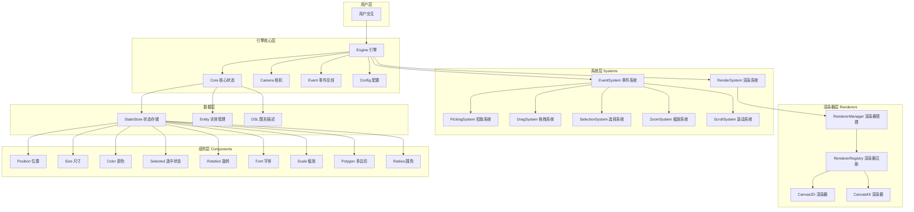

### 2.2 架构说明

引擎采用分层架构设计：

1. **用户层**: 接收用户输入和交互
2. **引擎核心层**: 管理引擎生命周期、配置和全局状态
3. **系统层**: 实现各种功能逻辑（渲染、交互、事件处理）
4. **渲染器层**: 抽象渲染接口，支持多种渲染后端
5. **数据层**: 管理实体数据和状态
6. **组件层**: 定义图形对象的属性

## 3. 核心模块设计

### 3.1 Engine (引擎核心)

Engine 是整个图形引擎的中枢，负责协调各个系统的运行。

#### 3.1.1 类图

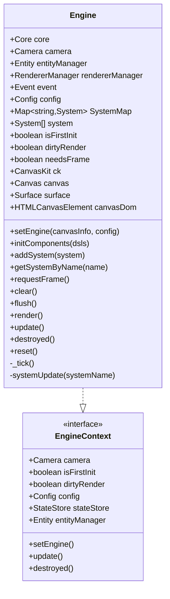

#### 3.1.2 核心职责

- **生命周期管理**: 初始化、渲染循环、销毁
- **系统管理**: 注册、获取和调度各类 System
- **渲染调度**: 管理脏标记、请求动画帧、执行渲染
- **状态同步**: 协调 Core 和各 System 之间的状态传递

#### 3.1.3 渲染流程

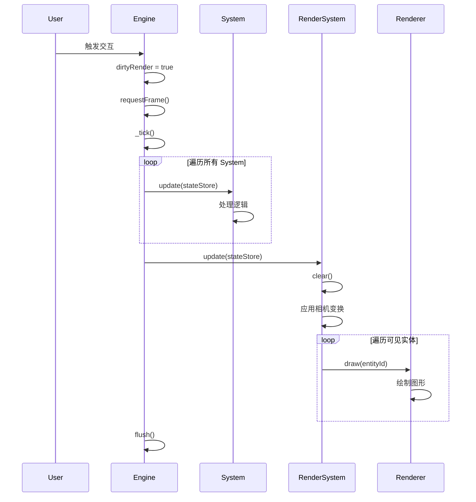

### 3.2 Core (核心状态管理)

Core 负责管理图形数据的初始化和状态存储。

#### 3.2.1 类图

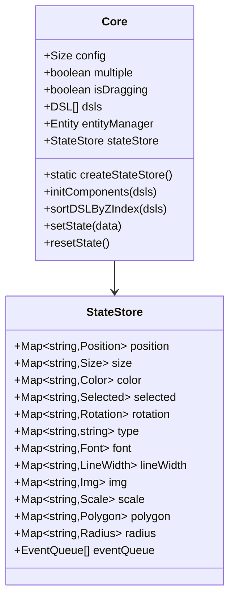

#### 3.2.2 状态存储机制

StateStore 采用 Map 结构存储组件数据，以 entityId 为键：

- **高性能查询**: O(1) 时间复杂度
- **类型安全**: 每种组件类型独立存储
- **易于扩展**: 新增组件只需添加新的 Map

### 3.3 Camera (相机系统)

Camera 管理视口的变换（平移、缩放），实现世界坐标到屏幕坐标的转换。

#### 3.3.1 数据结构

```typescript
class Camera {
  scale: boolean = true       // 是否启用缩放
  zoom: number = 1            // 缩放级别
  minZoom: number = 0.05      // 最小缩放
  maxZoom: number = 30        // 最大缩放
  isZooming: boolean = false  // 是否正在缩放
  translateX: number = 0      // X 轴平移
  translateY: number = 0      // Y 轴平移
  minX: number | null = null  // X 轴最小边界
  maxX: number | null = null  // X 轴最大边界
  minY: number | null = null  // Y 轴最小边界
  maxY: number | null = null  // Y 轴最大边界
}
```

#### 3.3.2 坐标转换

**屏幕坐标 → 世界坐标**:
$$\text{WorldX} = \frac{\text{ScreenX} - \text{TranslateX}}{\text{Zoom}}$$

**缩放中心计算**:
```typescript
camera.translateX = canvasX - (canvasX - camera.translateX) * (newZoom / prevZoom)
camera.translateY = canvasY - (canvasY - camera.translateY) * (newZoom / prevZoom)
```

### 3.4 Entity (实体管理)

Entity 采用颜色编码技术实现实体的唯一标识和高效拾取。

#### 3.4.1 颜色编码原理

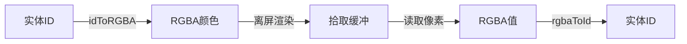

#### 3.4.2 核心方法

| 方法 | 说明 |
|------|------|
| `generateId()` | 生成唯一实体ID并转换为RGBA |
| `idToRGBA(id)` | 将24位整数ID映射到RGB颜色空间 |
| `rgbaToId(rgba)` | 从RGBA颜色反推实体ID |
| `getColorById(id)` | 获取实体对应的CSS颜色字符串 |

#### 3.4.3 ID编码算法

```typescript
// ID → RGBA
idToRGBA(id: number): [r, g, b, a] {
  const r = (id >> 16) & 0xff  // 高8位
  const g = (id >> 8) & 0xff   // 中8位
  const b = id & 0xff          // 低8位
  const a = 255                // 固定不透明
  return [r, g, b, a]
}

// RGBA → ID
rgbaToId([r, g, b, a]: number[]): string {
  const id = (r << 16) | (g << 8) | b
  return String(id)
}
```

### 3.5 DSL (领域特定语言)

DSL 是图形对象的统一描述格式，聚合了所有组件属性。

#### 3.5.1 类图

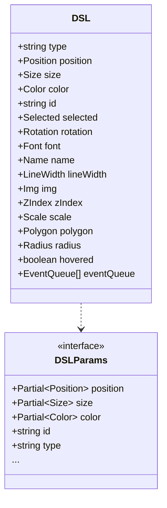

#### 3.5.2 初始化流程

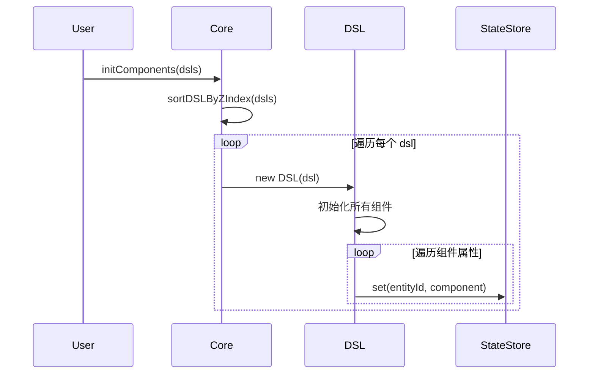

## 4. 系统层设计

### 4.1 System (系统基类)

所有系统的抽象基类，定义了统一接口。

```typescript
class System {
  hashMap: Map<string, any>        // 缓存哈希值
  
  update(components: StateStore)    // 更新逻辑
  draw(entityId: string)            // 绘制逻辑
  isDirty(entityId, newState)       // 脏检查
  isPositionDirty(entityId, state)  // 位置脏检查
  isGeometryDirty(entityId, state)  // 几何脏检查
  destroyed()                        // 销毁资源
}
```

### 4.2 RenderSystem (渲染系统)

负责图形的实际绘制，支持视口裁剪和多渲染器。

#### 4.2.1 渲染流程

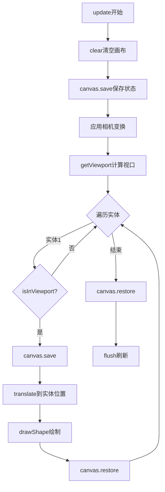

#### 4.2.2 视口裁剪

```typescript
getViewport() {
  const { camera, config } = this.engine
  const zoom = camera.zoom
  
  const left = -camera.translateX / zoom
  const top = -camera.translateY / zoom
  const right = left + config.width / zoom
  const bottom = top + config.height / zoom
  
  return { left, top, right, bottom }
}

isInViewport(position, size, viewport): boolean {
  const entityLeft = position.x
  const entityTop = position.y
  const entityRight = position.x + size.width
  const entityBottom = position.y + size.height
  
  return !(
    entityRight < viewport.left ||
    entityLeft > viewport.right ||
    entityBottom < viewport.top ||
    entityTop > viewport.bottom
  )
}
```

### 4.3 EventSystem (事件系统)

处理所有用户输入事件（鼠标、滚轮、触摸）。

#### 4.3.1 事件类型

| 事件类型 | 常量 | 说明 |
|---------|------|------|
| 点击 | `EventType.Click` | 鼠标点击 |
| 移动 | `EventType.MouseMove` | 鼠标移动 |
| 按下 | `EventType.MouseDown` | 鼠标按下 |
| 释放 | `EventType.MouseUp` | 鼠标释放 |
| 滚动 | `EventType.Scroll` | 滚轮滚动 |
| 缩放 | `EventType.Zoom` | 缩放操作 |

#### 4.3.2 事件处理流程

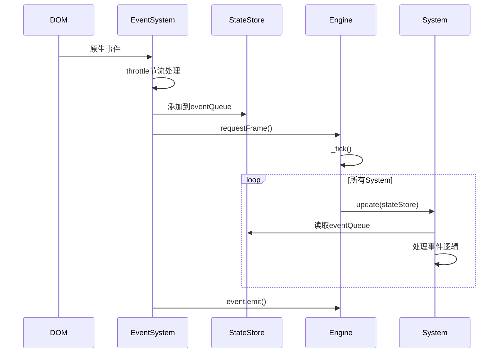

#### 4.3.3 事件节流

```typescript
// 鼠标移动事件节流（16ms）
this.throttledMouseMove = throttle(this.onMouseMove.bind(this), 16)

// 滚轮事件节流（16ms）
this.throttledWheel = throttle(this.onWheel.bind(this), 16)
```

### 4.4 PickingSystem (拾取系统)

基于离屏渲染的精确实体拾取。

#### 4.4.1 拾取原理

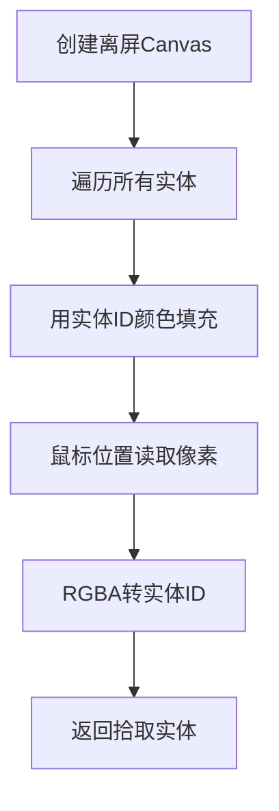

#### 4.4.2 核心流程

```typescript
// 1. 初始化离屏画布
initOffscreenCanvas() {
  const offscreenCanvas = document.createElement('canvas')
  offscreenCanvas.width = width
  offscreenCanvas.height = height
  return offscreenCanvas.getContext('2d', { willReadFrequently: true })
}

// 2. 离屏渲染（用实体颜色填充）
render(stateStore: StateStore) {
  ctx.save()
  ctx.translate(camera.translateX, camera.translateY)
  ctx.scale(camera.zoom, camera.zoom)
  
  stateStore.position.forEach((pos, entityId) => {
    const fillColor = entityManager.getColorById(entityId)
    ctx.fillStyle = fillColor
    ctx.fillRect(pos.x, pos.y, size.width, size.height)
  })
  
  ctx.restore()
}

// 3. 拾取实体
pickEntity(x: number, y: number): string | null {
  const pixel = ctx.getImageData(x, y, 1, 1).data
  const entityId = entityManager.rgbaToId([pixel[0], pixel[1], pixel[2], pixel[3]])
  return entityId !== '0' ? entityId : null
}
```

### 4.5 DragSystem (拖拽系统)

实现图形对象的拖拽功能。

#### 4.5.1 拖拽状态机

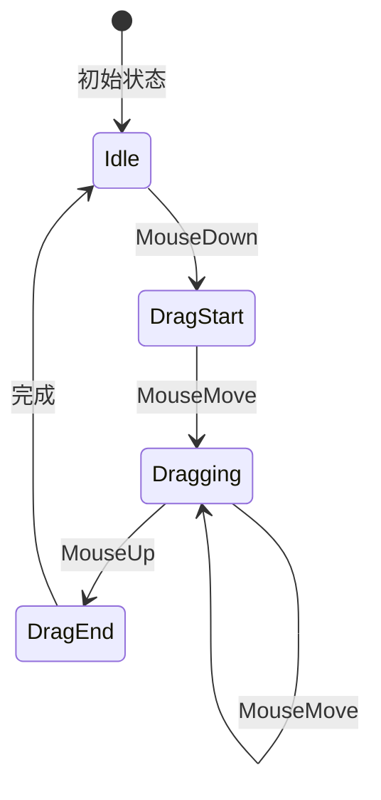

#### 4.5.2 拖拽计算

```typescript
// 拖拽开始：记录偏移量
onDragStart(pickSystem: PickingSystem) {
  const selectedEntities = pickSystem.getCurrentPickSelectedEntitys()
  const rect = canvasDom.getBoundingClientRect()
  const canvasX = event.clientX - rect.left
  const canvasY = event.clientY - rect.top
  
  selectedEntities.forEach(entity => {
    const position = stateStore.position.get(entity.entityId)
    // 计算鼠标在元素内的偏移
    offset.x = (canvasX - translateX) / zoom - position.x
    offset.y = (canvasY - translateY) / zoom - position.y
  })
}

// 拖拽中：更新位置
onDragShape(pickSystem: PickingSystem) {
  const rect = canvasDom.getBoundingClientRect()
  const canvasX = event.clientX - rect.left
  const canvasY = event.clientY - rect.top
  
  selectedEntities.forEach(entity => {
    const position = stateStore.position.get(entity.entityId)
    position.x = (canvasX - translateX) / zoom - offset.x
    position.y = (canvasY - translateY) / zoom - offset.y
  })
  
  engine.dirtyRender = true
}
```

### 4.6 SelectionSystem (选择系统)

管理图形对象的选中状态和视觉反馈。

#### 4.6.1 选择层设计

- 独立的 Canvas 层，覆盖在主画布之上
- `pointer-events: none` 不阻挡鼠标事件
- 高 `z-index` 确保在最上层

#### 4.6.2 渲染逻辑

```typescript
render(stateStore: StateStore, entityId: string, isHover: boolean) {
  const selected = stateStore.selected.get(entityId)
  const position = stateStore.position.get(entityId)
  const size = stateStore.size.get(entityId)
  
  if (position && size) {
    if (!selected?.value) {
      // 悬停状态：蓝色虚线边框
      this.shapeRect({
        position, size,
        color: 'rgba(90, 132, 255, 0.8)',
        dash: [2, 2]
      })
    } else {
      // 选中状态：实线边框
      this.shapeRect({
        position, size,
        color: 'rgba(90, 132, 255, 1)',
        dash: []
      })
    }
  }
}
```

### 4.7 ZoomSystem (缩放系统)

处理画布的缩放操作。

#### 4.7.1 缩放算法

```typescript
update(stateStore: StateStore) {
  const { deltaY, x, y } = event
  const prevZoom = camera.zoom
  
  // 触摸板检测
  const isTouchPad = !Number.isInteger(Math.abs(deltaY))
  const scaleFactor = isTouchPad ? 0.008 : 0.003
  
  // 动态灵敏度
  const sensitivity = Math.max(0.1, 1 - prevZoom * 0.05)
  const scale = 1 - deltaY * scaleFactor * sensitivity
  
  // 限制缩放范围
  const newZoom = Math.min(maxZoom, Math.max(minZoom, prevZoom * scale))
  
  // 围绕鼠标点缩放
  camera.translateX = canvasX - (canvasX - translateX) * (newZoom / prevZoom)
  camera.translateY = canvasY - (canvasY - translateY) * (newZoom / prevZoom)
  camera.zoom = newZoom
}
```

### 4.8 ScrollSystem (滚动系统)

实现画布的滚动和滚动条。

#### 4.8.1 滚动条组成

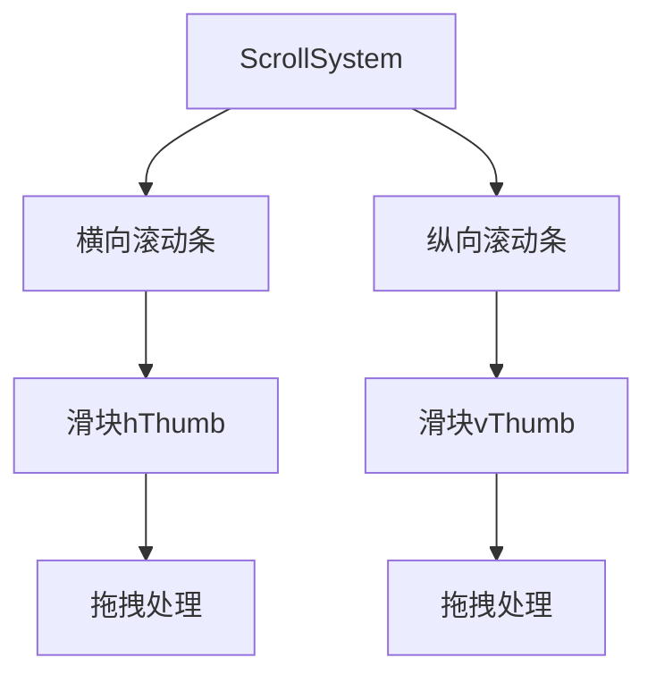

#### 4.8.2 滚动处理

```typescript
update(stateStore: StateStore) {
  const { type, event } = stateStore.eventQueue[0]
  
  if (type === EventType.Scroll) {
    const sensitivity = this.scrollSensitivity
    camera.translateX += event.deltaX * sensitivity
    camera.translateY += event.deltaY * sensitivity
    
    // 边界限制
    if (camera.minX !== null) {
      camera.translateX = Math.max(camera.minX, Math.min(camera.maxX, camera.translateX))
    }
    if (camera.minY !== null) {
      camera.translateY = Math.max(camera.minY, Math.min(camera.maxY, camera.translateY))
    }
    
    engine.dirtyRender = true
  }
}
```

## 5. 渲染器架构

### 5.1 渲染器管理

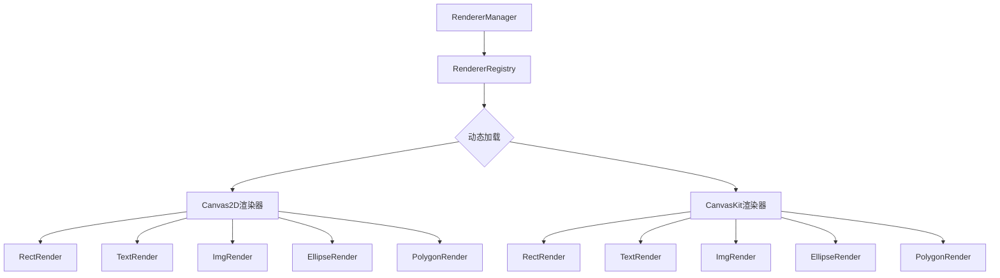

### 5.2 渲染器注册机制

```typescript
class RendererRegistry {
  private rendererMgr: RendererMgr[] = []
  
  initRenderer() {
    // 使用 Vite 的 glob 导入动态加载渲染器
    const rendererMap = import.meta.glob(
      '../System/RenderSystem/Renderer/**/index.ts',
      { eager: true }
    )
    
    Object.entries(rendererMap).forEach(([path, resolver]) => {
      this.rendererMgr.push({
        name: path,
        renderer: resolver
      })
    })
  }
  
  getRenderers(type?: string): RendererMgr | undefined {
    return this.rendererMgr.find(mgr => mgr.name.includes(type))
  }
}
```

### 5.3 Canvas2D 渲染器

#### 5.3.1 矩形渲染

```typescript
class RectRender extends System {
  // 像素对齐（避免抗锯齿模糊）
  private getPixelOffset(lineWidth: number): number {
    return lineWidth % 2 === 1 ? 0.5 : 0
  }
  
  // 圆角矩形绘制
  drawRoundRectPath(width, height, radius) {
    ctx.beginPath()
    ctx.moveTo(radius.lt, 0)
    ctx.lineTo(width - radius.rt, 0)
    if (radius.rt > 0) ctx.arcTo(width, 0, width, radius.rt, radius.rt)
    ctx.lineTo(width, height - radius.rb)
    if (radius.rb > 0) ctx.arcTo(width, height, width - radius.rb, height, radius.rb)
    ctx.lineTo(radius.lb, height)
    if (radius.lb > 0) ctx.arcTo(0, height, 0, height - radius.lb, radius.lb)
    ctx.lineTo(0, radius.lt)
    if (radius.lt > 0) ctx.arcTo(0, 0, radius.lt, 0, radius.lt)
    ctx.closePath()
  }
}
```

### 5.4 CanvasKit 渲染器

#### 5.4.1 矩形渲染

```typescript
class RectRender extends System {
  paint: Paint
  
  constructor(engine: Engine) {
    super()
    this.engine = engine
    this.paint = new engine.ck.Paint()
  }
  
  draw(entityId: string) {
    const ck = this.engine.ck
    const state = this.getComponentsByEntityId(stateStore, entityId)
    const { fillColor } = state.color
    const radius = state.radius
    
    const paint = this.paint
    paint.setAntiAlias(true)
    paint.setStyle(ck.PaintStyle.Fill)
    if (fillColor) paint.setColor(ck.parseColorString(fillColor))
    
    const radii = [lt, lt, rt, rt, rb, rb, lb, lb]
    const { left, top, right, bottom } = this.toLTRBRect(state)
    const rrect = Float32Array.of(left, top, right, bottom, ...radii)
    
    this.engine.canvas.drawRRect(rrect, paint)
  }
}
```

## 6. 组件设计

### 6.1 组件列表

| 组件 | 说明 | 数据结构 |
|------|------|---------|
| Position | 位置 | `{ x: number, y: number }` |
| Size | 尺寸 | `{ width: number, height: number }` |
| Color | 颜色 | `{ fillColor?, strokeColor?, strokeTColor?, strokeBColor?, strokeLColor?, strokeRColor? }` |
| Selected | 选中状态 | `{ value: boolean }` |
| Rotation | 旋转 | `{ value: number }` |
| Font | 字体 | `{ family?, size?, weight?, style? }` |
| Scale | 缩放 | `{ value: number }` |
| LineWidth | 线宽 | `{ value: number }` |
| Img | 图片 | `{ src?, width?, height? }` |
| Polygon | 多边形 | `{ points: Array<{x, y}> }` |
| Radius | 圆角 | `{ value: number or { lt?, rt?, rb?, lb? } }` |
| ZIndex | 层级 | `{ value: number }` |
| Name | 名称 | `{ value: string }` |

### 6.2 组件基类

```typescript
class Base {}  // 空基类，用于类型标识
```

所有组件均继承自 Base 类，提供统一的类型基础。

## 7. 性能优化

### 7.1 脏检查机制

```typescript
class System {
  isDirty(entityId: string, newState: DSL): boolean {
    if (!this.isPositionDirty(entityId, newState)) return false
    if (!this.isGeometryDirty(entityId, newState)) return false
    return true
  }
  
  isPositionDirty(entityId: string, state: DSL): boolean {
    const oldPosition = this.hashMap.get(entityId + '_position')
    if (oldPosition && 
        oldPosition.x === state.position.x && 
        oldPosition.y === state.position.y) 
      return false
    this.hashMap.set(entityId + '_position', state.position)
    return true
  }
  
  isGeometryDirty(entityId: string, state: DSL): boolean {
    const old = this.hashMap.get(entityId + '_geometry')
    const data = { ...state }
    delete data.position
    if (equal(data, old)) return false
    this.hashMap.set(entityId + '_geometry', data)
    return true
  }
}
```

### 7.2 视口裁剪

只渲染可视区域内的实体，大幅提升大量图形时的性能。

```typescript
const viewport = this.getViewport()
for (const [entityId, pos] of stateStore.position) {
  if (!this.isInViewport(position, size, viewport)) {
    continue  // 跳过不可见实体
  }
  await this.drawShape(stateStore, entityId)
}
```

### 7.3 事件节流

使用 lodash 的 `throttle` 对高频事件进行节流处理：

```typescript
this.throttledMouseMove = throttle(this.onMouseMove.bind(this), 16)  // ~60fps
this.throttledWheel = throttle(this.onWheel.bind(this), 16)
```

### 7.4 离屏渲染优化

```typescript
// 拾取系统的离屏画布配置
offscreenCanvas.getContext('2d', {
  willReadFrequently: true  // 优化频繁读取像素性能
})
```

### 7.5 渲染优化标志

```typescript
class Engine {
  dirtyRender: boolean = false      // 标记是否需要重新渲染
  needsFrame: boolean = false       // 标记是否已请求帧
  isFirstInit: boolean = true       // 首次渲染标记
  
  requestFrame() {
    if (!this.needsFrame) {
      this.needsFrame = true
      this.requestAnimationFrame()
    }
  }
}
```

## 8. 配置系统

### 8.1 默认配置

```typescript
class Config {
  static container: HTMLDivElement | null = null
  static width = 800
  static height = 800
  static drag = { enabled: true }
  static selected = { enabled: true }
  static hover = { enabled: true }
  static mode = 'Canvaskit'
  static camera = {
    minX: 0,
    maxX: 800,
    minY: 0,
    maxY: 800,
    scale: true
  }
  static scroll = {
    bar: { enabled: true },
    enabled: true
  }
  
  static merge(obj: Partial<Config>) {
    mergeWith(Config, obj, (_objValue, srcValue) => {
      if (Array.isArray(srcValue)) {
        return srcValue
      }
    })
  }
}
```

### 8.2 配置项说明

| 配置项 | 类型 | 默认值 | 说明 |
|--------|------|--------|------|
| width | number | 800 | 画布宽度 |
| height | number | 800 | 画布高度 |
| mode | string | 'Canvaskit' | 渲染模式 |
| drag.enabled | boolean | true | 启用拖拽 |
| selected.enabled | boolean | true | 启用选择 |
| hover.enabled | boolean | true | 启用悬停 |
| scroll.enabled | boolean | true | 启用滚动 |
| scroll.bar.enabled | boolean | true | 显示滚动条 |
| camera.scale | boolean | true | 启用缩放 |
| camera.minX/maxX | number | 0/800 | X轴边界 |
| camera.minY/maxY | number | 0/800 | Y轴边界 |

## 9. 事件系统

### 9.1 事件总线

使用 `mitt` 库实现轻量级事件总线：

```typescript
class Event {
  on = emitter.on
  emit = emitter.emit
  off = emitter.off
  clear() {
    emitter.all.clear()
  }
}
```

### 9.2 事件流转

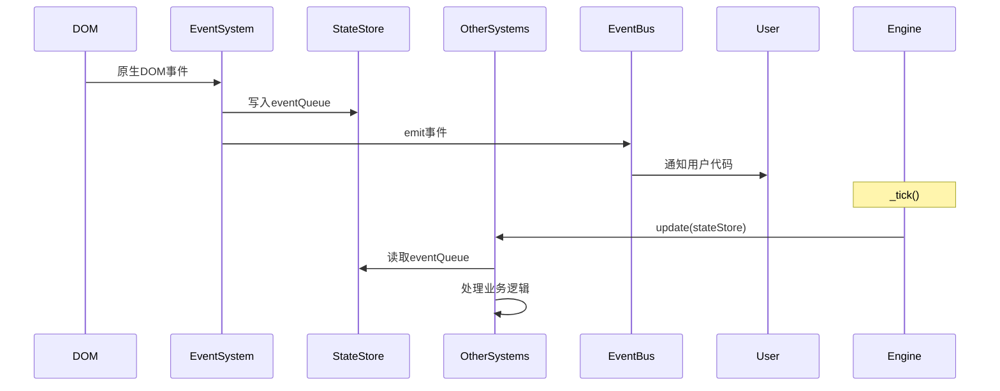

### 9.3 事件队列

```typescript
type EventQueue = {
  type: string                      // 事件类型
  event: MouseEvent | WheelEvent    // 原生事件对象
}[]

// 存储在 StateStore 中
stateStore.eventQueue = [
  { type: 'mousedown', event: mouseEvent },
  { type: 'mousemove', event: mouseMoveEvent }
]
```

## 10. 工具函数

### 10.1 getComponentsByEntityId

根据实体ID获取所有组件，组装成 DSL 对象。

```typescript
export const getComponentsByEntityId = (
  components: StateStore,
  entityId: string
) => {
  const size = components.size.get(entityId)
  const position = components.position.get(entityId)
  const color = components.color.get(entityId)
  const rotation = components.rotation.get(entityId)
  const type = components.type.get(entityId)
  const lineWidth = components.lineWidth.get(entityId)
  const font = components.font.get(entityId)
  const img = components.img.get(entityId)
  const scale = components.scale.get(entityId)
  const polygon = components.polygon.get(entityId)
  const radius = components.radius.get(entityId)
  
  return new DSL({
    size, position, color, rotation, type,
    lineWidth, font, img, scale, polygon, radius,
    id: entityId
  })
}
```

## 11. 总结

本图形引擎采用 ECS 架构，具有以下特点：

### 11.1 架构优势

- **解耦性强**: 数据（Component）、逻辑（System）、实体（Entity）完全分离
- **高性能**: 脏检查、视口裁剪、离屏渲染等多重优化
- **可扩展**: 插件化的系统和渲染器设计
- **跨平台**: 支持 Canvas2D 和 CanvasKit 双渲染后端

### 11.2 核心技术

- **ECS 架构**: 数据驱动的组件化设计
- **颜色编码拾取**: 高效的实体识别技术
- **相机系统**: 完善的视口变换管理
- **事件系统**: 统一的事件处理机制
- **渲染器抽象**: 多渲染后端支持

### 11.3 适用场景

- 在线图形编辑器
- 数据可视化平台
- 游戏引擎
- 甘特图
- 粒子效果
